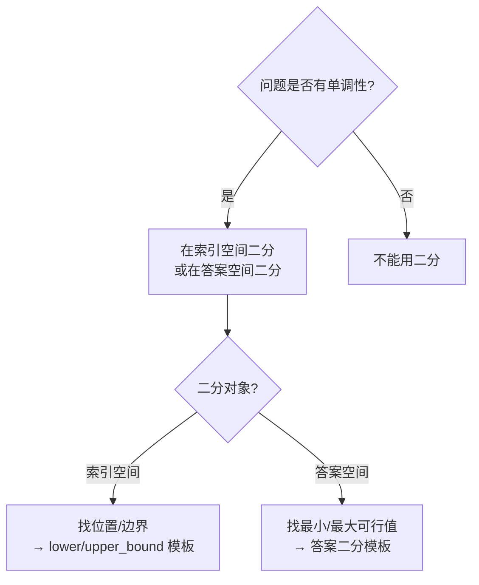

# [L3] 二分查找的统一模板：搜索边界与答案二分

#### 一句话结论

二分的本质是维护"循环不变量"，模板正确性来自区间语义而非背代码。

#### 体系讲解

**为什么二分容易写错**

手写二分时经典错误：
- `lo <= hi` 还是 `lo < hi`？
- `hi = mid` 还是 `hi = mid - 1`？
- `lo = mid` 还是 `lo = mid + 1`？

根因：没有从**区间语义**推导，而是凭感觉写，每次遇到变体就要重新猜。

**循环不变量方法：从区间语义推模板**

选定区间语义后，所有细节由语义决定，无需记忆。以「左闭右开 `[lo, hi)`」为例：

| 决策点 | 规则 | 原因 |
|---|---|---|
| 初始值 | `lo = 0, hi = n` | `[0, n)` 覆盖所有合法索引 |
| 循环条件 | `lo < hi` | 区间为空时 `lo == hi`，停止 |
| mid 取值 | `lo + (hi - lo) / 2` | 避免 `lo+hi` 溢出；向下取整偏左 |
| 目标在右 | `lo = mid + 1` | `mid` 已排除，新区间 `[mid+1, hi)` |
| 目标在左 | `hi = mid` | `mid` 已排除，新区间 `[lo, mid)` |
| 结果 | `return lo` | 循环结束时 `lo == hi`，即答案位置 |

**搜索左右边界**

在「找第一个 ≥ target」（lower_bound）和「找最后一个 ≤ target」（upper_bound）的场景下，
核心差异只在 `check(mid)` 为真时是收缩右边界还是左边界：

| 问题 | `check` 为真时 | 结果 |
|---|---|---|
| 左边界（first ≥ target） | `hi = mid`（答案可能就在 mid） | `lo` |
| 右边界（last ≤ target） | `lo = mid + 1`（答案在 mid 右边） | `lo - 1` |

**答案二分模板（在值域上二分）**

当问题满足「单调性：f(x) 满足条件 ↔ f(x+1) 也满足」时，可以在答案值域上二分：

```
lo = 最小可能答案，hi = 最大可能答案
while lo < hi:
    mid = lo + (hi - lo) / 2
    if check(mid):
        hi = mid      # mid 可行，答案可能更小
    else:
        lo = mid + 1  # mid 不可行，答案更大
return lo
```

经典应用：「分割数组最大值最小化」、「在 D 天内完成任务的最小速度」等。



#### 考察意图

考查候选人是否能从「循环不变量」原理出发推导二分写法，而非死记硬背；
进阶考查是否能识别「答案二分」的适用场景——这是区分 L2/L3 选手的典型问题。

#### 追问链

1. **为什么 `mid = lo + (hi - lo) / 2` 而不是 `(lo + hi) / 2`？**  
   简答：`lo + hi` 在两者都接近 `PHP_INT_MAX` 时会整数溢出；`lo + (hi - lo) / 2` 等价但安全。另：向下取整时若用 `lo = mid` 会死循环（区间不收缩），此时需向上取整 `lo + (hi - lo + 1) / 2`。

2. **在旋转有序数组（如 `[4,5,6,1,2,3]`）中查找目标值，如何用二分？**  
   简答：每次取 mid 后，必有一侧严格有序（由两端值判断）。若目标在有序侧的值域范围内，收缩到有序侧；否则收缩到另侧。时间仍 O(log n)，核心是"先判断哪侧有序，再判断目标在哪侧"。

3. **如何识别一道题是否适合答案二分？**  
   简答：三个信号——①求最小/最大值（或最小化最大值）；②对给定答案 x 可以 O(n) 校验其是否可行；③可行性具有单调性（x 可行则 x+1 也可行，或反之）。满足三条即可套答案二分模板。

4. **PHP 的 `array_search` 能用于二分查找吗？**  
   简答：不能。`array_search` 是线性搜索 O(n)，与值是否有序无关。PHP 标准库无内置二分，SPL 也未提供 lower_bound/upper_bound 工具，算法面试中需手动实现。

#### 易错点

1. **`lo <= hi` 与 `lo < hi` 混用**：闭区间 `[lo, hi]` 用 `lo <= hi`；左闭右开 `[lo, hi)` 用 `lo < hi`。混用导致死循环或漏检最后一个元素，根本原因是区间语义不统一。
2. **答案二分的 `check` 方向写反**：求最小可行值时 `check` 为真应收缩右边界（`hi = mid`）；求最大可行值时收缩左边界（`lo = mid`）。写反将得到相反的极值。
3. **旋转数组中忽略重复元素**：标准旋转数组二分假设无重复；有重复时（LeetCode 81）最坏退化为 O(n)，需额外处理 `nums[lo] == nums[mid]` 的情况（执行 `lo++` 缩小范围）。

#### 代码示例

```php
<?php

// ===== 左闭右开模板：搜索左边界（第一个 ≥ target 的位置）=====
function lowerBound(array $nums, int $target): int
{
    $lo = 0;
    $hi = count($nums); // 右开区间，hi 初始为 n
    while ($lo < $hi) {
        $mid = $lo + intdiv($hi - $lo, 2);
        if ($nums[$mid] < $target) {
            $lo = $mid + 1; // target 在右侧，排除 mid
        } else {
            $hi = $mid;     // target 可能就在 mid，保留并收缩右边界
        }
    }
    return $lo; // lo == hi，即第一个 ≥ target 的索引（不存在则返回 n）
}

// ===== 答案二分：最小化「完成所有任务所需的最小速度」=====
// 有 tasks[] 个任务量，每天完成 speed 单位，求能在 days 天内完成的最小速度
function minSpeed(array $tasks, int $days): int
{
    $check = function (int $speed) use ($tasks, $days): bool {
        $needed = 0;
        foreach ($tasks as $t) {
            $needed += (int) ceil($t / $speed);
        }
        return $needed <= $days;
    };

    $lo = 1;
    $hi = max($tasks); // 最大速度上界：1 天完成最重任务
    while ($lo < $hi) {
        $mid = $lo + intdiv($hi - $lo, 2);
        if ($check($mid)) {
            $hi = $mid;     // mid 可行，尝试更小的速度
        } else {
            $lo = $mid + 1; // mid 不可行，速度需更大
        }
    }
    return $lo;
}
```
