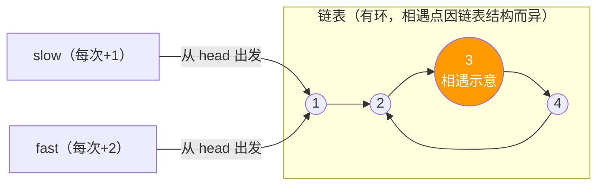

# [L2] 链表翻转与 Floyd 环检测

#### 一句话结论

链表翻转用三指针原地操作，Floyd 算法可 O(1) 空间检测环的存在。

#### 体系讲解

**链表翻转：三指针迭代法**

核心思路：维护 `prev`、`curr`、`next` 三个指针，逐节点将 `next` 指向反转，直到 `curr` 为 null。

```
初始：null ← (prev)  (curr)→1→2→3→null

步骤：
  1. 保存 next = curr->next
  2. 反转 curr->next = prev
  3. 前移 prev = curr，curr = next
```

时间 O(n)，空间 O(1)（相比递归法的 O(n) 调用栈更优）。

**Floyd 环检测：龟兔赛跑**

使用快慢两个指针：`slow` 每次走 1 步，`fast` 每次走 2 步。

- **无环**：`fast` 先到达 null，循环结束
- **有环**：`fast` 比 `slow` 每轮多走 1 步，最终在环内追上 `slow`（数学可证：相对速度差 1，必然相遇）



| 指针 | 步数 | 入环时状态 |
|---|---|---|
| slow | 每步 +1 | 走了 a+b 步进入环后 b 步处相遇 |
| fast | 每步 +2 | 走了 a+2b 步，与 slow 同处 |

> 设链表头到环入口距离为 a，环长为 c，可证相遇时 fast 已在环内绕了若干圈，相遇点离环入口距离可计算（延伸：找环入口需二次追及）。

**常见链表双指针技法汇总**

| 问题 | 技法 | 时间 | 空间 |
|---|---|---|---|
| 翻转链表 | 三指针迭代 | O(n) | O(1) |
| 环检测 | Floyd 快慢指针 | O(n) | O(1) |
| 找倒数第 K 个节点 | 快指针先走 K 步 | O(n) | O(1) |
| 合并两个有序链表 | 哑节点（dummy）+ 双指针 | O(m+n) | O(1) |

#### 考察意图

考查候选人对指针操控的熟练程度和对经典算法（Floyd）原理的理解；区分"只能背代码"与"能解释为什么快慢指针必然相遇"的候选人。

#### 追问链

1. **翻转链表用递归实现有什么问题？**  
   简答：递归翻转的空间复杂度是 O(n)（调用栈深度），在链表极长时有栈溢出风险；迭代法 O(1) 空间更安全。PHP 默认栈空间有限，生产代码应优先迭代。

2. **Floyd 算法如何找到环的入口节点（不只是检测是否有环）？**  
   简答：快慢指针相遇后，将其中一个指针重置到链表头，两者同时以每步 1 的速度前进；再次相遇时即为环入口。原理：设头到入口距离 a，相遇点到入口距离 b，可证 a ≡ c−b（c 为环长），两指针再走 a 步恰好同时到入口。

3. **删除倒数第 N 个节点如何用一次遍历完成？**  
   简答：使用哑节点（dummy）+ 快慢双指针。快指针先走 N+1 步，然后快慢同步前进，快指针到达 null 时慢指针恰好在目标节点的前驱节点，执行 `slow->next = slow->next->next` 即可删除。

4. **合并两个有序链表时为什么要用哑节点（dummy node）？**  
   简答：哑节点统一了头节点的插入逻辑，避免对"结果链表是否为空"做特判。合并完成后返回 `dummy->next` 即为真实头节点。这是链表题中消除边界判断的通用技巧。

#### 易错点

1. **翻转时忘记保存 next 导致断链**：执行 `curr->next = prev` 之前若未保存 `next = curr->next`，会丢失后续链表引用，是最常见的实现错误。
2. **Floyd 检测时 fast 越界**：循环条件应为 `$fast !== null && $fast->next !== null`，缺少 `$fast->next !== null` 时访问 `$fast->next->next` 会在 null 上调用属性。
3. **把"有环则无限循环"当理所当然**：若直接用 `while ($curr !== null)` 遍历有环链表，程序会死循环；生产代码处理用户输入的链表结构时应先做环检测。

#### 代码示例

```php
<?php

class ListNode
{
    public function __construct(
        public int $val,
        public ?ListNode $next = null
    ) {}
}

// ===== 链表翻转（三指针迭代）=====
function reverseList(?ListNode $head): ?ListNode
{
    $prev = null;
    $curr = $head;
    while ($curr !== null) {
        $next       = $curr->next; // 1. 保存后继
        $curr->next = $prev;       // 2. 反转指针
        $prev       = $curr;       // 3. 前移 prev
        $curr       = $next;       // 4. 前移 curr
    }
    return $prev; // prev 停在原尾节点，即新头节点
}

// ===== Floyd 环检测 =====
function hasCycle(?ListNode $head): bool
{
    $slow = $head;
    $fast = $head;
    while ($fast !== null && $fast->next !== null) {
        $slow = $slow->next;
        $fast = $fast->next->next;
        if ($slow === $fast) {
            return true; // 快慢指针相遇，存在环
        }
    }
    return false;
}

// ===== 合并两个有序链表（哑节点技巧，详见追问链 4）=====
// $dummy 统一头节点逻辑；循环结束后用 $l1 ?? $l2 接上剩余段
// 完整实现见追问链 4 的简答
```
