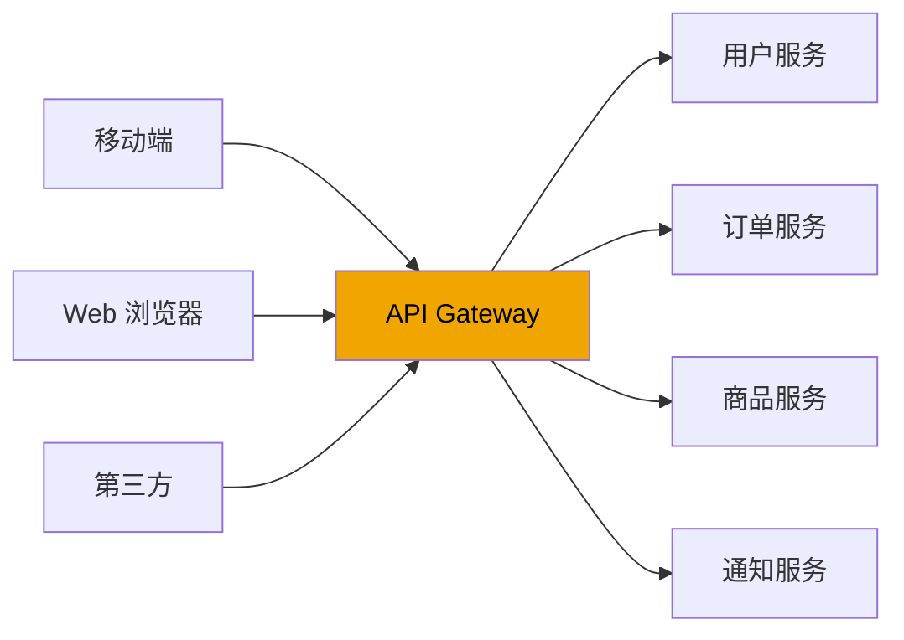
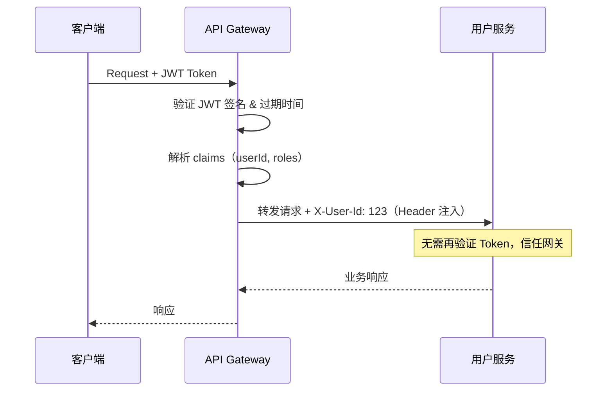
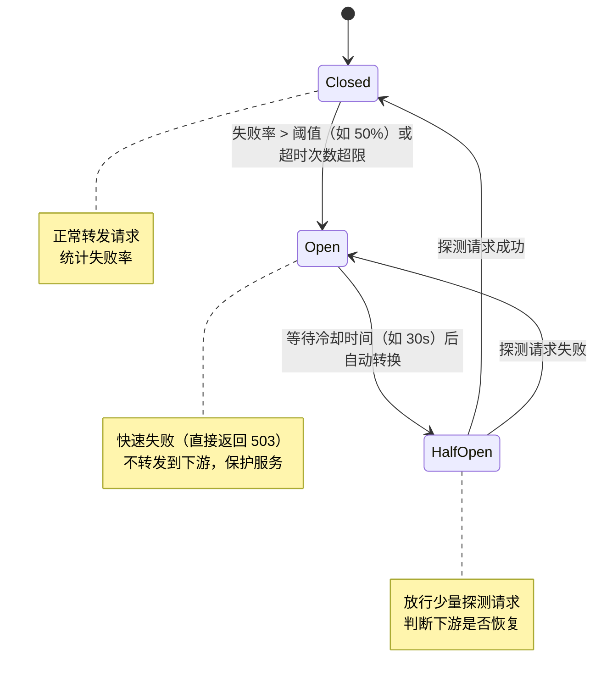
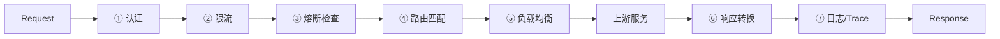

# [L3] API网关的核心职责与设计原则

#### 一句话结论

API 网关是南北流量的统一入口，将认证、路由、限流、熔断、协议转换等横切关注点聚合在单一层，避免各微服务重复实现，同时充当 BFF 聚合层。

#### 体系讲解

**网关在架构中的位置**



没有网关时，每个微服务需要独立实现：认证校验、限流、日志、Trace ID 注入……代码重复且难以统一变更；网关将这些**横切关注点（Cross-Cutting Concerns）**集中处理。

**核心职责拆解**

**① 路由（Routing）**

根据请求的 Path / Header / Host / Query Param 等维度，将请求转发到目标服务。支持：
- 路径前缀匹配：`/api/v1/users/*` → 用户服务
- 灰度/金丝雀路由：按 Header 或百分比将流量分发到新版本
- 动态路由：管理员通过 Admin API 实时变更规则，无需网关重启（Kong/APISIX 的核心优势）

**② 认证鉴权（AuthN / AuthZ）**

统一在网关层校验 JWT / OAuth2 Token，下游服务只接受来自网关的可信请求（内网 mTLS）：



**③ 限流（Rate Limiting）**

两种核心算法对比：

| 算法 | 原理 | 突发处理 | 适用场景 |
|:--|:--|:--|:--|
| **令牌桶（Token Bucket）** | 恒定速率补充令牌，桶满则溢出；请求消耗令牌 | 允许突发（桶内积累的令牌） | 允许短暂峰值的 API |
| **漏桶（Leaky Bucket）** | 请求入队，固定速率出队（流出） | 不允许突发，严格匀速 | 对下游速率敏感的场景 |
| **滑动窗口计数器** | Redis ZSET 记录请求时间戳，统计窗口内数量 | 无突发允许 | 精确计数，防滑动边界效应 |

**④ 熔断（Circuit Breaker）**

状态机机制，防止故障级联扩散：



**⑤ 协议转换**

- REST → gRPC：网关暴露 HTTP/JSON 接口，内部转为 gRPC 调用下游
- WebSocket 升级：HTTP Upgrade 握手后，网关维持长连接代理
- 响应格式归一化：将不同服务的响应格式统一为标准结构

**⑥ 聚合（BFF 模式）**

Backend for Frontend：针对不同客户端（移动/Web/第三方）定制聚合接口，一次调用替代多次下游请求，减少客户端网络往返：

```
Mobile 端一次请求 → 网关并发调用 [用户服务 + 订单服务 + 积分服务] → 聚合响应
```

**⑦ 可观测性**

- 注入 `X-Request-Id` / `X-Trace-Id`，贯穿全链路
- 统一采集访问日志、响应时间、错误率 Metrics
- 与 Zipkin / Jaeger 集成，实现分布式追踪

**请求处理管道（责任链模式）**



**自建 vs 成熟网关产品**

| 方案 | 优势 | 劣势 | 适用场景 |
|:--|:--|:--|:--|
| Nginx + OpenResty | 极高性能，Lua 脚本灵活 | 动态路由需 reload / lua-resty-* 维护 | 传统架构平滑升级 |
| Kong（基于 OpenResty） | 插件体系成熟，Admin API 动态配置 | 重量级，Postgres/Cassandra 存储依赖 | 企业级，插件生态丰富 |
| APISIX | 动态路由，etcd 存储，云原生友好 | 社区相对 Kong 较小 | 高性能，K8s 原生 |
| 自建（PHP/Go） | 完全定制，无外部依赖 | 路由、限流、熔断需自行实现，维护成本高 | 特殊场景，不推荐作首选 |

#### 考察意图

考察候选人能否系统描述网关的完整职责全景，理解限流算法（令牌桶 vs 漏桶）的设计差异、熔断状态机的状态转移逻辑，以及 BFF 聚合的设计意图，而非仅说出"网关做路由和认证"。

#### 追问链

**1. 令牌桶和漏桶限流的本质区别是什么？哪种更适合保护下游服务？**

令牌桶允许突发：桶内积累的令牌可以瞬间消耗，允许短暂的流量峰值，适合用户体验优先的 API。漏桶严格匀速：无论入队多快，出队速率固定，适合保护对流量敏感的下游（如数据库）。若目标是保护下游服务不被瞬间流量压垮，漏桶或滑动窗口计数器更合适；若目标是用户体验（允许合理突发），令牌桶更优。

**2. 熔断的 Half-Open 状态为何只放行少量请求而非全量？**

Open 转 Half-Open 后，下游可能刚刚恢复，若全量放行，峰值流量可能再次压垮服务，导致反复 Open-HalfOpen 抖动。只放行少量探测请求（如 1 次或按比例），成功则恢复 Closed；失败则重新进入 Open 并重置冷却计时器。这是**保守恢复策略**，以短暂限流换服务稳定性。

**3. 网关自身如何保证高可用？成为单点的风险如何规避？**

网关本身无状态（路由规则存储在外部 etcd/DB，限流计数存在 Redis），可多实例水平扩展，前置 LB（如 LVS/CLB）做流量分发。限流计数需用集中式 Redis 而非本地内存，否则多实例限流阈值不准确。熔断状态推荐存储在共享存储，避免各网关实例独立计数导致熔断状态不一致。

#### 易错点

1. **令牌桶与漏桶混淆**：令牌桶控制"生产速率"，消费端可突发消耗；漏桶控制"消费速率"，请求队列满后直接拒绝。面试中常被混用，需明确各自的限制方向。

2. **忽视网关自身限流数据一致性**：多网关实例用本地内存计数，每个实例各自统计，导致实际放通流量是阈值的 N 倍（N=实例数）；限流计数必须存储在集中式 Redis，并注意 Redis 单点问题。

3. **BFF 聚合过度导致网关臃肿**：将业务逻辑写入网关（如复杂的数据计算、业务规则判断），造成网关与业务强耦合；网关只应做无状态的流量编排（并发调用 + 聚合响应），业务逻辑归属下游服务。

#### 代码示例

```php
<?php
// PHP 8.0+ - 令牌桶限流（Redis 实现）
declare(strict_types=1);

final class TokenBucketRateLimiter
{
    public function __construct(
        private \Redis $redis,
        private int    $capacity,    // 桶容量（最大突发数）
        private int    $refillRate,  // 每秒补充令牌数
    ) {}

    /**
     * 尝试消费 1 个令牌，返回是否允许通过
     */
    public function allow(string $key): bool
    {
        $now      = microtime(true);
        $bucketKey = "ratelimit:token:{$key}";

        // Lua 脚本保证原子性（Redis 单线程执行）
        $script = <<<'LUA'
        local tokens     = tonumber(redis.call('HGET', KEYS[1], 'tokens')) or tonumber(ARGV[1])
        local lastRefill = tonumber(redis.call('HGET', KEYS[1], 'last'))   or tonumber(ARGV[3])
        local now        = tonumber(ARGV[3])
        local rate       = tonumber(ARGV[2])
        local capacity   = tonumber(ARGV[1])

        -- 按时间差补充令牌
        local elapsed = now - lastRefill
        tokens = math.min(capacity, tokens + elapsed * rate)

        if tokens >= 1 then
            tokens = tokens - 1
            redis.call('HSET',   KEYS[1], 'tokens', tokens, 'last', now)
            redis.call('EXPIRE', KEYS[1], 60)
            return 1
        end
        return 0
        LUA;

        $result = $this->redis->eval(
            $script,
            [$bucketKey, $this->capacity, $this->refillRate, $now],
            1
        );

        return (bool) $result;
    }
}

// 使用示例：每个 IP 每秒限 10 次，允许最多 20 次突发
// $limiter = new TokenBucketRateLimiter($redis, capacity: 20, refillRate: 10);
// if (!$limiter->allow($_SERVER['REMOTE_ADDR'])) {
//     http_response_code(429);
//     exit('Too Many Requests');
// }
```
