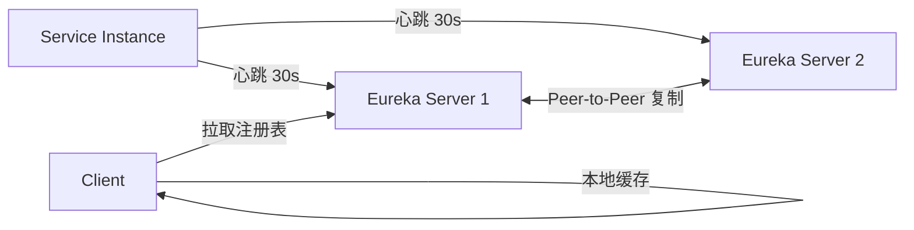

# [L2] AP vs CP：Eureka与ZooKeeper的注册中心选型对比

#### 一句话结论

注册中心优先选 AP（Eureka），网络分区时宁可用旧地址，不可拒绝服务发现。

---

#### 体系讲解

**1. 注册中心在 CAP 中的取舍**

注册中心的核心职责是**服务发现**：调用方拿到服务实例列表后发起请求。在网络分区发生时面临两种选择：

| 策略 | 行为 | 代价 |
|---|---|---|
| 保 C（CP） | 分区时拒绝查询或返回错误，直到一致性恢复 | 调用方无法获取服务列表，**请求全部失败** |
| 保 A（AP） | 分区时返回可能过时的实例列表 | 调用方可能访问到已下线实例，**少量请求失败** |

对于服务发现场景，**少量请求失败远优于全量请求失败**，因此 AP 是更合理的默认选择。

**2. Eureka（AP）原理**



- **多主复制**：各 Eureka Server 节点互相同步，无主节点，无 Quorum 要求
- **自我保护模式**：15 分钟内心跳丢失率超过 85%，**不注销**任何实例，避免网络抖动引起大规模误注销
- **客户端缓存**：客户端本地保存实例列表，Server 不可达时仍可使用缓存路由（保 A）
- **数据一致性**：最终一致，节点间复制有延迟，各节点注册表可能短暂不同

**3. ZooKeeper（CP）原理**

- **ZAB 协议**（ZooKeeper Atomic Broadcast）：基于 Paxos 变体，保证所有写操作经过 Leader 广播到多数派节点
- **Leader 选举**：Leader 宕机时触发选举（通常需要数百毫秒），**选举期间写操作被拒绝**
- **线性一致性读**（通过 `sync()` + `getData()`）：所有节点读到的数据一致

ZooKeeper 被用作注册中心的典型问题：**ZK Leader 重选期间，服务发现请求被阻塞或报错**，导致调用链大面积超时。

**4. 横向对比**

| 维度 | Eureka（AP） | ZooKeeper（CP） |
|---|---|---|
| CAP 定位 | AP | CP |
| 数据模型 | 键值（HTTP REST） | 树形 ZNode |
| 强一致性 | 否（最终一致） | 是（ZAB 协议） |
| 分区时行为 | 继续提供旧数据 | 非多数派节点拒绝读写 |
| 客户端缓存 | 内置（本地注册表） | 需自行维护 |
| 健康检查 | 心跳 + 自我保护 | 临时节点 + Session 超时 |
| 适用场景 | 服务发现、微服务注册 | 分布式锁、Leader 选举、配置管理 |

**5. 选型原则**

- **服务发现** → AP（Eureka、Nacos AP 模式、Consul AP 模式）
- **分布式锁 / 强一致配置** → CP（ZooKeeper、etcd）
- **Nacos** 同时支持两种模式，通过 `ephemeral` 参数区分：临时实例走 AP，持久实例走 CP

---

#### 考察意图

考察候选人能否将 CAP 理论落地到具体中间件选型，理解注册中心场景中"可用性优先于强一致性"的设计决策，以及 Eureka 自我保护模式的设计意图；同时考察能否区分 ZooKeeper 适合的使用场景（协调/锁）与不适合的场景（高可用服务发现）。

---

#### 追问链

1. **Eureka 自我保护模式有什么副作用？**
   > 自我保护期间即使实例真的下线也不会被注销，客户端会拿到包含"僵尸实例"的列表。调用方需配合**重试 + 熔断**（如 Resilience4j/Hystrix）处理连接失败，将故障影响限制在单次请求层面。

2. **ZooKeeper 临时节点是如何实现服务注册与注销的？**
   > 服务启动时在 ZK 创建临时 ZNode（路径如 `/services/order/192.168.1.1:8080`），节点与客户端 Session 绑定；Session 超时（默认 30s）或客户端主动断开时，ZK 自动删除临时节点，消费方通过 Watch 机制收到通知并更新本地缓存。

3. **Nacos 如何在同一个注册中心同时支持 AP 和 CP？**
   > Nacos 根据服务实例注册时的 `ephemeral` 字段决定模式：`ephemeral=true`（默认）使用 Distro 协议（类 Eureka，AP）；`ephemeral=false` 使用 Raft 协议（CP）。两类实例数据独立存储，互不影响。

---

#### 易错点

1. **把 ZooKeeper 当服务注册中心的默认选择**：ZK 的 CP 特性在 Leader 选举期间会造成服务发现不可用，这在微服务高频调用场景下是不可接受的。ZK 的强项是分布式协调（锁、选主），而非服务发现。

2. **认为 Eureka 自我保护是"Bug"**：自我保护模式是刻意设计的 AP 权衡——宁可短暂暴露失效节点（调用方有重试兜底），也不在网络抖动时大规模注销健康实例（否则引发雪崩）。

3. **混淆服务发现的"可用性"与业务的"数据一致性"要求**：注册中心的可用性（能否返回实例列表）与业务数据一致性（如账务）是两个不同层面的问题，不能用同一套 C/A 取舍框架套用。

---

#### 代码示例

```php
// 模拟 Eureka 客户端：本地缓存 + 分区时降级到缓存（AP 策略）
class EurekaClientSimulator
{
    private array $cache = [];

    public function getInstances(string $serviceName): array
    {
        try {
            $instances = $this->fetchFromServer($serviceName);
            $this->cache[$serviceName] = $instances; // 更新本地缓存
            return $instances;
        } catch (\RuntimeException $e) {
            // Server 不可达时返回本地缓存（AP：保可用性，数据可能过时）
            return $this->cache[$serviceName] ?? [];
        }
    }

    private function fetchFromServer(string $serviceName): array
    {
        // 实际通过 HTTP 请求 Eureka Server /eureka/apps/{serviceName}
        // 此处模拟网络不可达
        throw new \RuntimeException('Eureka Server unreachable');
    }
}

$client    = new EurekaClientSimulator();
$instances = $client->getInstances('order-service');
// 分区时返回缓存列表，而非抛出异常（AP 行为）
var_dump($instances);
```
