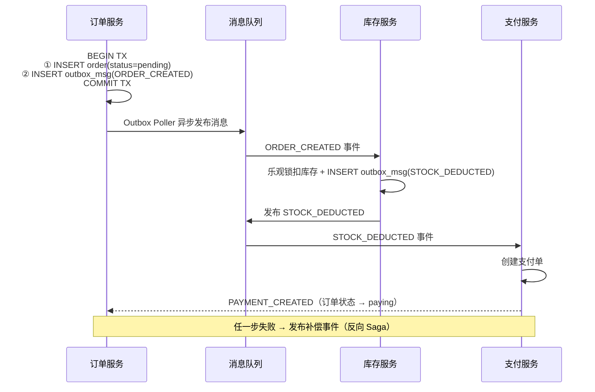

# [L4] 单体拆分微服务后的分布式事务选型

#### 一句话结论

跨服务事务首选 Saga+本地消息表，以最终一致换高可用。

---

#### 业务场景

电商平台将单体系统拆分为微服务，现状如下：

| 指标 | 数值 |
|---|---|
| DAU | 500 万 |
| 峰值下单 QPS | 3000 |
| 核心事务 | 下单跨 3 服务：扣库存（库存服务）+ 创建订单（订单服务）+ 发起支付（支付服务）|
| 强一致需求 | 库存不可超卖（扣减必须原子） |
| 最终一致需求 | 支付状态与订单状态允许短暂不一致（<5s） |
| SLA | 下单接口 P99 < 500ms，可用性 99.9% |

**问题**：单体拆分后，跨服务的数据一致性如何保证？如何在一致性强度与系统可用性之间做出量化选型？

---

#### 体系讲解

**1. 拆分后的一致性挑战**

单体时代下单可用一个数据库事务覆盖全流程，拆分后三个服务各有独立 DB，跨网络调用引入以下风险：
- 服务 A 成功，服务 B 因网络超时失败，部分成功导致数据不一致
- 没有全局事务协调者，无法回滚已提交的远程操作

**2. 三种方案横向对比**

| | 2PC | TCC | Saga + 本地消息表（推荐）|
|---|---|---|---|
| **一致性模型** | 强一致 | 应用层强一致 | 最终一致 |
| **可用性** | 低（协调者单点、阻塞锁） | 中（Try 阶段短暂锁定） | 高（无分布式锁） |
| **性能** | 差（阻塞等待所有参与方 ACK） | 中（三阶段网络往返） | 好（本地事务 + 异步消息） |
| **业务侵入** | 低 | 高（需实现 Try/Confirm/Cancel 三接口） | 中（写入本地 outbox 表） |
| **适用场景** | 强一致、低并发（内部运维系统） | 金融级强一致、中高并发 | 电商/互联网，允许短暂不一致 |
| **风险** | 协调者宕机导致参与方永久阻塞 | Cancel 空回滚、悬挂问题需额外处理 | 消息丢失需补偿轮询；下游消费需幂等 |

**3. 选型结论：Saga + 本地消息表**

符合本题约束的具体理由：
- 峰值 3000 QPS，2PC 全程持有跨服务资源锁，P99 极易突破 500ms 目标
- 库存超卖是**单服务内**的数值一致性问题，用本地乐观锁（`qty > 0` 条件 UPDATE）即可解决，无需跨服务强一致
- 支付状态允许 <5s 最终一致，Saga 异步补偿完全满足 SLA

**4. Saga + 本地消息表流程**



**5. 选型决策路径**

```
允许短暂不一致（秒级）？
  → 否（金融强一致，低并发）→ TCC
  → 是
      峰值 QPS > 1000？
        → 是 → Saga + 本地消息表
        → 否 → TCC 或 Saga，按团队熟悉度选
```

---

#### 考察意图

考察候选人能否区分三种分布式事务方案的核心差异（锁粒度/一致性模型/业务侵入度），并在给定 QPS/SLA 约束下做出量化选型；同时考察是否理解"库存超卖"这类局部强一致问题可在单服务内用乐观锁解决，无需引入跨服务强一致方案。

---

#### 追问链

1. **本地消息表可靠性**：订单服务宕机，outbox 消息如何保证不丢失？
   > outbox_msg 与业务数据在同一本地事务写入，要么同时提交，要么同时回滚。独立 Outbox Poller 进程定时扫描未投递消息并重试，下游消费需幂等（以 msg_id 去重）。

2. **补偿事务**：库存已扣但支付失败，如何触发反向 Saga 回补库存？
   > 支付服务发布 `PAYMENT_FAILED` 事件，库存服务订阅后执行归还（`qty+qty` 操作需幂等化：记录补偿流水，防止重复归还）；订单服务收到同一事件后将订单状态改为 `cancelled`。

3. **超卖防护**：选了最终一致，库存扣减如何做到不超卖？
   > 库存扣减在库存服务单机事务内完成，乐观锁：`UPDATE stock SET qty=qty-1 WHERE id=? AND qty>=1`；执行结果 `affected=0` 则代表库存不足，不依赖跨服务协调。

4. **幂等保障**：消息队列 at-least-once 投递，库存服务如何防止重复扣减？
   > 消费时先查 `consumed_messages`（以 msg_id 为唯一键），未消费则执行扣减 + 写消费记录，两步同一本地事务；重复消息触发唯一键冲突，直接幂等跳过。

---

#### 易错点

1. **用 2PC 解决高并发场景一致性**：2PC 持有跨服务资源锁等待 ACK，峰值 3000 QPS 时锁竞争激烈，P99 轻易超过 500ms；协调者宕机更会导致参与方永久阻塞。高并发场景下 2PC 是反模式。

2. **将"库存超卖"归类为"需跨服务强一致"**：超卖是单服务内的数值一致性问题，本地数据库乐观锁即可完美解决，无需为此引入 TCC 或 2PC 的全链路复杂度。

3. **Saga 补偿事务缺少幂等保护**：at-least-once 投递下补偿操作可能被重复触发，若"库存归还"逻辑无幂等保护，会导致库存被多次归还，产生反向超发（库存值虚高）。

---

#### 代码示例

```php
// 订单服务：下单（业务数据 + outbox 消息同一本地事务，保证原子性）
class PlaceOrderService
{
    public function execute(int $userId, int $productId, int $qty): int
    {
        return DB::transaction(function () use ($userId, $productId, $qty) {
            $orderId = DB::table('orders')->insertGetId([
                'user_id'    => $userId,
                'status'     => 'pending',
                'created_at' => now(),
            ]);
            DB::table('outbox_messages')->insert([
                'msg_id'     => (string) Str::uuid(),
                'type'       => 'ORDER_CREATED',
                'payload'    => json_encode(['order_id' => $orderId, 'product_id' => $productId, 'qty' => $qty]),
                'status'     => 'pending',
                'created_at' => now(),
            ]);
            return $orderId;
        });
    }
}

// 库存服务：消费 ORDER_CREATED（乐观锁防超卖 + 幂等消费）
class StockDeductConsumer
{
    public function handle(array $msg): void
    {
        DB::transaction(function () use ($msg) {
            // 幂等：msg_id 唯一键，重复消息跳过
            $inserted = DB::table('consumed_messages')
                ->insertOrIgnore(['msg_id' => $msg['msg_id'], 'created_at' => now()]);
            if ($inserted === 0) {
                return;
            }
            $payload  = $msg['payload'];
            $affected = DB::table('stock')
                ->where('product_id', $payload['product_id'])
                ->where('qty', '>=', $payload['qty'])
                ->decrement('qty', $payload['qty']);

            if ($affected === 0) {
                // 库存不足，触发反向 Saga 补偿
                event(new StockInsufficientEvent($payload['order_id']));
            }
        });
    }
}
```
