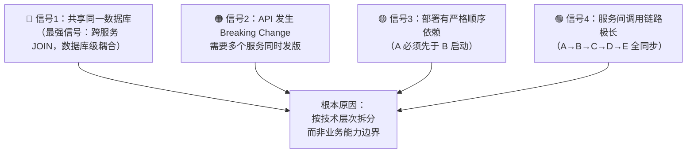
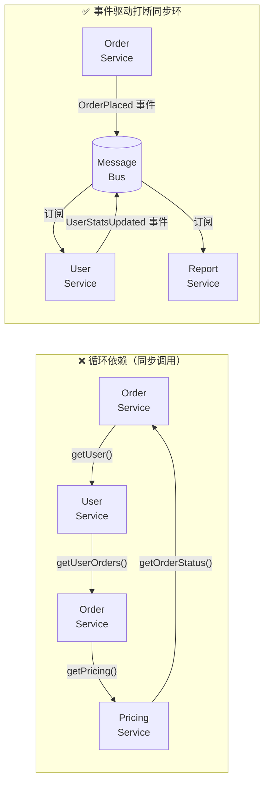

# [L3] 微服务拆分反模式：过度拆分、分布式单体与循环依赖

#### 一句话结论

过度拆分、分布式单体、循环依赖是微服务最常见的三种反模式，根本原因是**服务边界划定失败**，而非技术实现问题。

#### 体系讲解

**反模式一：过度拆分（Nano-Services）**

特征：服务粒度过细，每个功能操作独立成服务（如"获取用户头像服务"、"更新用户昵称服务"）。

```
❌ 过度拆分示例（一次下单流程）：
Request → OrderService → UserVerifyService → AddressService
       → InventoryCheckService → PriceCalcService
       → CouponService → PaymentService → NotificationService
（8次同步 RPC 调用，任一失败整体失败）

✅ 合理划分（聚合相关能力）：
Request → OrderService（内部处理：验证/计算/扣减）
       → PaymentService（支付独立，高内聚）
       → 异步通知（MQ 解耦）
```

过度拆分的量化信号：
- 一次业务操作跨越 5+ 个服务同步调用
- 两个服务总是同时变更、同时发布
- 服务间调用链路深度 > 4 层

过度拆分的代价：
- **延迟叠加**：每次 RPC 调用增加网络往返（约 1-10ms），8 次串行调用最差叠加 80ms+
- **分布式事务**：操作被拆散到多服务，需 Saga/2PC 协调，复杂度指数增长
- **运维成本**：K8s Pod 数、独立 CI/CD 流水线、日志分散，运维负担呈线性增大

**反模式二：分布式单体（Distributed Monolith）**

表面拆分为多个服务，但服务间高度耦合，既无单体的开发效率，又无微服务的弹性。

识别信号（从强到弱排列）：



分布式单体的典型成因：将原有单体的 Controller / Service / Repository 各层独立成服务，但数据库仍共享，接口仍紧耦合。

**反模式三：循环依赖（Circular Dependencies）**

特征：服务依赖关系形成有向环（A → B → C → A）。



循环依赖的危害：
- **无法独立部署**：A 启动依赖 B，B 启动依赖 C，C 启动依赖 A，陷入死锁
- **级联故障**：A 超时导致 B 等待，B 积压导致 C 阻塞，最终全链路雪崩
- **测试困难**：无法单独对 A 写集成测试，必须启动整个环

检测方法：将服务依赖关系建模为有向图，DFS 拓扑排序检测环：

```php
// 伪代码：DFS 检测服务依赖环
function hasCycle(string $node, array &$visited, array &$stack, array $graph): bool {
    $visited[$node] = true;
    $stack[$node]   = true;

    foreach ($graph[$node] ?? [] as $neighbor) {
        if (!isset($visited[$neighbor]) && hasCycle($neighbor, $visited, $stack, $graph)) {
            return true; // 发现环
        }
        if (isset($stack[$neighbor]) && $stack[$neighbor]) {
            return true; // 回边，存在环
        }
    }

    $stack[$node] = false;
    return false;
}
```

**三种反模式对比总览**

| 反模式 | 核心症状 | 实质 | 解决方向 |
|:--|:--|:--|:--|
| 过度拆分 | 一次业务跨 5+ 服务同步调用 | 聚合不足，粒度过细 | 合并强依赖服务 |
| 分布式单体 | 共享数据库 / 联动发版 | 边界划定失败，技术层拆分 | 按业务能力重新划界 + 数据自治 |
| 循环依赖 | A→B→C→A 同步调用环 | 双向依赖，无层次结构 | 事件驱动打断同步环 / 提取共享服务 |

**循环依赖的两种解决策略**

策略一：**事件驱动（推荐）**——将同步调用改为异步事件，打断依赖环，引入最终一致性

策略二：**提取共享服务**——将被多方依赖的公共逻辑抽取为独立的无状态服务（如"定价计算服务"），各方均单向依赖它，消除环

#### 考察意图

考察候选人能否从架构层面识别拆分失败的模式，理解过度拆分（粒度问题）、分布式单体（边界问题）、循环依赖（结构问题）各自的本质原因，以及在工程实践中的检测与修复思路。

#### 追问链

**1. 如何判断一个服务是否需要拆分，有什么量化标准？**

可参考的量化信号：① 单个服务代码库超过 3-5 个团队同时修改，合并冲突频繁；② 服务内存在两个明显不同的变更频率区域（如商品基本信息变更少，商品推荐算法变更频繁）；③ 某个功能需要独立扩展（如商品搜索需要高 CPU，而商品详情需要高内存）。反之，若两个服务总是同时变更，说明边界划错，应合并。

**2. 分布式单体和正常微服务的本质区别是什么？如何修复？**

正常微服务：每个服务独立拥有数据库，跨服务通过 API 或事件通信，可独立部署。分布式单体：服务间共享数据库（直接 JOIN）或接口强耦合（Breaking Change 需联动发版）。修复路径：① 先做数据库分离（Database per Service），用 API Composition 替代跨库 Join；② 引入领域事件替代同步调用；③ 版本化 API（API Versioning）避免 Breaking Change 联动。

**3. 服务依赖关系中出现循环后，为什么"提取公共服务"有时比"事件驱动"更适合？**

当循环依赖的根本原因是共享逻辑（如定价规则被 Order / Promotion / Report 三个服务各自复制实现，导致三者互相调用对方），事件驱动只是推迟了问题，数据最终还是需要同步。此时提取无状态的"定价服务"，三方单向依赖，消除数据重复和依赖环，比引入最终一致性的复杂度更低。若循环依赖源于业务流程的双向通知需求，则事件驱动更合适。

#### 易错点

1. **把"服务数量多"等同于"过度拆分"**：服务数量本身不是问题，关键是单次业务操作的同步调用跳数；100 个服务若边界清晰、调用链短，优于 10 个服务但存在循环依赖的架构。

2. **误以为分布式单体只是"共享数据库"**：共享数据库是最明显的信号，但 API 强耦合（服务 A 硬编码依赖服务 B 的内部字段语义）、发布顺序依赖同样是分布式单体的特征，即使数据库已分离。

3. **用"服务聚合层"修复循环依赖但引入新单点**：将 A、B、C 的调用集中到一个"编排服务"（Orchestrator），看似消除了直接循环，实则造成编排服务成为新的分布式单体核心，且单点故障风险更高；应优先考虑事件驱动的编排去中心化。

#### 代码示例

```php
<?php
// PHP 8.0+ - 服务依赖图循环检测工具
declare(strict_types=1);

final class ServiceDependencyGraph
{
    /** @var array<string, string[]> 邻接表：serviceName => [依赖的服务列表] */
    private array $edges = [];

    public function addDependency(string $from, string $to): void
    {
        $this->edges[$from][] = $to;
    }

    /**
     * 检测图中是否存在循环依赖
     * @return string[] 存在环时返回构成环的服务路径，否则返回空数组
     */
    public function detectCycle(): array
    {
        $visited = [];
        $stack   = [];
        $path    = [];

        foreach (array_keys($this->edges) as $service) {
            if (!isset($visited[$service])) {
                $cycle = $this->dfs($service, $visited, $stack, $path);
                if ($cycle !== []) {
                    return $cycle;
                }
            }
        }
        return [];
    }

    private function dfs(string $node, array &$visited, array &$stack, array &$path): array
    {
        $visited[$node] = true;
        $stack[$node]   = true;
        $path[]         = $node;

        foreach ($this->edges[$node] ?? [] as $neighbor) {
            if (!isset($visited[$neighbor])) {
                $cycle = $this->dfs($neighbor, $visited, $stack, $path);
                if ($cycle !== []) {
                    return $cycle;
                }
            } elseif (isset($stack[$neighbor]) && $stack[$neighbor]) {
                // 发现回边：找到环的起点，截取环路径
                $cycleStart = array_search($neighbor, $path, true);
                return array_slice($path, (int) $cycleStart);
            }
        }

        $stack[$node] = false;
        array_pop($path);
        return [];
    }
}

// 使用示例
$graph = new ServiceDependencyGraph();
$graph->addDependency('OrderService',   'UserService');
$graph->addDependency('UserService',    'NotificationService');
$graph->addDependency('NotificationService', 'OrderService'); // 循环！

$cycle = $graph->detectCycle();
if ($cycle !== []) {
    // 输出：Circular dependency detected: OrderService → UserService → NotificationService
    echo 'Circular dependency detected: ' . implode(' → ', $cycle) . PHP_EOL;
}
```
