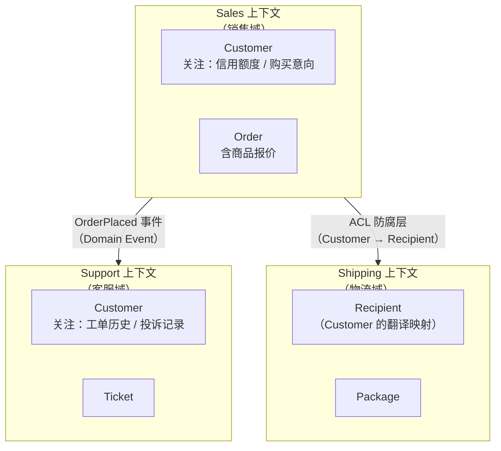
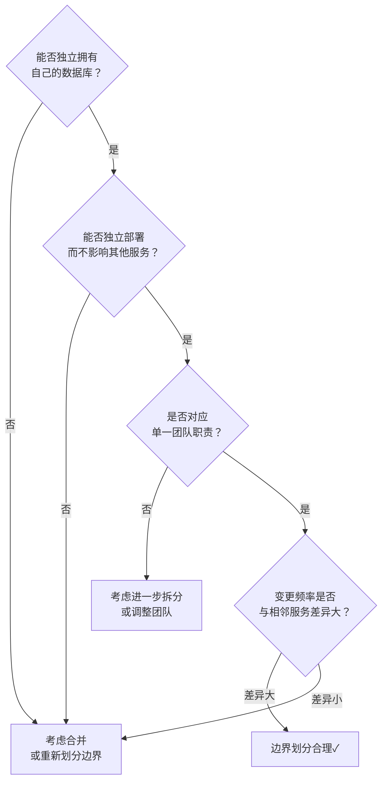

# [L3] 微服务服务边界划分：业务能力与DDD限界上下文

#### 一句话结论

服务边界应以**业务能力**为主轴、以**DDD 限界上下文**为工具划定，而非按技术层次拆分，边界内保持数据自治，跨界通过事件或 ACL 防腐层通信。

#### 体系讲解

**为什么按技术层次拆分是反模式？**

常见错误：将"Controller 层"、"Service 层"、"DAO 层"各自独立成微服务，或建立"通用数据库服务"。这种拆分方式：

- 业务变更需跨多个技术层服务协调修改，发布需同步
- 服务间高频同步调用，形成分布式事务问题
- 本质是**分布式单体**：无服务自治，只是把单体拆散到网络上

**业务能力分解（Business Capability Decomposition）**

业务能力是企业为产生价值所做的事情（动词 + 名词），与技术无关，变化频率低：

```
电商平台业务能力树：
├── 用户管理（User Management）
│   ├── 注册/登录
│   └── 个人资料维护
├── 商品目录（Product Catalog）
│   ├── 商品展示
│   └── 库存查询
├── 订单处理（Order Processing）
│   ├── 购物车
│   ├── 下单
│   └── 订单状态管理
├── 支付（Payment）
└── 通知（Notification）
```

每个叶节点能力对应一个候选服务，拥有完整的数据所有权（独立数据库）。

**DDD 限界上下文（Bounded Context）**

限界上下文定义了领域模型的有效边界——**同一个词在不同上下文中含义不同**：



**上下文映射模式（Context Mapping）**

跨上下文通信的标准模式，决定服务耦合程度：

| 模式 | 描述 | 耦合度 | 适用场景 |
|:--|:--|:--|:--|
| **Shared Kernel** | 共享部分领域模型代码/库 | 极高 | 紧密协作团队，慎用 |
| **Customer-Supplier** | 上游提供接口，下游消费 | 中 | 明确依赖方向时 |
| **Conformist** | 下游完全遵循上游模型（无翻译） | 高 | 下游无谈判能力时 |
| **Anticorruption Layer（ACL）** | 下游通过翻译层隔离上游模型 | 低 | 跨域集成，防止模型污染 |
| **Open Host Service** | 上游发布协议（API），供多消费者使用 | 低 | 平台型服务 |
| **Published Language** | 共享领域语言（如 JSON Schema / Protobuf） | 低 | 跨团队标准化 |

**边界划分的判断标准（四维检验）**



**康威定律（Conway's Law）与服务边界**

> 系统结构往往与设计该系统的组织通信结构一致。

实践含义：服务边界应与团队边界对齐，而非强行先拆服务再调整团队。"逆康威操作"（Inverse Conway Maneuver）：通过主动调整团队结构，引导系统向目标架构演进。

**数据自治原则**

每个服务拥有自己的数据库（Database per Service 模式），禁止跨服务直接查询对方数据库：

```
✅ 正确：Order Service → 发布 OrderPlaced 事件 → Inventory Service 订阅并更新库存
❌ 错误：Order Service → SELECT FROM inventory.stock（跨库 Join）
```

跨服务数据聚合需通过 API 组合（API Composition）或 CQRS 查询视图实现。

#### 考察意图

考察候选人是否理解微服务边界的本质（不是技术拆分，而是业务能力 + 数据自治），能否运用 DDD 限界上下文工具识别模型边界，以及上下文映射模式的工程意义（ACL 防腐层隔离变化）。

#### 追问链

**1. 如何识别一个限界上下文内存在"模型腐烂"（大泥球）的信号？**

信号包括：① 领域对象承担过多职责（User 类既包含登录逻辑，又包含地址、支付方式、权限……）；② 同一实体字段在不同场景下语义不同（`status` 字段在订单上下文和物流上下文含义完全不同但共用同一字段）；③ 两个服务频繁同步调用对方（循环依赖信号）。此时应拆分限界上下文，用 ACL 隔离各自模型。

**2. ACL（防腐层）在实现上如何落地？**

ACL 位于消费方（下游），是一个翻译/适配层。上游模型发生变化时，只需修改 ACL 内的翻译逻辑，下游领域模型保持稳定：

```php
// Sales Context 的 Customer 翻译为 Shipping Context 的 Recipient
final class CustomerToRecipientTranslator {
    public function translate(SalesCustomer $customer): ShippingRecipient {
        return new ShippingRecipient(
            name:    $customer->getFullName(),
            address: $customer->getShippingAddress()->toString(),
            phone:   $customer->getPrimaryPhone(),
        );
    }
}
```

**3. 康威定律对微服务拆分有何指导意义？如果团队与服务边界不匹配会发生什么？**

若一个团队维护多个服务，团队成员对"自己负责哪块"产生歧义，代码边界逐渐模糊；若多个团队共同维护一个服务，沟通成本激增，发布频率下降（需协调多团队 Review）。理想状态：一个小团队（2-8 人）独立负责一个服务的全生命周期（"你构建，你运维"），服务边界即团队边界。

#### 易错点

1. **把"微"理解为粒度越小越好**：服务边界是业务语义边界，不是代码行数边界。一个"用户服务"可能包含注册、登录、资料管理等多个功能模块，只要它们属于同一限界上下文（数据自治、团队对应），就应合并为一个服务。

2. **跨上下文直接共用领域模型**：如将 `User` 实体直接在 Sales 和 Support 两个上下文中引用同一个类，导致上下文间的模型变更相互污染；应各自维护独立的 Customer 模型，通过 ACL 或领域事件解耦。

3. **忽视数据自治原则**：在划定服务边界后，仍允许服务 A 直接查询服务 B 的数据库（跨库 Join），看似方便，实则绕过边界，形成数据层耦合；数据库变更需两个服务同步修改，等同于分布式单体。

#### 代码示例

```php
<?php
// PHP 8.0+ - ACL 防腐层 + 限界上下文隔离示例
declare(strict_types=1);

// ── Sales 上下文的 Customer（关注销售信息）──────────────────
final class SalesCustomer
{
    public function __construct(
        public readonly int    $id,
        public readonly string $fullName,
        public readonly string $email,
        public readonly float  $creditLimit,
    ) {}
}

// ── Shipping 上下文的 Recipient（关注收货信息）────────────────
final class ShippingRecipient
{
    public function __construct(
        public readonly string $name,
        public readonly string $address,
        public readonly string $phone,
    ) {}
}

// ── ACL 防腐层：隔离 Sales ↔ Shipping 的模型依赖 ─────────────
final class SalesCustomerToRecipientAcl
{
    /**
     * 上游 Sales 模型变更时，只修改此处翻译逻辑
     * 下游 Shipping 领域模型保持稳定
     */
    public function translate(SalesCustomer $customer, string $shippingAddress, string $phone): ShippingRecipient
    {
        return new ShippingRecipient(
            name:    $customer->fullName,
            address: $shippingAddress,
            phone:   $phone,
        );
    }
}

// ── 领域事件：跨上下文异步通信（替代同步调用）─────────────────
final class OrderPlacedEvent
{
    public readonly string $occurredAt;

    public function __construct(
        public readonly int   $orderId,
        public readonly int   $customerId,
        public readonly array $items,      // [['sku' => 'SKU001', 'qty' => 2]]
    ) {
        $this->occurredAt = (new \DateTimeImmutable())->format(\DateTimeInterface::ATOM);
    }
}

// Sales 上下文发布事件 → Inventory/Shipping 上下文订阅处理
// 各上下文独立演进，无直接代码依赖
```
