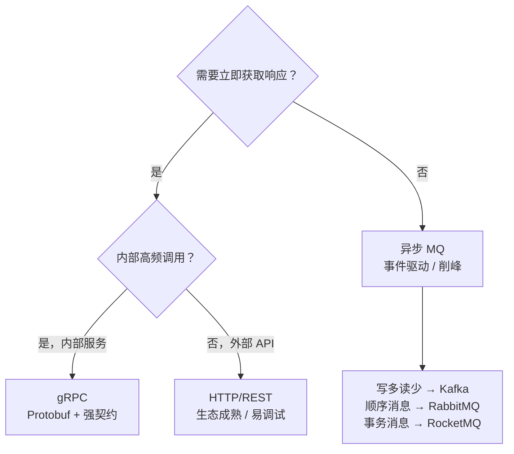

# [L3] 服务间通信选型：同步HTTP与gRPC对比异步MQ

#### 一句话结论

同步调用（REST/gRPC）适合需要即时响应的强依赖场景，gRPC 通过 Protobuf + HTTP/2 降低序列化与连接开销；异步 MQ 以最终一致换吞吐量和服务解耦，二者不可互替。

#### 体系讲解

**HTTP/REST 工作机制**

- 文本协议（JSON/XML），无强制 Schema 约束，字段错误运行时才暴露
- HTTP/1.1 每请求建立 TCP 连接（Keep-Alive 可复用，但受限制）；HTTP/2 多路复用（Multiple Streams over single TCP）、HPACK 头部压缩
- RESTful 设计以资源为中心，接口语义约定俗成，无跨语言 IDL 保障

**gRPC 工作机制**

gRPC 建立在 HTTP/2 之上，核心差异在于传输格式与契约定义：

```
// Protobuf 编码原理（理解序列化性能的关键）
message User {
  int64  id   = 1;   // field_number=1, wire_type=varint(0)
  string name = 2;   // field_number=2, wire_type=len(2)
}

// 二进制编码：tag = (field_number << 3) | wire_type
// id=1:   0x08 0x01              (2 bytes)
// name=2: 0x12 0x05 0x41 0x6c 0x69 0x63 0x65  (7 bytes, "Alice")
// 合计 9 bytes，而 JSON {"id":1,"name":"Alice"} = 20 bytes
```

⚠️ 需查证：gRPC/Protobuf 相对 REST/JSON 的序列化体积与性能提升幅度，需以具体 payload 大小和 benchmark 为准，不同场景差异显著。

gRPC 支持四种调用模式：
- **Unary**：请求-响应，等同于 HTTP 普通请求
- **Server Streaming**：服务端流式返回（如实时日志、大数据分页）
- **Client Streaming**：客户端批量上传后服务端汇总
- **Bidirectional Streaming**：双向实时流（如 IM、实时监控）

**异步 MQ 工作机制**

```mermaid
sequenceDiagram
    participant A as 服务 A（生产者）
    participant B as Broker（持久化）
    participant C as 服务 B（消费者）

    Note over A,C: 同步调用（gRPC Unary）
    A->>C: Request（Protobuf over HTTP/2）
    C-->>A: Response（同步阻塞等待）

    Note over A,B,C: 异步调用（MQ）
    A->>B: Publish Event（持久化落盘）
    B-->>A: ACK（已持久化，A 立即返回）
    Note over A: A 无需等待 C 处理结果
    B->>C: Deliver（at-least-once）
    C->>B: Consumer ACK（处理完成后确认）
```

MQ 关键语义：
- **at-least-once**：消息至少投递一次，消费者需实现幂等（消息 ID 去重）
- **at-most-once**：消息至多投递一次，可能丢失（适合日志等非关键数据）
- **exactly-once**：恰好一次（Kafka 事务 + Idempotent Producer，实现复杂）

**三者综合对比**

| 维度 | HTTP/REST | gRPC | 异步 MQ |
|:--|:--|:--|:--|
| 协议 | HTTP/1.1 or 2，JSON | HTTP/2，Protobuf | AMQP / Kafka 协议 |
| 延迟 | 中（序列化 + 连接） | 低（二进制 + 多路复用） | 高（Broker 中转） |
| 吞吐量 | 中 | 高 | 极高（异步解耦） |
| 一致性 | 同步强一致 | 同步强一致 | 最终一致 |
| 服务耦合 | 强（直连） | 强（直连 + IDL 契约） | 弱（Broker 解耦） |
| 错误处理 | HTTP 状态码 | Status Code + Error Details | 死信队列 / 重试队列 |
| PHP 适配性 | 原生支持 | 需 grpc 扩展 / RoadRunner | php-amqplib / rdkafka |
| 适用场景 | 外部 API、简单内部调用 | 内部高频同步调用 | 事件驱动、削峰填谷 |

**选型决策依据**



**PHP 中 gRPC 的特殊考量**

PHP-FPM 是 Share-Nothing 模型，每个请求独立进程，进程结束即销毁连接，HTTP/2 多路复用的连接复用优势在 PHP-FPM 下几乎无法发挥。需借助 **Swoole** 或 **RoadRunner** 常驻进程模型，才能真正复用 gRPC 长连接，此时性能提升才主要来自连接复用 + Protobuf 序列化双重优化。

#### 考察意图

考察候选人对三种通信模式底层机制的掌握：Protobuf 编码原理、MQ 投递语义（at-least-once / exactly-once）、以及 PHP 运行时特性对 gRPC 性能的影响，而非仅凭经验说"内部用 gRPC，异步用 MQ"。

#### 追问链

**1. MQ 的 at-least-once 语义如何保证消息幂等？**

消费者需实现幂等处理：以消息唯一 ID（messageId）为幂等键，写入 Redis SET（SETNX）或数据库唯一索引。数据库操作可用 `INSERT IGNORE` 或 `ON DUPLICATE KEY UPDATE` 保证幂等；支付等敏感操作需结合业务 ID（如 orderId）做二次校验，不能仅依赖 messageId。

**2. gRPC Streaming 适合什么场景？PHP 中如何实现？**

Server Streaming 适合大数据集分批返回（如报表导出、实时日志流）；Bidirectional Streaming 适合实时双向通信（如 IM、实时监控）。PHP 中需要：① 安装 `grpc` PHP 扩展；② 使用 `protoc` + `grpc_php_plugin` 从 `.proto` 生成 Stub；③ 在 RoadRunner 或 Swoole 环境中保持长连接复用；PHP-FPM 下 Streaming 模式意义不大。

**3. 为什么说"分布式事务"场景不能简单用 MQ 替代同步调用？**

MQ 提供最终一致性，但无法保证消息处理与本地事务的原子性（消费者处理失败时消息会重投，可能导致部分操作重复执行）。需结合**事务消息**（如 RocketMQ Half Message：先发半消息，本地事务提交后 commit，失败则 rollback）或**Saga 模式**（每步操作对应补偿操作）才能实现可靠的分布式事务语义。

#### 易错点

1. **PHP-FPM 下 gRPC 连接复用优势误判**：PHP-FPM 每请求新进程，进程退出即关闭连接，gRPC 的 HTTP/2 多路复用形同虚设，此时性能提升仅来自 Protobuf 序列化，幅度远小于常驻进程场景。

2. **把 MQ 当强一致通信用**：MQ 提供 at-least-once，消费者故障时消息会重投，若消费者未实现幂等，会导致重复操作（如重复扣款）；需要强一致须用同步调用或配合事务消息。

3. **REST 跑在 HTTP/2 上≠gRPC**：REST 也可基于 HTTP/2（如 HTTP/2 Cleartext），但仍使用 JSON 序列化，无 IDL 强契约；gRPC 的核心差异是 Protobuf 编码 + .proto 契约，而非单纯的传输层协议。

#### 代码示例

```php
<?php
// PHP 8.0+ - 三种通信模式对比示意
declare(strict_types=1);

// ─────────────────────────────────────────────
// 1. REST 调用（原生 cURL，无类型保障）
// ─────────────────────────────────────────────
function fetchUserByRest(int $id): array
{
    $ch = curl_init("http://user-service/api/users/{$id}");
    curl_setopt_array($ch, [
        CURLOPT_RETURNTRANSFER => true,
        CURLOPT_HTTPHEADER     => ['Accept: application/json'],
        CURLOPT_TIMEOUT        => 3,
    ]);
    $body = curl_exec($ch);
    $code = curl_getinfo($ch, CURLINFO_HTTP_CODE);
    curl_close($ch);

    if ($code !== 200) {
        throw new RuntimeException("HTTP {$code}");
    }
    // 无 Schema 约束，字段名拼写错误运行时才暴露
    return json_decode($body, true);
}

// ─────────────────────────────────────────────
// 2. gRPC 调用（需 grpc 扩展 + 生成的 Stub）
// ─────────────────────────────────────────────
// $client  = new UserServiceClient('user-service:50051', [
//     'credentials' => Grpc\ChannelCredentials::createInsecure(),
// ]);
// $request = new GetUserRequest();
// $request->setId(42);
// [$response, $status] = $client->GetUser($request)->wait();
// // 类型安全，字段由 .proto 编译期保证
// $name = $response->getName();

// ─────────────────────────────────────────────
// 3. MQ 异步发布（php-amqplib，at-least-once）
// ─────────────────────────────────────────────
function publishOrderCreatedEvent(array $order): void
{
    // $channel->basic_publish(
    //     new AMQPMessage(
    //         json_encode($order),
    //         ['delivery_mode' => AMQPMessage::DELIVERY_MODE_PERSISTENT]
    //     ),
    //     exchange:     'orders',
    //     routing_key:  'order.created'
    // );
    // 发布即返回，不等待消费者处理结果（解耦 + 削峰）
}

// ─────────────────────────────────────────────
// 4. 消费端幂等处理（at-least-once 防重）
// ─────────────────────────────────────────────
function consumeOrderEvent(array $message, \Redis $redis): void
{
    $msgId   = $message['message_id'];
    $lockKey = "consumed:{$msgId}";

    // SETNX + 过期时间，保证同一消息只处理一次
    if (!$redis->set($lockKey, 1, ['NX', 'EX' => 86400])) {
        return; // 重复消息，跳过
    }

    // 业务处理...
}
```
