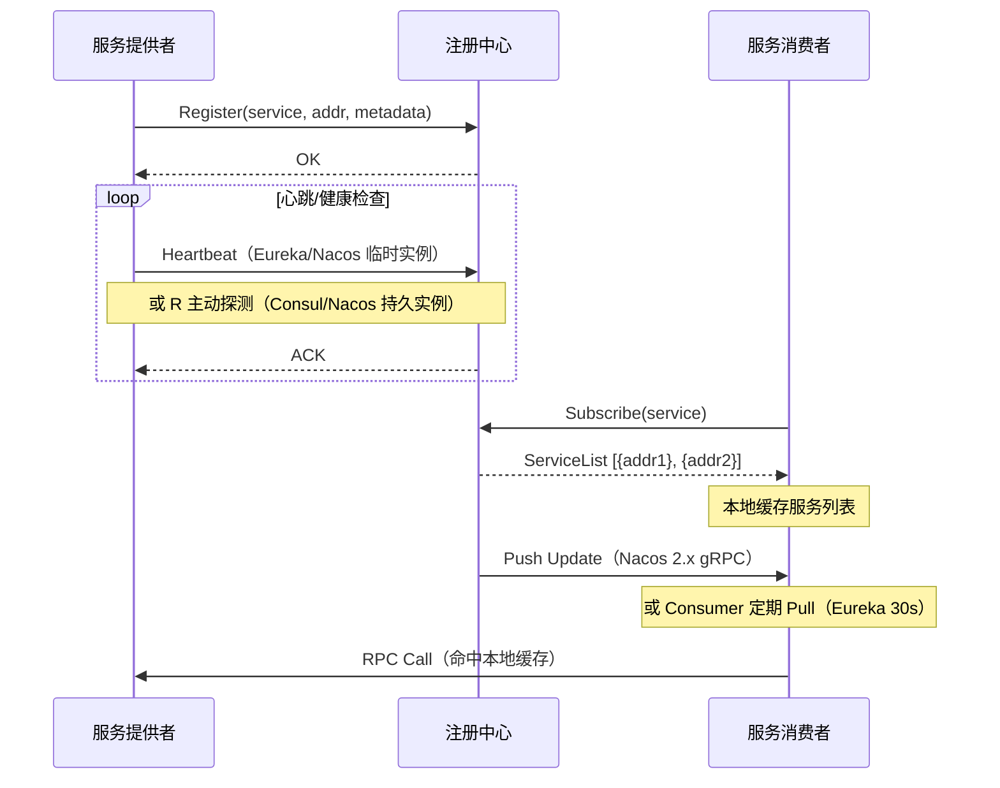

# [L3] 注册中心原理与选型：Consul、Nacos与Eureka对比

#### 一句话结论

注册中心通过心跳续约、健康检查、本地缓存三层机制实现服务发现，Consul 主动探测 + Gossip，Nacos 2.x gRPC 推送，Eureka 客户端心跳 + 自我保护，机制差异决定选型。

#### 体系讲解

**服务注册与发现的通用流程**

1. 服务实例启动时向注册中心注册（地址、端口、元数据）
2. 注册中心通过心跳或主动探测维持实例健康状态
3. 消费者订阅服务列表，缓存本地副本（降低注册中心压力）
4. 注册中心变更时，通过推送或消费者轮询同步到本地缓存



**Eureka：客户端心跳 + 自我保护**

- 服务实例每 30s 发送心跳续约（renew），超过 90s（3 个周期）未续约则剔除
- 消费者每 30s 全量拉取服务列表（Pull 模式），变更感知最差约 120s（90s 超时 + 30s 轮询）
- **自我保护机制**：15 分钟内心跳失败率 > 85%（期望续约数 = 实例数 × 2），停止剔除实例，防止网络分区误删健康实例；副作用：可能向消费者返回已下线实例，需配合重试/熔断
- 数据存储：内存 `ConcurrentHashMap<appName, Map<instanceId, Lease<InstanceInfo>>>`，无持久化，重启后需实例重新注册

**Consul：主动健康检查 + Gossip + Raft**

- 健康检查由 Consul Agent **主动执行**（HTTP/TCP/Script/TTL），不依赖服务实例上报心跳
- **Gossip 协议（Serf）**：负责集群成员管理（节点加入/离开/故障检测），信息传播时间复杂度 O(log N)
- **Raft 协议**：负责 Catalog（服务注册表）的强一致性写入，写操作需 quorum 确认
- 两层协议分工：Gossip 保障集群感知效率，Raft 保障数据正确性；Raft 不适合管理大量动态成员（选举开销随节点数增大）
- 服务发现：支持 DNS 接口（SRV 记录）和 HTTP API 双模式，Watch 接口可在变更时秒级推送

**Nacos：推拉结合 + 双协议双模式**

Nacos 将实例分为两类，使用不同机制和协议：

| 维度 | 临时实例（Ephemeral） | 持久实例（Persistent） |
|:--|:--|:--|
| 健康检查方式 | 客户端心跳（5s/次） | Nacos Server 主动探测 |
| 超时剔除 | 15s 不健康，30s 剔除 | 标记不健康，不自动剔除 |
| 存储协议 | Distro（AP，最终一致） | Raft（CP，强一致） |
| 典型场景 | 无状态微服务实例 | 数据库、中间件等基础设施 |

Nacos 2.x 将 1.x 的 HTTP 长轮询升级为 **gRPC 长连接**，变更可毫秒级推送，连接数从 `O(实例 × 服务订阅数)` 降为 `O(实例)`，Server 端压力显著降低。

**三者核心机制对比**

| 维度 | Eureka | Consul | Nacos |
|:--|:--|:--|:--|
| 健康检查 | 客户端心跳（被动） | Agent 主动探测 | 心跳 + 主动双模式 |
| 数据同步 | 异步复制（最终一致） | Raft（强一致） | Distro / Raft 双模式 |
| 服务发现延迟 | ~120s（最差） | 秒级（Watch） | 毫秒级（gRPC 推送，2.x） |
| 集群协议 | 无（内存异步复制） | Gossip + Raft | Distro + Raft |
| 配置中心 | 无（需外部组件） | KV 存储（基础） | 内置，支持动态刷新 |
| 多数据中心 | 不支持 | 原生 Federation | Cluster 隔离 |
| 维护状态 | 停止维护（Spring Cloud 已移除推荐） | 活跃 | 活跃（阿里主导） |

#### 考察意图

考察候选人对注册中心内部机制的理解深度：能否区分心跳驱动与主动探测的本质差异，理解 Eureka 自我保护的设计意图与副作用，以及 Gossip/Raft 协议在 Consul 中的分工逻辑，而非仅停留在 AP/CP 标签层面。

#### 追问链

**1. Eureka 自我保护机制的触发条件和副作用是什么，实际工程中如何应对？**

触发条件：15 分钟内接收到的心跳续约数 < 期望续约数 × 85%（期望值 = 注册实例数 × 2，即每 30s 2 次心跳）。触发后停止剔除失效实例。

副作用：消费者可能拿到已下线实例地址，调用失败。应对：在客户端配置重试（`spring.cloud.loadbalancer.retry.enabled=true`）、结合熔断（Resilience4j）快速失败，同时监控心跳续约失败率指标。

**2. Nacos 2.x 为何从 HTTP 长轮询切换到 gRPC 长连接？对服务端有何影响？**

HTTP 长轮询每次超时（默认 30s）后需重建连接，变更通知存在最长一个轮询周期的延迟窗口；且每个长轮询连接独占一个 HTTP 线程，服务端线程数随订阅关系线性增长。gRPC 长连接保持持久双向流，变更可实时推送；多路复用使单一连接可承载多个订阅，连接数量大幅下降，服务端资源消耗更可控。

**3. Consul 的 Gossip + Raft 双层协议如何分工？为何不统一使用 Raft？**

Gossip（Serf）专门负责成员管理：节点加入/离开/故障检测，适合大规模集群，O(log N) 轮次完成传播，代价是最终一致。Raft 负责 Catalog 数据（服务注册表、KV 存储）的强一致性写入，需要 Leader 和 quorum 确认。若统一用 Raft 管理成员，选举和心跳消息随节点数增大会成为瓶颈；若统一用 Gossip 管理数据，则无法保证强一致性。两层协议各取所长，是工程上的典型权衡。

#### 易错点

1. **混淆 Nacos 临时实例与持久实例**：两类实例健康检查方向相反（客户端心跳 vs Server 主动探测），存储协议不同（Distro AP vs Raft CP），不能一概而论说"Nacos 是 AP"。

2. **低估 Eureka 服务发现延迟**：从实例下线到消费者感知，需要：心跳超时（90s）+ 消费者定期拉取（30s），最差情况约 120s，而非仅心跳间隔 30s。

3. **认为 Consul Raft 强一致无代价**：网络分区时，Raft 少数派节点会拒绝写入（CP 代价）；读取时若未指定 `consistent` 模式，可能读到 Follower 上的 stale 数据。

#### 代码示例

```php
<?php
// PHP 8.0+ - Consul HTTP API 服务注册与健康探测示例
declare(strict_types=1);

readonly class ConsulServiceRegistry
{
    public function __construct(
        private string $consulAddr,
        private string $serviceId,
        private string $serviceName,
        private string $address,
        private int    $port,
    ) {}

    /**
     * 注册服务，配置 Consul 主动健康检查（对比 Eureka 的客户端心跳方向相反）
     */
    public function register(): bool
    {
        $payload = [
            'ID'      => $this->serviceId,
            'Name'    => $this->serviceName,
            'Address' => $this->address,
            'Port'    => $this->port,
            'Check'   => [
                // Consul Agent 主动 HTTP 探测，非客户端上报
                'HTTP'                            => "http://{$this->address}:{$this->port}/health",
                'Interval'                        => '10s',
                'Timeout'                         => '3s',
                'DeregisterCriticalServiceAfter'  => '30s',
            ],
        ];

        $ch = curl_init("{$this->consulAddr}/v1/agent/service/register");
        curl_setopt_array($ch, [
            CURLOPT_RETURNTRANSFER => true,
            CURLOPT_CUSTOMREQUEST  => 'PUT',
            CURLOPT_POSTFIELDS     => json_encode($payload),
            CURLOPT_HTTPHEADER     => ['Content-Type: application/json'],
        ]);
        $status = curl_getinfo($ch, CURLINFO_HTTP_CODE);
        curl_exec($ch);
        curl_close($ch);

        return $status === 200;
    }

    /**
     * 服务发现：只返回通过健康检查的实例（?passing=true）
     */
    public function discover(string $service): array
    {
        $ch = curl_init("{$this->consulAddr}/v1/health/service/{$service}?passing=true");
        curl_setopt($ch, CURLOPT_RETURNTRANSFER, true);
        $json = curl_exec($ch);
        curl_close($ch);

        return array_map(
            fn(array $node) => [
                'address' => $node['Service']['Address'],
                'port'    => $node['Service']['Port'],
            ],
            json_decode($json, true) ?? []
        );
    }
}
```
