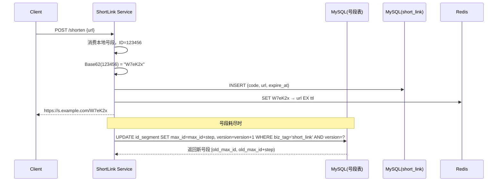

# [L5] 短链系统设计：唯一短码生成方案的架构权衡

#### 一句话结论

短链唯一码生成首选号段发号器：无碰撞、可离线、可横向扩展。

---

#### 业务场景

| 指标 | 数值 |
|---|---|
| 日均新增短链 | 500 万条（写峰值 QPS 500） |
| 短链访问 | 日均 5 亿次（读峰值 QPS 30 万） |
| 短链有效期 | 1–365 天，支持永久链接 |
| 支持自定义别名 | 是（最长 20 字符） |
| 数据规模（运营 3 年） | 约 55 亿条短链 |
| SLA | P99 写 < 100ms，P99 读 < 50ms，可用性 99.9% |

**核心问题**：在上述约束下，如何设计短码生成方案，保证唯一性、高可用、低延迟？

---

#### 方案对比

| | 方案一：哈希截断法 | 方案二：Redis INCR | 方案三：号段发号器（推荐）|
|---|---|---|---|
| **核心思路** | 对原始 URL 做 MurmurHash，取前 6 位 Base62 | 用 Redis INCR 生成全局自增 ID，转 Base62 | MySQL 维护号段表，服务预取 N 个 ID 缓存本地消费 |
| **优点** | 无单点；相同 URL 可幂等写（去重） | 实现简单；无碰撞；纯内存延迟极低 | 无碰撞；DB 故障时本地号段仍可服务；吞吐可横向扩展 |
| **缺点** | 随数据量增大碰撞率急剧上升，重试逻辑复杂 | Redis 需哨兵/Cluster；持久化异常时 ID 可能回退，造成重复分配 | 号段耗尽时有短暂 DB 访问；ID 有序可遍历（安全性弱） |
| **适用场景** | 数据量 < 1 亿、写 QPS 低、重视幂等写 | 写 QPS 万级以上、团队 Redis 运维成熟、对持久化有把握 | 生产主流，写 QPS 百~千级，可靠性优先 |
| **反例** | 截取 5 位 Base62（空间仅 9 亿），写入 55 亿数据后碰撞率趋近 100%，陷入无限重试 | INCR 与写入 DB 非原子——ID 已消耗但 MySQL 写入失败，出现"幽灵短链"（码发出但无记录） | 号段步长设为 1，退化为每次写请求都访问 DB，号段缓存形同虚设 |

---

#### 体系讲解

**选型结论**：采用方案三（号段发号器），辅以 Redis 覆盖读路径。

**写路径**

```
Client → API Gateway → ShortLink Service（本地号段缓存）
                              ↓ 号段耗尽时触发
                         MySQL 号段表（CAS 乐观锁更新 max_id）
                              ↓ 号段申请成功
                         MySQL short_link 表（持久化记录）
                              ↓ 异步写入
                         Redis（short_code → long_url，TTL = 有效期）
```

**读路径**

```
Client → CDN（边缘缓存高频短链，TTL = 1min）
       → Nginx → Redis（命中率 >95%，直接 301/302 重定向）
               → MySQL 从库（Redis Miss，回写 Redis）
```

读写比 ≈ 100:1，读路径强依赖 Redis，MySQL 仅兜底。

**容量估算**

| 资源 | 估算 |
|---|---|
| 短码地址空间（6 位 Base62） | 62^6 ≈ 568 亿，覆盖 55 亿数据无压力 |
| MySQL short_link 表（3 年） | 55 亿行 × ~200 Byte ≈ 1.1 TB，需按 short_code hash 分库分表 |
| Redis 热点数据（Top 10%） | 5.5 亿条 × ~100 Byte ≈ 55 GB，Redis Cluster 3 主 3 从可承载 |
| 读峰值带宽 | 30 万 QPS × 200 Byte ≈ 60 MB/s，CDN 拦截后实际回源 <5% |



---

#### 考察意图

考察候选人能否在数据规模约束下（55 亿/3 年）量化各方案的碰撞概率和可靠性边界，理解 Redis INCR 原子性的局限，以及号段模式如何通过本地缓存均摊 DB 压力；同时考察对读多写少（100:1）场景下 CDN → Redis → DB 三层缓存的设计直觉。

---

#### 追问链

1. **一致性**：短链写入 MySQL 成功但 Redis 异步写入失败（服务宕机），读请求如何保证正确？
   > Redis 仅是缓存，MySQL 是 source of truth。Redis Miss 时从 MySQL 从库查询并回写，不影响正确性。关键：短链**不能**以 Redis 为持久层。

2. **热点**：某条短链被明星转发，瞬间 QPS 达 100 万，如何防止单个 Redis Key 被打穿？
   > 三层防御：① CDN 边缘缓存（命中在 CDN 层不回源）；② 应用层 in-process 本地缓存 Top 短链 30 秒（PHP-FPM 下各 worker 独立缓存，Swoole 下跨协程共享）；③ 对单 Key QPS 超阈值的请求做 Singleflight 合并，只有一个请求穿透到 Redis。

3. **自定义别名**：用户提交 `custom=mylink`，如何与自增发号器共存避免码空间冲突？
   > 自定义别名独立写入 short_link 表，不走号段发号器；写入前用唯一索引约束，冲突返回 409。规划码空间时将自定义别名与数字 Base62 码的字符集隔离（如限定自定义别名允许含大写字母，发号器生成的码仅用小写+数字），从根源隔离命名空间。

4. **分库分表**：55 亿条如何分片？分片键选自增 ID 还是 short_code？
   > 以 short_code 哈希分片，而非自增 ID——读路径（用 short_code 查长链）只查一个分片；若按 ID 分片则读路径需广播查询。按 created_at 做冷热分离，90 天前数据归档至低成本存储（OSS + 离线索引）。

---

#### 易错点

1. **哈希空间估算失误**：拍脑袋选 5 位 Base62（仅 9 亿空间），写入 55 亿数据后碰撞率趋近 100%，系统陷入无限重试甚至死锁。正确做法：先算数据规模，再反推所需码长，保持填充率 < 10%。

2. **Redis INCR 与 DB 写入非原子**：先 INCR 取 ID，后写 MySQL——若 MySQL 写入失败，该 ID 已被消耗但无对应记录，形成"幽灵短链"（码可被枚举发现但返回 404）。正确顺序：先写 DB，成功后写 Redis 缓存；ID 是否"泄漏"不影响唯一性，只影响码空间利用率。

3. **号段步长设置两个极端**：步长 = 1 退化为每次写请求都访问 DB；步长过大（如 100 万）则服务重启丢失大量未消费号段，造成短链码出现大幅度不连续跳跃。生产建议 `step = 1000~5000`，结合写 QPS 动态调整（`step ≈ 预取时间窗口 × 写QPS`）。

---

#### 代码示例

```php
// 号段发号器（乐观锁 CAS 申请，PHP 服务层实现）
class SegmentIdGenerator
{
    private int $current = 0;
    private int $max     = 0;

    public function nextId(): int
    {
        if ($this->current >= $this->max) {
            $this->fetchSegment();
        }
        return $this->current++;
    }

    private function fetchSegment(): void
    {
        do {
            $row = DB::table('id_segment')
                ->where('biz_tag', 'short_link')
                ->first();

            $affected = DB::table('id_segment')
                ->where('biz_tag', 'short_link')
                ->where('version', $row->version)
                ->update([
                    'max_id'  => $row->max_id + $row->step,
                    'version' => $row->version + 1,
                ]);
        } while ($affected === 0); // CAS 失败则重试

        $this->current = $row->max_id;
        $this->max     = $row->max_id + $row->step;
    }
}

// Base62 编码
function toBase62(int $num): string
{
    $chars  = '0123456789abcdefghijklmnopqrstuvwxyzABCDEFGHIJKLMNOPQRSTUVWXYZ';
    $result = '';
    do {
        $result = $chars[$num % 62] . $result;
        $num    = intdiv($num, 62);
    } while ($num > 0);
    return str_pad($result, 6, '0', STR_PAD_LEFT);
}
```
