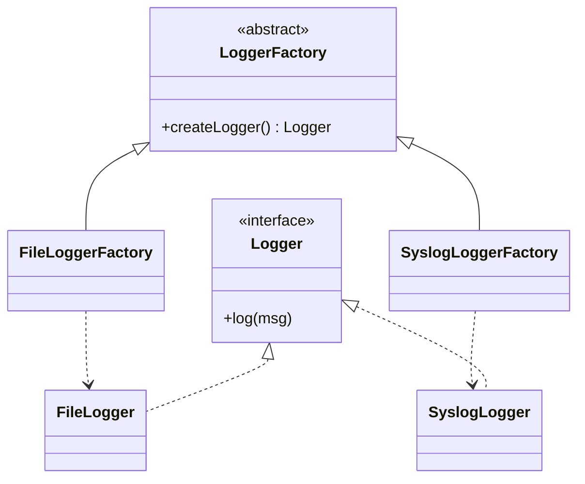
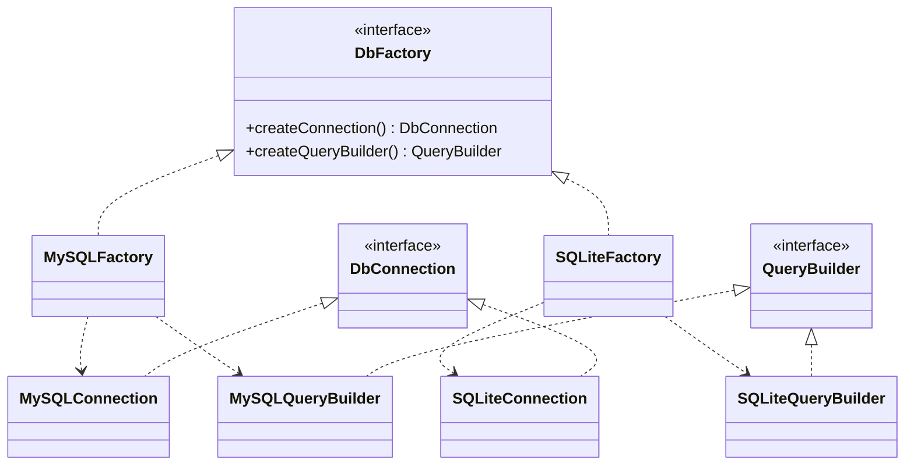

# [L2] 工厂方法与抽象工厂的区别及选型

#### 一句话结论

工厂方法让子类决定创建单一产品；抽象工厂创建一族相关产品；产品维度数量是核心选型依据。

#### 体系讲解

**核心区别对照**

| 维度 | 工厂方法 | 抽象工厂 |
|---|---|---|
| 创建粒度 | 单一产品 | 一族相关产品（多个产品维度） |
| 扩展方向 | 纵向：新增产品类型只需新增子类 | 横向：新增产品族只需新增工厂实现 |
| 实现方式 | 子类重写一个工厂方法 | 接口定义多个工厂方法，各自创建不同产品 |
| 违反开闭的场景 | 新增产品族 → 需改所有工厂子类 | 新增产品类型 → 需改工厂接口+所有实现 |

**工厂方法机制**

定义一个创建对象的接口，由子类决定实例化哪个具体类。
调用方依赖抽象工厂，而非具体产品类，实现创建逻辑解耦。

**抽象工厂机制**

提供创建相关/依赖对象家族的接口，无需指定具体类。
典型场景：数据库驱动族（MySQL 的连接器 + 查询构建器 + 结果集处理器需保持一致）。

**工厂方法（单一产品维度）**



**抽象工厂（产品族，多个产品维度）**



**选型决策树**

> 只有一种产品 → 工厂方法
> 产品有多个维度且需要约束族内一致性 → 抽象工厂
> 未来更可能新增"产品族"而非"产品类型" → 抽象工厂

#### 考察意图

考查候选人能否区分两种模式的设计意图，而不仅仅是背定义；
重点观察是否能结合实际场景（如多数据库驱动、多 UI 主题）说清选型依据。

#### 追问链

1. **工厂方法如何实现"对扩展开放、对修改关闭"？**
   简答：新增产品类型时只需新建具体产品类 + 对应工厂子类，调用方的工厂接口引用无需修改；这正是多态替换的体现。

2. **抽象工厂在 PHP 项目中最典型的场景是什么？**
   简答：多数据库驱动支持——MySQL/SQLite 各自实现 Connection、QueryBuilder、Connector 三个产品；切换数据库只需切换工厂，族内一致性由接口约束。

3. **Laravel 的数据库管理器（DatabaseManager）用的是哪种工厂模式？为什么？**
   简答：偏向抽象工厂思想——`createConnector()`、`createConnection()` 等方法组成产品族，通过 driver 名称路由到不同实现；纯工厂方法无法同时约束多个产品维度的一致性。

4. **"静态工厂方法"和工厂方法模式是一回事吗？**
   简答：不是。静态工厂方法（如 `DateTime::createFromFormat()`）是编程惯用法，不依赖子类多态；GoF 工厂方法模式的核心在于"子类决定实例化"，必须通过继承/多态实现。

#### 易错点

1. **把抽象工厂理解为"工厂的工厂"**：这是误导性表述。抽象工厂的"抽象"是指工厂接口本身是抽象的，核心是一次性创建相关联的多个产品，而非嵌套工厂。
2. **认为静态工厂方法 = 工厂方法模式**：两者名字相近但本质不同；GoF 工厂方法依赖多态，静态方法无法被子类重写（PHP 中可以，但违背模式初衷）。
3. **新增产品类型时误选抽象工厂**：此场景会导致需要修改工厂接口及所有已有实现类，违反开闭原则；新增产品类型用工厂方法更合适。

#### 代码示例

```php
<?php
// ===== 工厂方法（单一产品）=====
interface Logger
{
    public function log(string $msg): void;
}

class FileLogger implements Logger
{
    public function log(string $msg): void
    {
        echo "[File] {$msg}\n";
    }
}

abstract class LoggerFactory
{
    abstract public function createLogger(): Logger;

    public function write(string $msg): void
    {
        $this->createLogger()->log($msg);
    }
}

class FileLoggerFactory extends LoggerFactory
{
    public function createLogger(): Logger
    {
        return new FileLogger();
    }
}

// ===== 抽象工厂（产品族）=====
interface DbConnection { public function connect(): void; }
interface QueryBuilder  { public function build(string $sql): string; }

interface DbFactory
{
    public function createConnection(): DbConnection;
    public function createQueryBuilder(): QueryBuilder;
}

class MySQLConnection implements DbConnection
{
    public function connect(): void { echo "MySQL connected\n"; }
}

class MySQLQueryBuilder implements QueryBuilder
{
    public function build(string $sql): string { return "MySQL: {$sql}"; }
}

class MySQLFactory implements DbFactory
{
    public function createConnection(): DbConnection { return new MySQLConnection(); }
    public function createQueryBuilder(): QueryBuilder { return new MySQLQueryBuilder(); }
}

// 调用方只依赖 DbFactory 接口，切换数据库只需替换工厂
function bootstrap(DbFactory $factory): void
{
    $conn = $factory->createConnection();
    $qb   = $factory->createQueryBuilder();
    $conn->connect();
    echo $qb->build('SELECT 1') . "\n";
}

bootstrap(new MySQLFactory());
```
