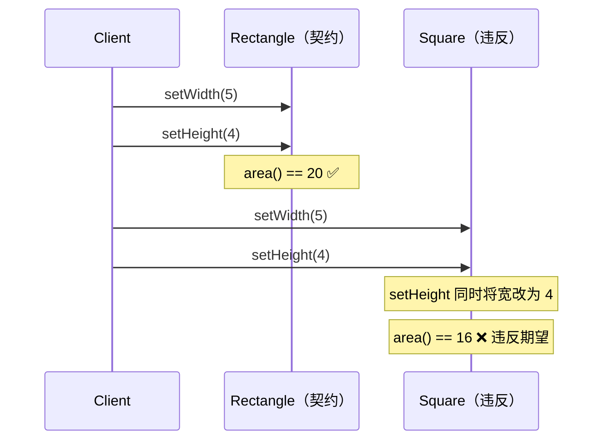

# [L3] 里氏替换原则的行为契约与继承陷阱

#### 一句话结论

LSP 要求子类遵守父类的行为契约，本质是行为兼容而非语法兼容。

#### 体系讲解

**三条行为契约规则**

| 规则 | 含义 | 违反信号 |
|---|---|---|
| 前置条件不可强化 | 子类方法接受的参数范围必须 ≥ 父类（入参更宽松） | 父类接受任意整数，子类只接受正整数 |
| 后置条件不可弱化 | 子类方法的返回保证必须 ≥ 父类（出参更严格） | 父类保证返回非空列表，子类可能返回 `null` |
| 不变量必须保持 | 子类必须维持父类规定的对象状态约束 | `Rectangle` 宽高独立，`Square` 强制宽高相等 |

**经典陷阱：Rectangle → Square**

数学上"正方形是特殊的矩形"，但在 OOP 中 `Square extends Rectangle` 会破坏不变量：`Rectangle` 的契约是"宽高可以独立设置"，而 `Square` 覆写 `setWidth` 时同时修改高度，导致调用方的断言失败。



**PHP 7.4+ 协变返回类型与 LSP**

PHP 7.4 引入协变返回类型（covariant return type）：子类方法可以返回父类返回值类型的**子类型**，这是 LSP 后置条件"不可弱化"在语言层面的部分保障。

- **协变（covariant）**：返回值类型可以收窄（子类型），更具体的返回更安全 ✅
- **逆变（contravariant）**：参数类型可以放宽（父类型），接受更多输入更安全 ✅
- PHP 会阻止子类**收窄**参数类型（Fatal Error），但不要求子类必须**放宽**参数类型；实践中参数类型通常保持不变，前置条件的宽松性需靠业务逻辑（如参数校验范围）自行保证

**如何设计不违反 LSP 的继承**

1. **行为契约先于实现**：设计父类/接口时明确声明前置/后置条件和不变量（文档注释或 DbC 工具）
2. **优先面向接口**：接口无状态，天然无"不变量被子类破坏"的问题（见追问链 4）
3. **组合代替继承**：`Square` 不继承 `Rectangle`，而是内部持有边长，各自实现 `Shape` 接口
4. **禁止在子类中抛出父类未声明的异常**：这是最常被忽视的后置条件弱化形式

#### 考察意图

考查候选人能否突破"子类可以覆写任何方法"的语法思维，理解 LSP 的核心是行为语义一致；
进阶考查是否了解 PHP 7.4+ 类型系统对 LSP 的支持边界，以及在继承陷阱中的设计决策能力。

#### 追问链

1. **Rectangle → Square 的根因是什么？如何在不违反 LSP 的前提下复用代码？**  
   简答：根因是两者的不变量冲突——Rectangle 要求宽高独立，Square 要求宽高相等，无法在同一继承树中同时满足。正确做法：两者共同实现 `Shape` 接口（`area()`），用组合而非继承，彻底解开行为契约的绑定。

2. **PHP 7.4+ 的协变返回类型如何支持 LSP？还有哪些情况语言检查不到？**  
   简答：协变返回类型确保子类返回"更具体的类型"（后置条件不弱化的一部分），但语言层面检查不到：①业务语义的后置条件（如"返回值非空"的约定）；②不变量约束（如对象状态规则）；③子类新增未声明的副作用。这些仍需靠契约文档 + 单测保障。

3. **LSP 与 OCP 的依存关系是什么？**  
   简答：OCP 要求"扩展新功能不改旧代码"，实现途径是多态替换；若子类违反 LSP，多态替换就不安全，调用方需要加 `instanceof` 判断，反而被迫修改旧代码，OCP 因此失效。LSP 是 OCP 生效的前提条件。

4. **为什么面向接口比面向抽象类更容易遵守 LSP？**  
   简答：抽象类携带状态和具体实现，子类继承时可能改变父类维护的不变量（如 Rectangle-Square 场景）；接口只声明行为契约，无状态，实现类各自管理内部状态，天然消除"不变量被子类破坏"的风险。这也是 ISP 和 LSP 协同作用的原因：接口细化 → 每个实现类只承载必要契约 → LSP 更易保持。

#### 易错点

1. **认为 LSP = "子类可以覆写任何方法"**：PHP 语法允许覆写，但行为契约可能被破坏。语法兼容 ≠ 行为兼容，LSP 关注的是语义层。
2. **认为"数学上正确就可以"**：Square 在数学上确是 Rectangle 的特例，但 OOP 类型系统描述的是行为契约，不是数学集合关系。"Is-A"关系在 OOP 中必须以行为可替换为标准。
3. **认为强类型检查能保证 LSP**：类型系统只检查签名兼容，不检查业务语义。子类收窄了参数合法范围、改变了返回值的业务含义，类型系统不会报错，但 LSP 已被违反。

#### 代码示例

```php
<?php

// ===== ❌ 违反 LSP：Square extends Rectangle =====

class Rectangle
{
    public function __construct(
        protected float $width,
        protected float $height
    ) {}

    public function setWidth(float $w): void  { $this->width  = $w; }
    public function setHeight(float $h): void { $this->height = $h; }
    public function area(): float             { return $this->width * $this->height; }
}

class Square extends Rectangle
{
    // 强制保持宽高相等，破坏了 Rectangle 的"宽高独立"不变量
    public function setWidth(float $w): void  { $this->width = $this->height = $w; }
    public function setHeight(float $h): void { $this->width = $this->height = $h; }
}

function assertArea(Rectangle $r): void
{
    $r->setWidth(5);
    $r->setHeight(4);
    assert($r->area() === 20.0, "期望面积 20，实际 {$r->area()}"); // Square 时断言失败
}

// assertArea(new Square(0, 0)); // ❌ LSP 违反，area() == 16 而非 20

// ===== ✅ 修复：面向接口，组合代替继承 =====

interface Shape
{
    public function area(): float;
}

class Rect implements Shape
{
    public function __construct(private float $w, private float $h) {}
    public function area(): float { return $this->w * $this->h; }
}

class Sq implements Shape
{
    public function __construct(private float $side) {}
    public function area(): float { return $this->side ** 2; }
}

// ===== PHP 7.4+ 协变返回类型（LSP 语言层保障）=====

class Animal {}
class Dog extends Animal {}

class AnimalFactory
{
    public function create(): Animal { return new Animal(); }
}

class DogFactory extends AnimalFactory
{
    public function create(): Dog { return new Dog(); } // 协变：更具体的返回类型 ✅
}
```
