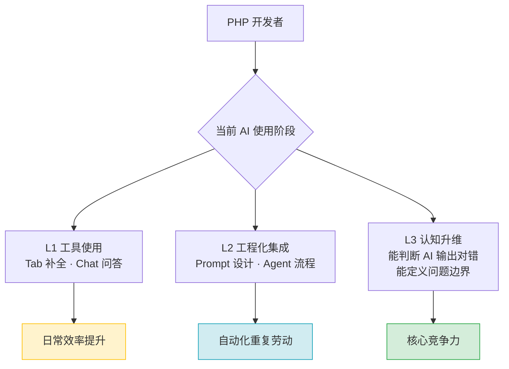

# [L2] AI 时代的 PHP 开发者：从工具选择到学习方法论

#### 一句话结论

AI 加速执行、基础决定上限——会用工具、能验证输出、持续建认知。

#### 体系讲解

> ⚠️ 需查证：Cursor 与 Claude Code 的具体功能描述基于 2026 年初状态，产品迭代快，细节以官方文档为准。

**现状：两种工具的本质分野**

AI 编程工具当前有两种代表性形态：

| 维度 | Cursor（AI 辅助） | Claude Code（AI 原生） |
|---|---|---|
| 主驾驶 | 开发者 | AI Agent |
| 交互方式 | Tab 补全 / Chat / Agent | 自然语言描述目标 |
| 上下文范围 | 当前项目文件 | 端到端任务（含终端、测试） |
| 开发者角色 | 写代码 + AI 辅助 | 定义目标 + 审查结果 |
| 适合场景 | 已有代码库的日常迭代 | 从零启动、探索性任务 |

两者的本质差异：**Cursor 是副驾驶，Claude Code 是自动驾驶**——后者让开发者的价值从"写代码"向"定义边界 + 审查质量"迁移。

**争议焦点：PHP 开发者如何学 AI？**

常见的两种极端认知：

- **工具论**："AI 会写代码了，学会用工具就够了，别卷基础"
- **焦虑论**："AI 要替代 PHP 开发者了，转行吧"

这两种都是认知陷阱。真实的学习路径应分三层：



**核心判断：编程基础还要学吗？**

答案是**要学，但学习目的发生了变化**：

| 过去学基础的目的 | AI 时代学基础的目的 |
|---|---|
| 自己手写实现 | 判断 AI 输出是否正确 |
| 记忆 API 用法 | 理解 AI 生成代码的意图 |
| 掌握语法细节 | 给出精准的问题描述（prompt） |
| 能写出来 | 能看出哪里错了、为什么错 |

一个没有基础的开发者使用 AI 工具，就像一个不懂医学的人用 AI 给自己看病——AI 给出的答案可能 80% 是对的，但你不知道哪 20% 是错的。

**如何学：可操作的三层框架**

1. **会用工具**（1-2 周）：掌握 Cursor/Claude Code 的核心工作流，建立 AI 辅助开发的肌肉记忆
2. **懂验证**（持续）：每次 AI 生成代码后，不直接提交，先做"最小理解"——能描述这段代码在做什么，以及为什么
3. **提认知**（长期）：系统性学习不依赖 AI 补全——AI 的补全是基于你已知知识的延伸，新技术的认知框架必须自己建立

#### 考察意图

面试官通过这题验证候选人的**元认知水平**：

- 是否只停留在工具层面，还是有自己的判断框架
- 对"AI 替代焦虑"的处理方式，能反映候选人的学习心态
- 能否清晰区分"工具能力"与"技术能力"的边界
- 是否理解 AI 辅助开发中，人类的核心价值在哪里

#### 追问链

1. Cursor 的 Agent 模式和 Claude Code 有什么本质区别？

   简答：Cursor Agent 仍在 IDE 内工作，以文件编辑为主要动作，开发者随时可介入；Claude Code 以终端为主战场，可自主执行命令、跑测试、提交代码，开发者是任务的发起者和最终审查者，而非过程参与者。本质区别是**控制权在谁手上**。

2. 一个 PHP 开发者想切入 AI 开发，第一步应该做什么？

   简答：不是学 Python，也不是学大模型原理——第一步是**在自己熟悉的 PHP 项目中引入 AI 工具**，建立"AI 辅助 → 自己理解 → 提交代码"的工作闭环。先在已知领域建立 AI 使用习惯，再拓展到新领域。

3. AI 能生成 PHP 代码了，还有必要学 PHP 底层原理（如 OPcache、GC）吗？

   简答：有必要，但优先级调整。底层知识的价值从"写出来"变成了"看出问题"——当 AI 生成了一段有性能隐患的代码（如循环内重复查询、不当的引用赋值），只有懂原理的开发者才能识别并修正。原理是**质量护城河**，不是考试题。

4. 如何避免"AI 依赖症"——过度依赖补全，自己的代码能力反而退化？

   简答：设立"理解门槛"——不理解的代码不提交，AI 生成后必须能用自己的语言解释。另一个方法是定期做"脱机练习"：关掉 AI 补全，手写一段熟悉的逻辑，保持肌肉记忆不萎缩。

5. AI 时代，PHP 开发者最应该强化的核心能力是什么？

   简答：**问题定义能力**。AI 的输出质量上限由你的 prompt 质量决定，而 prompt 质量的上限是你对问题的理解深度。能把一个模糊的业务需求拆解成可执行的技术描述，这个能力 AI 无法替代，也是高级开发者与初级开发者最大的分水岭。

#### 易错点

1. **把"会用 Cursor"等同于"懂 AI 开发"**

   正确姿势：Cursor 是工具，AI 开发是认知升级。工具会用只是起点，能判断 AI 输出的对错、能定义清晰的问题边界，才是 AI 时代开发者的核心价值。

2. **认为"AI 会写代码 → 基础不用学了"**

   正确姿势：基础学习的目的变了，但必要性没有消失。AI 生成的代码需要人来做 code review，没有基础的 review 形同虚设；调试 AI 的错误输出，更需要对原理的理解。

3. **用学新技术的方式来学 AI 工具（看文档、背 API）**

   正确姿势：AI 工具的学习路径是"用中学"——在真实项目中反复使用，积累 prompt 模式，观察 AI 在不同场景的行为边界，而不是先把文档读完再动手。

#### 代码示例

> 本示例为 prompt 质量对比演示，重点在注释中。

以下展示**基础扎实的开发者**如何写出更高质量的 AI prompt，对比说明基础的价值：

```php
<?php
// 场景：需要 AI 帮你优化一个慢查询

// ❌ 基础薄弱的 prompt（模糊，AI 给出的答案大概率是泛泛的建议）
// "帮我优化这个查询，它很慢"
// SELECT * FROM orders WHERE DATE(created_at) = '2026-01-01'

// ✅ 基础扎实的 prompt（精准描述问题，AI 能给出可落地的方案）
// "以下查询在 orders 表（500万行）上全表扫描，EXPLAIN 显示 type=ALL。
//  已知 created_at 字段有索引，但 DATE() 函数导致索引失效。
//  请给出改写方案，要求：保持语义不变、能命中索引、兼容 MySQL 8.0"
//
// SELECT * FROM orders
// WHERE created_at >= '2026-01-01 00:00:00'
//   AND created_at <  '2026-01-02 00:00:00'

// 结论：
// 懂 MySQL 索引的开发者，能把"查询很慢"翻译成"DATE()函数导致索引失效"
// 这一层翻译能力，让 AI 从给出通用建议变为给出精准方案
// 基础知识在 AI 时代的价值：提升 prompt 的"信噪比"
```
