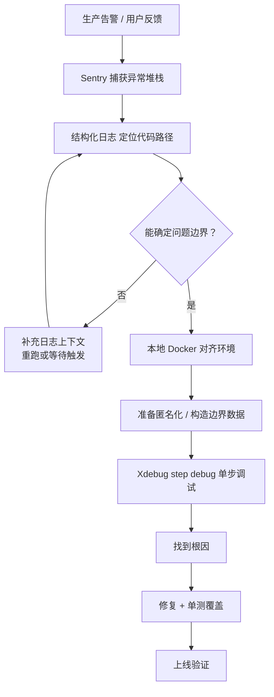

# [L2] 生产环境如何排查 Bug，以及如何在本地复现并调试

#### 一句话结论

生产靠日志与错误追踪定位边界，本地用 Xdebug 单步复现根因。

#### 体系讲解

**原理：为什么生产和本地要用不同工具**

Xdebug 在 step debug 模式下会暂停 PHP-FPM worker 进程等待 IDE 响应，导致当前请求被 hold 住直至超时，影响所有并发用户；同时其默认监听端口若未严格隔离，存在被外部连接注入调试会话的安全风险。因此生产环境只做"**定位**"，本地才做"**单步**"。

**机制：两阶段排查流程**



**Phase 1 — 生产侧：定位问题边界**

| 工具 | 职责 | 特点 |
|---|---|---|
| Sentry / Bugsnag | 捕获异常堆栈、面包屑、请求上下文 | 有异常才触发，无法覆盖"结果不对"的业务 Bug |
| 结构化日志（Monolog） | 记录关键业务节点的状态流水 | 覆盖正常流程，便于 request_id 关联追溯 |
| APM（Datadog / SkyWalking） | 慢查询、外部调用耗时、链路追踪 | 定位性能瓶颈或分布式调用异常 |

三者配合，最终确定"**哪个函数 + 哪个入参 + 哪种数据状态**"下触发了问题。

**Phase 2 — 本地侧：复现与单步调试**

1. 用 Docker 固定 PHP 版本与 `php.ini`（`date.timezone`、`precision`、OPcache 开关等）
2. 准备匿名化的生产数据，或根据 Phase 1 定位到的边界条件构造最小复现用例
3. 启用 Xdebug `debug` 模式，在 IDE（PhpStorm / VS Code）中打断点
4. 单步追踪变量状态，找到根因后编写单元测试覆盖该路径，再修复

**结论：对开发的直接影响**

- 生产侧的可观测性基础设施（日志格式、错误追踪接入）必须**事前建好**，出了 Bug 才想起加日志则为时已晚。
- 本地侧的环境一致性是复现成功的前提，Docker 化是最低成本的保障手段。

#### 考察意图

面试官想验证候选人是否具备真实的线上值班经验，具体考察三个维度：

1. **工具链认知**：知道 Xdebug 不能用于生产，且能说清楚为什么（而非只是"听说不行"）
2. **可观测性意识**：是否主动建设日志 + 错误追踪，而非出了问题才翻 `error_log`
3. **环境一致性**：复现问题时会不会主动排除本地与生产的配置差异

#### 追问链

1. **生产环境为什么不能直接开启 Xdebug step debug？**

   简答：Xdebug step debug 会暂停 PHP-FPM worker 进程等待 IDE 连接，导致请求被 hold 住直至超时，影响所有并发用户；同时默认监听的 9003 端口若未严格隔离，存在被外部连接注入调试会话的安全风险。

2. **日志没有足够上下文时怎么办？**

   简答：梳理问题触发条件，在可疑代码路径上补加结构化日志（记录关键变量、request_id、user_id），然后等待或构造请求触发再次采集。如有 Feature Flag，可针对特定用户临时提升日志级别至 `DEBUG`，而不影响全体用户的性能。

3. **如何保证本地能复现生产问题？**

   简答：关键在于环境一致性。用 Docker 固定 PHP 版本和 `php.ini`（重点：`error_reporting`、`precision`、`date.timezone`、OPcache 是否开启）；用匿名化或构造的边界数据，而非随意测试数据。常见复现失败原因：本地 PHP 版本差 1 个小版本、字符集或时区配置不同、数据量级相差悬殊。

4. **Xdebug 有哪几种工作模式，`step debug` 之外还有什么？**

   简答：Xdebug 3.x 通过 `xdebug.mode` 切换模式——`debug`（单步调试）、`profile`（性能剖析，输出 cachegrind 文件供 KCachegrind/WebGrind 分析）、`coverage`（代码覆盖率，配合 PHPUnit）、`trace`（函数调用追踪）。多个模式可组合：`xdebug.mode=debug,coverage`。

5. **用了 Sentry 还需要写结构化日志吗？两者职责有什么区别？**

   简答：两者互补，不可替代。Sentry 专注于**异常/错误事件**的捕获、聚合与报警；结构化日志（Monolog）适合记录**正常业务流程的关键节点**（如订单状态变更、外部 API 调用结果），覆盖"结果不对但未抛异常"的场景。配合使用：Sentry 发现异常 → 用 `request_id` 关联到日志系统查上下文。

#### 易错点

1. **以为「只要接了 Sentry 就够了」**

   Sentry 只捕获抛出的异常或显式上报的错误。如果 Bug 表现为"计算结果不符合预期"而非"程序崩溃"，Sentry 不会有任何记录。结构化日志记录正常流程中的关键状态，是 Sentry 无法覆盖的盲区。

2. **本地复现时忽略环境差异**

   最常见的"本地正常、线上报错"根源：`php.ini` 中 `precision`（浮点精度）、`date.timezone`、`memory_limit`、OPcache 是否开启等配置不同。Docker + 版本锁定 + 配置文件同步是避免此类问题的标准做法。

3. **排查慢接口时误用 step debug 模式**

   调试性能问题时开 step debug 会 hold 住进程，应改用 Xdebug `profile` 模式生成 cachegrind 文件，再用 KCachegrind 或 WebGrind 分析热点函数，两者适用场景完全不同。

#### 代码示例

```php
<?php

// ── 1. 生产侧：Monolog 输出结构化日志（JSON，便于日志平台解析与 request_id 关联）──

use Monolog\Logger;
use Monolog\Handler\StreamHandler;
use Monolog\Formatter\JsonFormatter;

$log = new Logger('order');
$handler = new StreamHandler('/var/log/app/order.log', Logger::DEBUG);
$handler->setFormatter(new JsonFormatter());
$log->pushHandler($handler);

$requestId = $_SERVER['HTTP_X_REQUEST_ID'] ?? uniqid('req_', true);

// 以下变量来自业务上下文（此处为示意赋值）
$orderId = 42;
$amount  = 99.00;
$userId  = 1001;

$log->info('order.pay.start', [
    'request_id' => $requestId,
    'order_id'   => $orderId,
    'amount'     => $amount,
    'user_id'    => $userId,
]);

// 输出示例（JSON）：
// {"message":"order.pay.start","context":{"request_id":"req_abc","order_id":42,...},...}


// ── 2. 本地 Docker：php.ini 片段，仅在开发容器中生效 ──
//
// [xdebug]
// xdebug.mode                = debug
// xdebug.start_with_request  = yes
// xdebug.client_host         = host.docker.internal   ; 连宿主机 IDE
// xdebug.client_port         = 9003


// ── 3. 性能剖析（排查慢接口时替换 mode，不阻塞进程）──
//
// xdebug.mode           = profile
// xdebug.output_dir     = /tmp/xdebug
// xdebug.profiler_output_name = cachegrind.out.%p
//
// 生成文件后用 KCachegrind 或 WebGrind 打开，定位热点函数。
```
