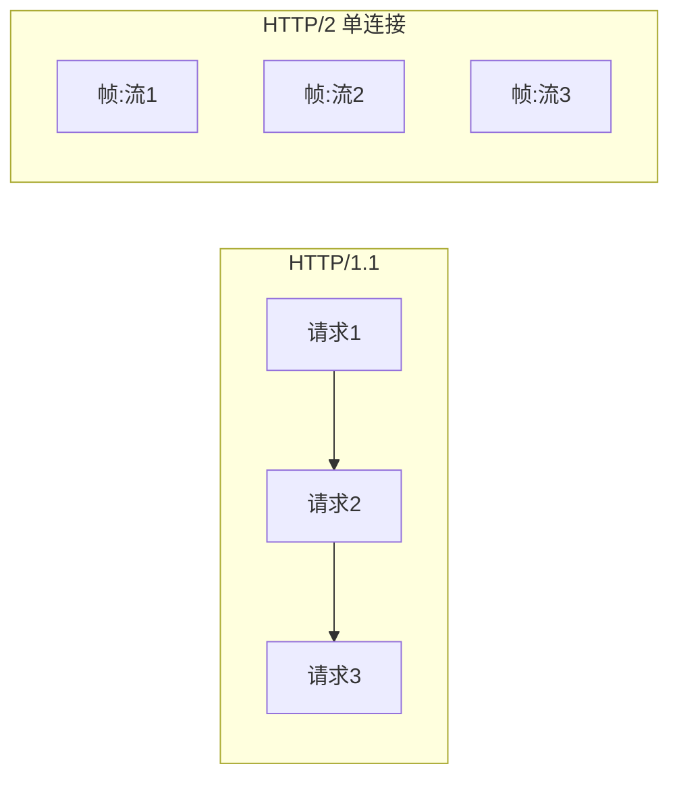
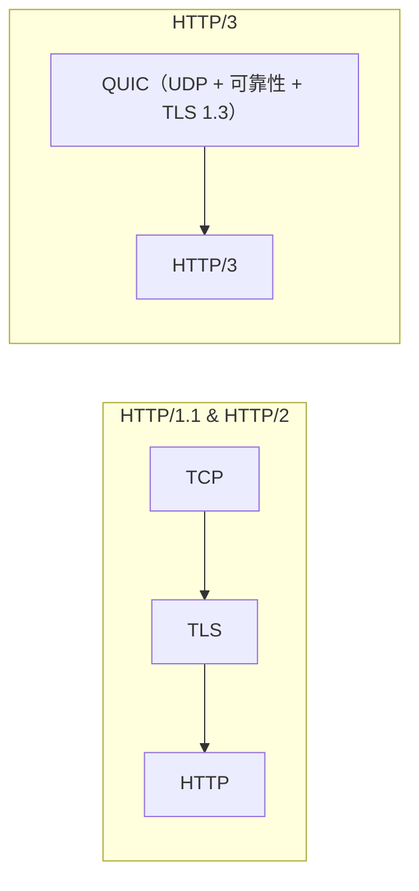

# [L3] HTTP/2 与 HTTP/3 的核心改进与底层原理

#### 一句话结论

HTTP/2 用二进制帧与多路复用消除 HTTP 层队头阻塞，HTTP/3 将传输层换为 QUIC，从根本上解决 TCP 层队头阻塞。

#### 体系讲解

**1. HTTP/1.1 的核心痛点**

| 痛点 | 根因 |
|---|---|
| HTTP 队头阻塞 | 同一 TCP 连接上请求必须串行，前一个响应未完成，后续请求阻塞 |
| 头部冗余 | 每次请求重复携带大量 Cookie/User-Agent 等头部，无压缩 |
| 连接数限制 | 浏览器对同域名限制 6 条 TCP 连接，并发靠并行连接绕开，资源浪费 |

**2. HTTP/2：二进制帧 + 多路复用** ⚠️ 需查证



核心机制：

- **二进制帧（Frame）**：HTTP/2 将报文拆分为带有流 ID（Stream ID）的二进制帧，帧是最小传输单元
- **多路复用（Multiplexing）**：同一 TCP 连接上多个流并发交错传输，互不阻塞，消除 HTTP 层队头阻塞
- **流优先级**：可为不同流设置权重，关键资源优先传输
- **服务端推送（Server Push）**：服务端可主动推送客户端尚未请求的资源（如 CSS/JS）
- **HPACK 头部压缩**：
  - **静态表**：预定义 60+ 个常用头部字段，传输时用索引代替字符串
  - **动态表**：维护本次连接中出现过的头部，后续请求复用，大幅降低重复头部开销
  - 与 HTTP/1.1 的 gzip 压缩不同，HPACK 专为 HTTP 头部设计，安全且高效

**HTTP/2 的残留问题**：多路复用解决了 HTTP 层阻塞，但底层 TCP 的可靠传输机制仍会导致**传输层队头阻塞**——一个 TCP 包丢失时，整条连接上所有流都必须等待重传，高丢包网络下性能退化严重。

**3. HTTP/3：QUIC 替换 TCP** ⚠️ 需查证



QUIC 核心特性：

- **基于 UDP**：绕开 TCP 协议栈，在用户态实现可靠传输（重传、拥塞控制、流控）
- **流级别丢包恢复**：一个流的丢包只阻塞该流，其他流不受影响——彻底消除传输层队头阻塞
- **0-RTT / 1-RTT 连接建立**：QUIC 将 TLS 1.3 握手与传输层握手合并，首次连接 1-RTT，会话恢复 0-RTT
- **连接迁移**：用 Connection ID 标识连接，网络切换（WiFi → 4G）时无需重新握手

**4. 三代 HTTP 对比** ⚠️ 需查证

| 维度 | HTTP/1.1 | HTTP/2 | HTTP/3 |
|---|---|---|---|
| 传输格式 | 文本 | 二进制帧 | 二进制帧（QUIC） |
| 连接复用 | 有限（Keep-Alive 串行） | ✅ 多路复用 | ✅ 多路复用 |
| HTTP 层队头阻塞 | ✅ 有 | ❌ 消除 | ❌ 消除 |
| 传输层队头阻塞 | ✅ 有（TCP） | ✅ 有（TCP） | ❌ 消除（QUIC） |
| TLS 握手 RTT | 2-RTT（TLS 1.2） | 2-RTT（TLS 1.2） | 0/1-RTT（TLS 1.3 内置） |
| 头部压缩 | 无 | HPACK | QPACK |
| 传输协议 | TCP | TCP | UDP（QUIC） |

#### 考察意图

考察候选人能否追溯「队头阻塞」问题在不同层次的表现（HTTP 层 vs 传输层），理解 HTTP/2 解决了什么、没解决什么，以及 HTTP/3 为何需要从传输层动手——这是网络性能优化思维的分水岭。

#### 追问链

1. **HTTP/2 的多路复用为何没有彻底解决队头阻塞？**  
   HTTP/2 在 HTTP 层实现多路复用，但底层仍是 TCP。TCP 保证有序交付，一旦某个 TCP 包丢失，内核必须等待重传，整条 TCP 连接上所有流（Stream）都被阻塞，即使其他流的数据已到达缓冲区。QUIC 在流级别管理重传，丢包只影响当前流。

2. **HPACK 头部压缩与 HTTP/1.1 的 gzip 压缩有什么区别？**  
   HTTP/1.1 的 gzip 压缩响应体（Body），不压缩头部；HPACK 专门压缩 HTTP/2 的头部字段，通过静态表（预定义常用头）和动态表（会话级头部历史）将重复头部替换为索引，大幅降低带宽消耗。另外，HPACK 的设计特别规避了 CRIME 攻击（利用压缩长度推断明文内容）风险。

3. **QUIC 基于 UDP，如何保证可靠传输？**  
   QUIC 在用户态实现了 TCP 的可靠性机制：① 序列号与确认应答（ACK）保证包到达；② 超时重传丢失的包；③ 流量控制（连接级 + 流级别）；④ 拥塞控制（默认 Cubic/BBR 算法）。与 TCP 不同，QUIC 的重传是流级别而非连接级别，避免了 TCP 的 HOL 阻塞。

4. **什么场景下 HTTP/2 反而比 HTTP/1.1 差？**  
   高丢包网络（如移动网络抖动严重时），HTTP/2 的传输层队头阻塞效应被放大——一个 TCP 包丢失导致所有流停滞，此时「多路复用」带来的并发优势被抵消，可能比多条 HTTP/1.1 连接并行还慢。HTTP/3 的 QUIC 正是为此场景设计。

#### 易错点

1. **认为 HTTP/2 多路复用完全消除了队头阻塞**：HTTP/2 只消除了应用层（HTTP）队头阻塞，TCP 层队头阻塞依然存在。高丢包环境下 HTTP/2 性能可能退化，HTTP/3 才是完整解法。

2. **混淆 HPACK 和 QPACK**：HTTP/2 用 HPACK，HTTP/3 用 QPACK。QPACK 针对 QUIC 乱序交付做了适配（动态表更新需要显式确认），不能直接互换。

3. **以为 QUIC = HTTP/3**：QUIC 是传输层协议（RFC 9000），HTTP/3（RFC 9114）是运行在 QUIC 之上的应用层协议，两者关系类似 TCP 与 HTTP/1.1——QUIC 也可以承载其他应用协议。

#### 代码示例

```php
// PHP cURL 检测服务器是否支持 HTTP/2 并强制使用
$ch = curl_init('https://example.com');
curl_setopt_array($ch, [
    CURLOPT_RETURNTRANSFER => true,
    CURLOPT_HTTP_VERSION   => CURL_HTTP_VERSION_2_0, // 请求 HTTP/2
]);
curl_exec($ch);
$info = curl_getinfo($ch);
// http_version: 2 = HTTP/2, 3 = HTTP/3
echo '协议版本: ' . ($info['http_version'] ?? 'unknown') . PHP_EOL;
curl_close($ch);
```

```nginx
# Nginx 同时启用 HTTP/2（HTTPS）和 HTTP/3（QUIC）⚠️ 需查证：需 Nginx 1.25+
server {
    listen 443 ssl;
    listen 443 quic reuseport;         # HTTP/3 via QUIC
    http2 on;                           # HTTP/2

    ssl_protocols TLSv1.2 TLSv1.3;
    add_header Alt-Svc 'h3=":443"; ma=86400'; # 告知客户端支持 HTTP/3
}
```
