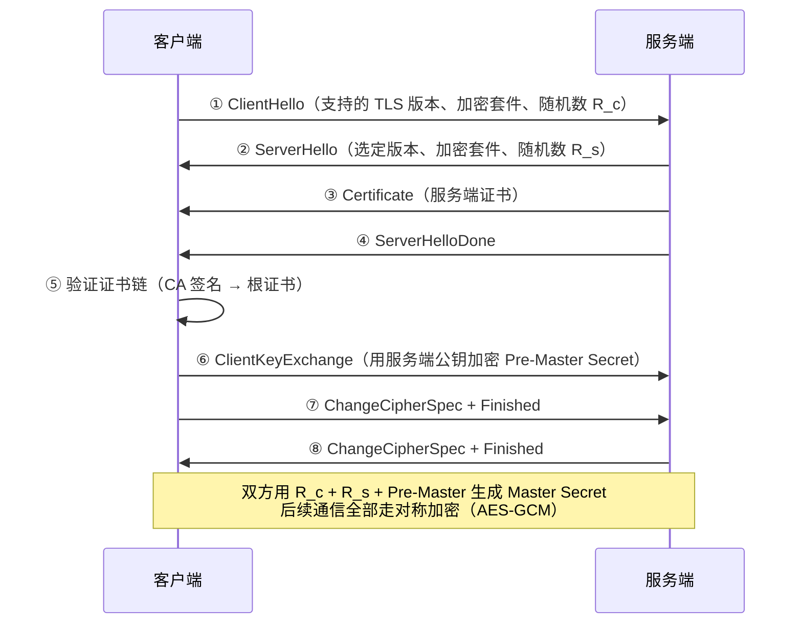

# [L2] HTTPS 的 TLS 握手流程与加密分工

#### 一句话结论

TLS 握手用非对称加密完成身份认证与密钥协商，协商出的对称密钥负责后续数据加密，兼顾安全与性能。

#### 体系讲解

**1. 为什么需要两种加密？**

| 加密方式 | 优点 | 缺点 | TLS 中的角色 |
|---|---|---|---|
| 非对称加密（RSA/ECDHE） | 无需提前共享密钥，安全分发 | 计算开销大，速度慢 | 身份认证 + 密钥协商 |
| 对称加密（AES-GCM） | 速度快，适合大数据量 | 密钥如何安全分发是难题 | 实际数据加密 |

结论：非对称加密解决「密钥分发」难题，对称加密承担「数据加密」重任，二者配合取长补短。

**2. TLS 1.2 握手流程** ⚠️ 需查证



**3. TLS 1.3 改进** ⚠️ 需查证

TLS 1.3 将握手从 **2-RTT 降至 1-RTT**（支持 0-RTT 恢复），移除了不安全的加密套件（RSA 密钥交换、RC4、DES 等），强制使用前向保密（ECDHE），更简洁也更安全。

**4. 证书链验证逻辑**

```
根 CA 证书（预置在操作系统/浏览器）
    └── 中间 CA 证书（由根 CA 签发）
            └── 服务端证书（由中间 CA 签发，含域名/公钥）
```

客户端逐级验证签名，直至命中受信任的根 CA。验证内容：

- 签名是否合法（上级 CA 私钥签名，用上级公钥验证）
- 证书是否过期
- 域名是否匹配（CN 或 SAN 字段）
- 证书是否被吊销（CRL / OCSP）

**5. HSTS（HTTP Strict Transport Security）**

服务端通过 `Strict-Transport-Security` 响应头告知浏览器，该域名后续一段时间内只能使用 HTTPS，防止 SSL Strip 降级攻击。

#### 考察意图

考察候选人能否描述 TLS 握手的阶段性分工，理解「为什么非对称加密只用于握手而非数据传输」的性能权衡，以及证书链验证的信任链路——这是理解 HTTPS「为什么可信」的核心。

#### 追问链

1. **前向保密（Forward Secrecy）是什么？为什么 TLS 1.3 要强制使用？**  
   前向保密指即使服务端私钥将来泄露，也无法解密历史流量。ECDHE 每次握手生成临时密钥对，会话结束后丢弃，历史流量不可被解密。RSA 密钥交换用服务端固定私钥，私钥泄露后历史会话全部暴露，因此 TLS 1.3 移除了 RSA 密钥交换。

2. **证书链验证失败有哪些常见原因？**  
   ① 证书过期（最常见）；② 域名不匹配（使用了 IP 访问但证书是域名证书）；③ 中间 CA 证书未随证书一起下发（服务端配置不完整）；④ 根 CA 不受信任（自签名证书）；⑤ 证书被吊销（OCSP 查询失败或 CRL 更新延迟）。

3. **PHP 中如何正确配置 cURL 的 HTTPS 验证？为什么不应该关闭验证？**  
   见代码示例。关闭 `CURLOPT_SSL_VERIFYPEER` 会使 PHP 跳过证书链验证，中间人可伪造任意服务端证书，cURL 不会报警。开发环境调试可用，生产环境绝对禁止。

4. **HSTS 和 HTTPS 重定向有什么区别？**  
   HTTPS 重定向（301/302）每次第一个请求仍走 HTTP，存在首次被 SSL Strip 降级攻击的窗口；HSTS 让浏览器在本地记录该域名的 HTTPS 强制策略，后续直接在本地升级，无需第一次 HTTP 请求，窗口消除。

#### 易错点

1. **以为 HTTPS = 绝对安全**：HTTPS 保证传输加密与服务端身份认证，但不防御服务端本身的漏洞（SQL 注入、XSS）、证书被误签发（CA 被攻击）或用户忽略证书警告等情形。

2. **混淆证书的「公钥」与「会话密钥」**：证书中的公钥只用于握手阶段的密钥协商（加密 Pre-Master Secret 或验证签名），实际数据加密用的是握手协商出的**对称会话密钥**，两者不同。

3. **开发环境关闭 SSL 验证后忘记在生产恢复**：`CURLOPT_SSL_VERIFYPEER = false` 是调试快捷方式，若通过配置中心或环境变量传播到生产，会使所有 HTTPS 请求暴露于中间人攻击，属于高危安全漏洞。

#### 代码示例

```php
// 正确配置：启用证书验证（生产标准配置）
$ch = curl_init('https://api.example.com/data');
curl_setopt_array($ch, [
    CURLOPT_RETURNTRANSFER  => true,
    CURLOPT_SSL_VERIFYPEER  => true,   // 验证证书链（默认 true，勿关闭）
    CURLOPT_SSL_VERIFYHOST  => 2,      // 验证域名匹配
    CURLOPT_CAINFO          => '/etc/ssl/certs/ca-certificates.crt',
    CURLOPT_SSLVERSION      => CURL_SSLVERSION_TLSv1_2, // 最低 TLS 版本
]);
$response = curl_exec($ch);
if (curl_errno($ch)) {
    throw new RuntimeException('cURL TLS 错误: ' . curl_error($ch));
}
curl_close($ch);

// ❌ 反例：禁用验证（仅开发调试，严禁生产使用）
// curl_setopt($ch, CURLOPT_SSL_VERIFYPEER, false);
```
