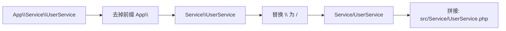

# [L2] Composer 自动加载机制与 PSR-4 规范

#### 一句话结论

Composer 通过 `spl_autoload_register` 注册加载器，按 PSR-4 规则将命名空间映射到文件路径。

#### 体系讲解

**原理：从手动 `require` 到自动加载**

早期 PHP 项目需要手动 `require` / `include` 每个文件。PHP 5.1 引入了 `spl_autoload_register()`，允许注册回调函数：当代码使用一个尚未定义的类时，PHP 自动调用注册的回调去加载对应文件。

Composer 正是基于此机制，在 `vendor/autoload.php` 中注册自动加载器，开发者只需在入口文件 `require 'vendor/autoload.php'` 一次，之后所有符合规则的类都会被自动加载。

**机制：Composer 的四种自动加载策略**

| 策略 | `composer.json` 配置 | 原理 | 适用场景 |
|---|---|---|---|
| **PSR-4** | `"autoload": {"psr-4": {...}}` | 命名空间前缀 → 目录前缀，一一映射 | 现代项目首选 |
| **PSR-0** | `"autoload": {"psr-0": {...}}` | 类似 PSR-4 但包含完整命名空间路径 | 旧项目兼容，已弃用 |
| **classmap** | `"autoload": {"classmap": [...]}` | 扫描目录生成类名→文件的映射表 | 无命名空间的遗留代码 |
| **files** | `"autoload": {"files": [...]}` | 每次请求都 `require` 指定文件 | 全局辅助函数文件 |

**PSR-4 的映射规则**

`composer.json` 配置示例：

```json
{
    "autoload": {
        "psr-4": {
            "App\\": "src/"
        }
    }
}
```

当代码中使用 `new App\Service\UserService()` 时，加载器按以下步骤查找：

1. 匹配命名空间前缀 `App\` → 基目录 `src/`
2. 去掉前缀，剩余 `Service\UserService`
3. 将 `\` 替换为目录分隔符 → `Service/UserService`
4. 拼接基目录 + `.php` → `src/Service/UserService.php`



**`composer dump-autoload` 的优化选项**

- `composer dump-autoload`：重新生成自动加载文件（修改 `composer.json` 后必须执行）。
- `composer dump-autoload -o`（`--optimize`）：生成 classmap 索引，PSR-4/PSR-0 的类也被预先映射，加载更快。
- `composer dump-autoload -a`（`--classmap-authoritative`）：只从 classmap 加载，跳过文件系统查找，最快但新增类不会被发现。

**结论：对开发的直接影响**

- 项目必须遵循"一个文件只定义一个类，类名与文件名一致"的约定。
- 新增类后如果使用的是 classmap 或优化模式，需要重新 `dump-autoload`。
- 生产部署时应使用 `composer dump-autoload -o` 或 `--classmap-authoritative` 提升性能。

#### 考察意图

- 验证候选人是否理解现代 PHP 项目的类加载机制，而非停留在手动 `require`
- 考察对 PSR-4 映射规则的掌握——这是排查"类找不到"问题的基础
- 判断候选人是否了解生产环境的自动加载优化

#### 追问链

1. `spl_autoload_register()` 的工作原理是什么？可以注册多个加载器吗？

   简答：`spl_autoload_register()` 将一个回调注册到自动加载队列。当使用未定义的类时，PHP 依次调用队列中的加载器，直到类被加载或队列耗尽。可以注册多个加载器，它们按注册顺序执行。Composer 的加载器通常注册为第一个（prepend）。

2. PSR-4 和 PSR-0 有什么区别？为什么 PSR-0 被弃用了？

   简答：PSR-0 要求完整命名空间对应完整目录结构（包括 vendor 前缀），且支持类名中的 `_` 转为目录分隔符（为兼容 PHP 5.3 之前无命名空间的代码）。PSR-4 简化了映射，去掉了前缀目录的冗余层级，不再支持 `_` 转换。PSR-0 已于 2014 年标记为弃用。

3. `composer install` 和 `composer update` 有什么区别？

   简答：`composer install` 按 `composer.lock` 安装精确版本，保证团队成员和部署环境一致。`composer update` 按 `composer.json` 的版本约束重新解析依赖，更新 `composer.lock`。生产部署和 CI 应始终使用 `composer install`，本地开发需要升级依赖时才用 `composer update`。

4. 为什么生产环境要执行 `composer dump-autoload -o`？

   简答：默认的 PSR-4 加载每次需要根据命名空间计算文件路径并检查文件是否存在（文件系统 I/O）。`-o` 选项预先扫描所有类并生成完整的类名→文件映射表（classmap），加载时直接查表，跳过路径计算和 `file_exists` 检查，显著减少 I/O。

#### 易错点

1. **修改 `composer.json` 的 autoload 后忘记 `dump-autoload`**：新增或修改了命名空间映射后必须执行 `composer dump-autoload`，否则自动加载器仍使用旧映射，导致"Class not found"。这是新手最常见的困惑。

2. **类名/文件名大小写不一致**：PSR-4 要求类名与文件名完全一致（含大小写）。在 macOS/Windows（文件系统不区分大小写）上开发不会报错，但部署到 Linux（区分大小写）后报"Class not found"。这是经典的跨平台 bug。

3. **混淆 `autoload` 和 `autoload-dev`**：`autoload-dev` 中的映射只在 `require-dev` 安装时生效（开发环境），生产环境 `composer install --no-dev` 不会加载这些映射。测试类的命名空间应放在 `autoload-dev` 中。

#### 代码示例

```php
<?php
// composer.json 配置
/*
{
    "autoload": {
        "psr-4": {
            "App\\": "src/",
            "App\\Tests\\": "tests/"
        },
        "files": [
            "src/helpers.php"
        ]
    },
    "autoload-dev": {
        "psr-4": {
            "App\\Tests\\": "tests/"
        }
    }
}
*/

// 目录结构:
// src/
//   Service/
//     UserService.php    ← App\Service\UserService
//   Repository/
//     UserRepository.php ← App\Repository\UserRepository
//   helpers.php          ← 全局辅助函数（files 加载）

// src/Service/UserService.php
namespace App\Service;

use App\Repository\UserRepository;

class UserService
{
    public function __construct(
        private UserRepository $repo,
    ) {}

    public function findById(int $id): ?array
    {
        return $this->repo->find($id);
    }
}

// 入口文件 index.php
// require __DIR__ . '/vendor/autoload.php';
//
// $service = new App\Service\UserService(
//     new App\Repository\UserRepository(),
// );
// 自动加载器将 App\Service\UserService → src/Service/UserService.php

// 手动注册自定义加载器（了解底层原理）
spl_autoload_register(function (string $class): void {
    $prefix = 'App\\';
    $baseDir = __DIR__ . '/src/';

    $len = strlen($prefix);
    if (strncmp($prefix, $class, $len) !== 0) {
        return; // 不属于该前缀，交给下一个加载器
    }

    $relativeClass = substr($class, $len);
    $file = $baseDir . str_replace('\\', '/', $relativeClass) . '.php';

    if (file_exists($file)) {
        require $file;
    }
});
```
