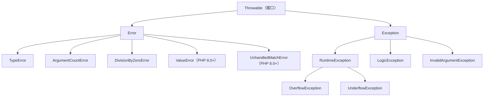

# [L2] PHP 中 Error 与 Exception 的区别及异常处理最佳实践

#### 一句话结论

Error 表示引擎级严重错误，Exception 表示业务级可恢复异常，二者共同实现 `Throwable` 接口。

#### 体系讲解

**原理：PHP 7 的异常体系重构**

PHP 7 之前，引擎级错误（如类型错误、除零）通过 `E_ERROR`、`E_WARNING` 等错误级别触发，无法用 `try-catch` 捕获，只能通过 `set_error_handler()` 处理部分非致命错误。致命错误会直接终止脚本，开发者束手无策。

PHP 7 引入了 `Throwable` 接口，将整个异常体系统一为两支：



**机制：Error vs Exception 的核心区别**

| 特性 | Error | Exception |
|---|---|---|
| 含义 | 引擎/编译级严重错误 | 业务逻辑可恢复异常 |
| 常见子类 | `TypeError`、`ParseError`、`DivisionByZeroError` | `RuntimeException`、`LogicException`、`InvalidArgumentException` |
| 是否应该捕获 | 通常不应在业务层捕获（说明代码有 bug） | 应该按场景捕获并处理 |
| 公共接口 | `Throwable` | `Throwable` |
| 可以 catch | ✅ PHP 7+ 可以 | ✅ 一直可以 |

**三种错误处理机制的关系**

1. **`try-catch-finally`**：捕获 `Throwable`（含 Error 和 Exception）。`finally` 块无论是否抛出异常都会执行。
2. **`set_error_handler()`**：捕获传统错误级别（`E_WARNING`、`E_NOTICE` 等）。**不能**捕获 `E_ERROR`。
3. **`set_exception_handler()`**：兜底处理未被 `catch` 的异常/错误，通常用于全局异常日志记录。

**结论：对开发的直接影响**

- 全局异常处理器（`set_exception_handler`）是生产环境的安全网，应在项目入口注册。
- 业务层 `catch` 应只捕获预期的 `Exception` 子类，不要无脑 `catch (\Throwable $e)` 吞掉所有错误。
- `TypeError` 等 Error 说明代码本身有缺陷（传参类型错误），应修复代码而非捕获 Error。

#### 考察意图

- 验证候选人是否理解 PHP 7+ 的异常体系结构，而非停留在 PHP 5 的认知
- 考察对 Error 和 Exception 设计意图的区分——是否知道"什么该捕获、什么不该捕获"
- 判断候选人是否具备工程化的异常处理习惯（自定义异常、全局兜底、日志记录）

#### 追问链

1. 为什么不应该在业务代码中 `catch (\Throwable $e)` 或 `catch (\Error $e)`？

   简答：`Error` 通常意味着代码 bug（如类型错误、调用不存在的方法），应该暴露并修复，而非捕获后静默处理。无差别捕获 `Throwable` 会掩盖真实问题，导致 bug 难以排查。业务层应只 `catch` 具体的 `Exception` 子类。

2. `set_error_handler()` 能捕获所有传统错误吗？

   简答：不能。`set_error_handler()` 能捕获 `E_WARNING`、`E_NOTICE`、`E_USER_*` 等，但**不能**捕获 `E_ERROR`、`E_PARSE`、`E_CORE_ERROR`、`E_COMPILE_ERROR`。致命错误只能通过 `register_shutdown_function()` + `error_get_last()` 做最后的日志记录。

3. `finally` 块在什么场景下必须使用？

   简答：需要释放资源的场景：关闭文件句柄、数据库连接、释放锁等。无论 `try` 块是否抛出异常，`finally` 都会执行，确保资源不泄漏。即使 `try` 或 `catch` 中有 `return`，`finally` 仍然会执行。

4. 如何设计项目的自定义异常体系？

   简答：建议按业务领域划分异常层级。定义一个项目根异常（如 `AppException extends RuntimeException`），再按模块细分（`OrderException`、`PaymentException`）。每个异常携带错误码（`$code`）和上下文数据。API 项目通过全局异常处理器将异常转换为统一的错误响应格式。

#### 易错点

1. **以为 `try-catch` 能捕获所有错误**：PHP 7 之前的 `E_ERROR` 和 `E_PARSE` 无法被 `try-catch` 捕获。PHP 7+ 的 `Error` 可以被 `catch`，但传统错误级别（如 `E_WARNING`）仍然走 `set_error_handler()` 通道，不会被 `try-catch` 拦截。

2. **空的 `catch` 块吞掉异常**：`catch (Exception $e) { }` 静默吞掉异常是最危险的做法。至少应记录日志。面试中如果候选人写出空 `catch`，面试官会追问"为什么不处理"。

3. **混淆 `Error` 和传统错误级别**：`TypeError` 是 PHP 7+ 的 `Error` 类（可 `catch`），而 `E_WARNING` 是传统错误级别（走 `set_error_handler`）。两者是不同的体系，候选人容易混为一谈。

#### 代码示例

```php
<?php

// 1. Error vs Exception 的捕获
function divide(int $a, int $b): float
{
    if ($b === 0) {
        throw new \InvalidArgumentException('除数不能为零');
    }
    return $a / $b;
}

// 捕获业务异常
try {
    echo divide(10, 0);
} catch (\InvalidArgumentException $e) {
    echo "业务异常: {$e->getMessage()}\n";
}

// TypeError — 代码 bug，通常不应在业务层捕获
function greet(string $name): string
{
    return "Hello, {$name}";
}

try {
    // @phpstan-ignore argument.type
    greet(123); // PHP 严格模式下抛出 TypeError
} catch (\TypeError $e) {
    echo "类型错误: {$e->getMessage()}\n";
    // ⚠️ 正确做法是修复调用方代码，而非在此捕获
}

// 2. 自定义异常体系
class AppException extends \RuntimeException
{
    public function __construct(
        string $message,
        int $code = 0,
        private array $context = [],
        ?\Throwable $previous = null,
    ) {
        parent::__construct($message, $code, $previous);
    }

    public function getContext(): array
    {
        return $this->context;
    }
}

class OrderException extends AppException {}

// 抛出携带上下文的业务异常
throw new OrderException(
    message: '库存不足',
    code: 4001,
    context: ['product_id' => 42, 'requested' => 10, 'available' => 3],
);

// 3. 全局异常处理器（项目入口注册）
set_exception_handler(function (\Throwable $e): void {
    error_log(sprintf(
        "[%s] %s in %s:%d\n%s",
        get_class($e),
        $e->getMessage(),
        $e->getFile(),
        $e->getLine(),
        $e->getTraceAsString(),
    ));

    if ($e instanceof AppException) {
        http_response_code(400);
        echo json_encode([
            'error'   => $e->getMessage(),
            'code'    => $e->getCode(),
            'context' => $e->getContext(),
        ]);
    } else {
        http_response_code(500);
        echo json_encode(['error' => 'Internal Server Error']);
    }
});

// 4. finally 确保资源释放
function readConfig(string $path): array
{
    $handle = fopen($path, 'r');
    try {
        $content = fread($handle, filesize($path));
        return json_decode($content, true, flags: JSON_THROW_ON_ERROR);
    } catch (\JsonException $e) {
        throw new AppException("配置文件 JSON 格式错误: {$path}", 5001, previous: $e);
    } finally {
        fclose($handle); // 无论是否异常都关闭文件
    }
}
```
