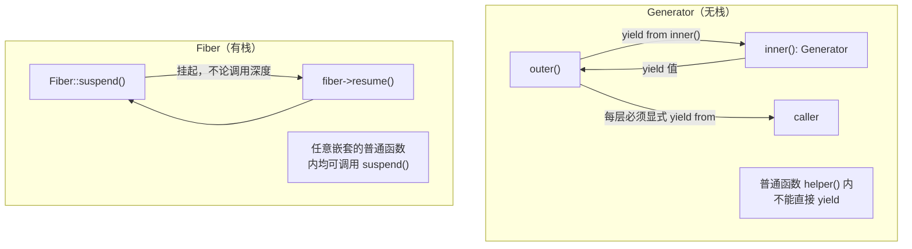

# [L3] Fiber 与 Generator 有栈协程与无栈协程的本质区别

#### 一句话结论

Generator 是编译器生成的状态机（无栈协程），`yield` 只能挂起当前函数帧；Fiber 持有独立的 C 执行栈（有栈协程），可在任意调用深度调用 `Fiber::suspend()` 挂起。

#### 体系讲解

**无栈协程：Generator 的状态机实现**

PHP 编译器将含 `yield` 的函数编译为一个实现了 `Iterator` 接口的状态机对象（`Generator` 类实例）。每次 `yield` 时，状态机保存：

- 当前函数的局部变量快照
- 下次恢复的 opcode 偏移量（执行位置）

**关键限制**：`yield` 只能出现在 Generator 函数本身内，无法在其调用的普通函数中使用——这意味着挂起能力不会穿透调用栈。

> ⚠️ 需查证：Generator 编译为状态机的内部实现细节参见 PHP 源码 `Zend/zend_generators.c`。

`yield from` 可以将执行委托给另一个 Generator 或可迭代对象，但每一层嵌套都必须显式加 `yield from`，无法透明地在中间某层的普通函数内自动挂起。

**有栈协程：Fiber 的独立执行栈**

PHP 8.1 引入的 Fiber 持有一个独立的 C 级执行栈。`Fiber::suspend()` 可以在 Fiber 内部**任意深度的调用栈**中调用，挂起时引擎保存整个调用栈（寄存器状态、栈帧链），恢复时从被挂起的位置继续执行。

> ⚠️ 需查证：Fiber 的底层栈切换机制以 PHP 源码 `Zend/zend_fibers.c` 及实际使用的第三方栈切换库（Boost.Context 或 `ucontext`）为准，具体实现因平台而异。

**Fiber 状态机**

```mermaid
stateDiagram-v2
    [*] --> created : new Fiber(callable)
    created --> running : fiber->start()
    running --> suspended : Fiber::suspend()
    suspended --> running : fiber->resume()
    running --> terminated : callable 返回
    terminated --> [*]
```

**嵌套挂起能力对比**



**核心能力对比**

| 维度 | Generator（无栈协程） | Fiber（有栈协程） |
|------|---------------------|-----------------|
| 引入版本 | PHP 5.5 | PHP 8.1 |
| 内部实现 | 编译器状态机 | 独立 C 执行栈 |
| 挂起位置 | 只能在 Generator 函数内 `yield` | 任意调用深度均可 `Fiber::suspend()` |
| 嵌套挂起 | 需逐层 `yield from` 显式传播 | 无需修改中间调用链 |
| 内存开销 | 极低（只保存局部变量快照） | 较高（需分配完整 C 栈空间） |
| 主要用途 | 惰性数据流、迭代器、简单生成器 | 异步 I/O 协程、复杂流程控制 |
| 双向通信 | `send()` / `throw()` | `start($val)` / `resume($val)` |

**结论：选型指导**

- **Generator**：适合数据生成/惰性求值场景（大文件逐行读取、无限数列、流式 API 响应）。内存开销极低，无需引入额外机制。
- **Fiber**：适合需要在任意位置挂起的异步协程场景（配合 Revolt/AMPHP/ReactPHP 事件循环实现非阻塞 I/O）。代价是每个 Fiber 需要分配独立栈空间。

#### 考察意图

- 验证候选人是否能区分"有栈协程"与"无栈协程"这两个核心概念，而非将 Fiber 和 Generator 混为"PHP 的两种协程"
- 考察候选人是否理解 `yield from` 的局限性（只能传播到 Generator，无法穿透普通函数）
- 检验候选人在实际项目中选择 Generator 还是 Fiber 的判断依据

#### 追问链

1. **为什么在普通函数中不能直接 `yield`？**

   简答：`yield` 是 Generator 函数的语法，编译器在看到 `yield` 时会将整个函数编译为 Generator 状态机；在普通函数（不含 `yield`）中直接调用另一个 Generator 函数只是调用了它的构造过程，并不会将 `yield` 的暂停语义传播到当前调用栈。要在嵌套结构中传播 yield，必须在每一层都使用 `yield from`，整个调用链都必须是 Generator 函数。

2. **`yield from` 与 `Fiber::suspend()` 的嵌套能力差异在实际开发中意味着什么？**

   简答：使用 Generator 实现协程时（如早期的 ReactPHP Coroutine 方案），代码中每个可能被挂起的中间层函数都必须改为 Generator 并加 `yield from`，会引发"颜色问题"（function color problem）——异步函数与同步函数不能自由混用。Fiber 消除了这一限制：中间层函数无需改动，`Fiber::suspend()` 可在任意位置调用，对调用者透明。

3. **Fiber 的栈空间默认大小是多少？可以配置吗？**

   简答：⚠️ 需查证（实现因平台和版本而异）。根据 PHP RFC，Fiber 使用的栈初始大小可通过构造参数或配置指定，实现上依赖 Boost.Context 或平台 `ucontext`。在生产环境中大量创建 Fiber 时需关注总内存消耗，这是 Fiber 相较于 Generator 最主要的代价。

4. **能否用 Generator 完全替代 Fiber 来实现异步 I/O？**

   简答：技术上可行（如旧版 ReactPHP 和 amphp/amp v2 使用 Generator 驱动协程），但有明显局限：调用链中所有函数必须改为 Generator，代码侵入性强；遇到未改造的第三方同步代码时无法挂起。Fiber 的出现（PHP 8.1）正是为了解决这一问题，amphp/amp v3 和 Revolt 已全面迁移到 Fiber。

#### 易错点

1. **认为 `yield from` 等价于 Fiber 的嵌套挂起能力**：`yield from` 只能委托给另一个 Generator 或可迭代对象，无法穿透普通函数。如果调用链中某一层是普通函数（非 Generator），`yield from` 链条在那里断裂，无法将挂起语义向上传播。

2. **认为 Generator 的内存开销与 Fiber 相同**：Generator 只保存当前函数的局部变量快照（非常轻量）；Fiber 需要分配独立的 C 执行栈（远重于 Generator）。在需要创建大量并发单元（如处理数万个并发连接）时，两者的内存消耗差距显著。

3. **混淆双向通信 API**：Generator 用 `$gen->send($val)` 向内传值，`yield` 表达式接收；Fiber 用 `$fiber->resume($val)` 向内传值，`Fiber::suspend()` 返回值接收。两者语义相近但 API 不同，实现细节也有差异（Fiber 支持在 `start()` 时传入初始值）。

#### 代码示例

```php
<?php

// ——— 场景 1：Generator（无栈）——嵌套 yield from 必须逐层传播 ———

function innerGen(): Generator
{
    yield 'inner-1';
    yield 'inner-2';
}

function outerGen(): Generator
{
    yield 'outer-before';
    yield from innerGen(); // 必须显式 yield from，否则内层 yield 不传播
    yield 'outer-after';
}

foreach (outerGen() as $v) {
    echo $v . PHP_EOL; // outer-before / inner-1 / inner-2 / outer-after
}

echo "---\n";

// ——— 场景 2：Fiber（有栈）——任意深度均可 suspend ———

function deepHelper(): void
{
    // 普通函数（非 Generator）内可直接调用 Fiber::suspend()
    echo "helper: before suspend\n";
    $received = Fiber::suspend('from-deep-helper'); // 挂起整个 Fiber 调用栈
    echo "helper: resumed with '{$received}'\n";
}

$fiber = new Fiber(function (): void {
    echo "fiber: start\n";
    deepHelper(); // 无需任何改造，suspend 穿透调用栈
    echo "fiber: end\n";
});

$val = $fiber->start();              // 输出 "fiber: start" / "helper: before suspend"
echo "main: fiber suspended with '{$val}'\n"; // from-deep-helper
$fiber->resume('hello');             // 输出 "helper: resumed with 'hello'" / "fiber: end"
```
