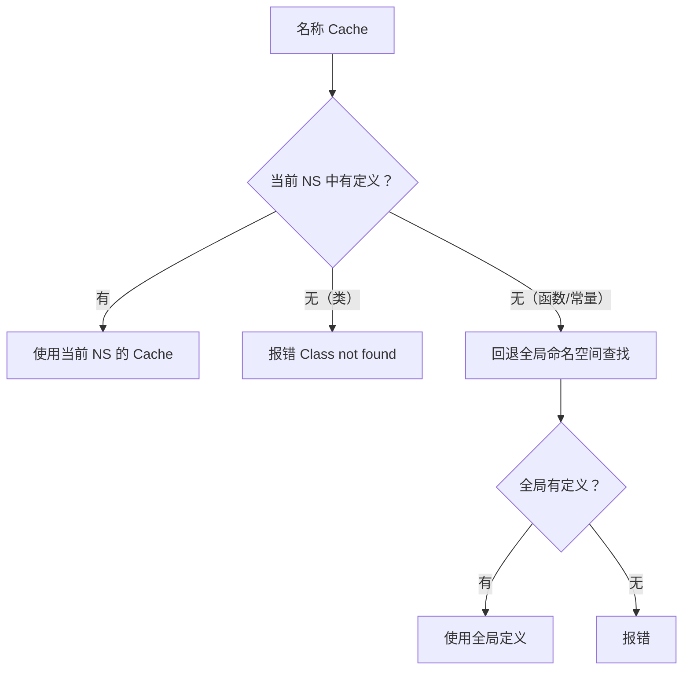

# [L2] PHP 命名空间的解析规则与别名机制

#### 一句话结论

命名空间通过非限定/限定/完全限定三种名称形式隔离代码，`use`/`as` 解决跨命名空间引用与同名冲突。

#### 体系讲解

**原理：为什么需要命名空间**

PHP 5.3 之前，所有类/函数/常量共享全局作用域，第三方库极易发生名称冲突（如两个库都定义了 `Cache` 类）。命名空间将代码隔离到独立的虚拟层级，类似文件系统目录，从根本上消除冲突风险。

**机制：三种名称形式与解析规则**

| 形式 | 写法示例 | 解析规则 |
|---|---|---|
| 非限定名称 | `Cache` | 当前命名空间下查找；**类**找不到直接报错，**函数/常量**找不到自动回退全局 |
| 限定名称 | `Http\Cache` | 相对当前命名空间，等价于 `当前NS\Http\Cache` |
| 完全限定名称 | `\App\Http\Cache` | 从全局根开始的绝对路径，不受当前命名空间影响 |

> 类名与函数/常量的非限定解析存在关键差异：类名找不到**不会自动回退全局**，函数和常量会。



**`use` / `as`：别名机制**

```php
use App\Http\Controllers\UserController;          // 导入类，直接用 UserController
use App\Http\Controllers\UserController as UC;    // 别名，用 UC
use function App\Utils\formatDate;                // 导入函数
use const App\Config\MAX_RETRY;                  // 导入常量
```

同文件引用两个同名类时，为其中一个（或两个）设置别名：

```php
use GuzzleHttp\Psr7\Response as GuzzleResponse;
use Illuminate\Http\Response;
```

**实践结论**

- 引用内置类（`Exception`、`ArrayAccess`）：有命名空间的文件中，`new Exception()` 查找 `当前NS\Exception`，建议写 `new \Exception()` 或顶部 `use Exception`，意图清晰且安全。
- 限定名是**相对路径**，不是绝对路径；完全限定名（`\` 开头）才是绝对路径。
- PHP 的命名空间分隔符 `\` 只是字符串约定，`App\Http` 和 `App` 是完全独立的两个命名空间，不存在继承或包含关系。

#### 考察意图

- 验证候选人是否理解三种名称形式的解析差异，以及类与函数/常量的解析差异
- 考察在实际开发中（同名冲突、引用全局类）能否正确选用别名
- 判断候选人是否踩过"非限定类名不回退全局"这一经典陷阱

#### 追问链

1. 非限定类名和非限定函数名的解析规则有何不同？

   简答：类名在当前命名空间找不到时**不会**自动回退全局，直接报 `Class not found`；函数和常量的非限定名找不到时，PHP 会自动回退全局命名空间查找。这就是为什么调用内置函数 `strlen()` 不需要 `\strlen()`，但 `new Exception()` 在有命名空间的文件中建议写 `new \Exception()`。

2. `use` 语句可以写在函数/方法体内吗？

   简答：不能。`use` 语句只能在命名空间块顶部或文件顶层使用。方法体内的 `use` 是匿名函数的**变量捕获**语法，与类导入完全不同，编写时需注意上下文区分。

3. 子命名空间之间有继承或包含关系吗？

   简答：没有。`App\Http` 和 `App` 是完全独立的两个命名空间，`App\Http` 无法自动访问 `App` 下的任何内容，必须通过完整的 `use` 或完全限定名引用。`\` 只是命名约定，不代表层级关系。

4. 同一文件能否声明多个命名空间？

   简答：语法上允许，但强烈不推荐。多命名空间有两种写法：花括号块语法（`namespace A { ... } namespace B { ... }`）或连续声明。实践中每个文件对应单一命名空间（与 PSR-4 一致），多命名空间仅在合并构建工具生成的单文件场景出现。

#### 易错点

1. **非限定类名不回退全局**：候选人常以为"类找不到就用全局的"，实际上仅函数/常量有此特性。在有命名空间的文件中，`new Exception()` 会查找 `当前NS\Exception`，找不到报错，而非自动使用 `\Exception`。

2. **限定名是相对路径而非绝对路径**：在 `App` 命名空间中，直接写限定名 `Http\Cache` 解析为 `App\Http\Cache`（相对路径），而非全局的 `\Http\Cache`（绝对路径）。若要引用全局的 `\Http\Cache`，必须写完全限定名或 `use \Http\Cache` 显式导入。初学者常误以为带分隔符就是绝对路径。

3. **`use` 的作用域仅限当前文件**：`use` 导入的别名不会跨文件传递，也不会在 `require`/`include` 的文件中生效。每个文件必须独立声明自己需要的 `use`。

#### 代码示例

```php
<?php
// 文件：src/Http/Router.php
namespace App\Http;

use App\Models\User;            // 完全限定类导入，别名 User
use Exception as BaseException; // 内置类别名（明确意图，避免找当前 NS\Exception）

class Router
{
    public function resolve(string $path): User
    {
        if (empty($path)) {
            throw new BaseException('Path cannot be empty');
            // 等价于：throw new \Exception(...)
            // 若不 use 且不加 \，PHP 会找 App\Http\Exception → 报错
        }

        return new User(); // 由 use 导入，解析为 App\Models\User
    }
}

// ---------- 三种名称形式对比 ----------
namespace Demo;

use PDO;                           // 将全局 \PDO 导入当前 NS
use App\Http\Router as HttpRouter; // 完全限定 + 别名

class Test
{
    public function run(): void
    {
        // 完全限定名：绝对路径，始终指向全局 \PDO
        $conn1 = new \PDO('sqlite::memory:');

        // 非限定名（有 use PDO）：通过 use 解析为 \PDO，等价于上面
        $conn2 = new PDO('sqlite::memory:');

        // 别名调用
        $router = new HttpRouter();

        // 限定名（相对路径）：解析为 Demo\Sub\Helper
        // 仅当 Demo\Sub\Helper 实际存在时有效
        // $helper = new Sub\Helper();
    }
}

// ---------- 同名冲突解决 ----------
namespace Conflict;

use GuzzleHttp\Psr7\Response as GuzzleResponse;
use Illuminate\Http\Response; // 保留原名

function demo(): void
{
    $a = new GuzzleResponse(200);
    $b = new Response();
    // 两个 Response 共存，无冲突
}
```
