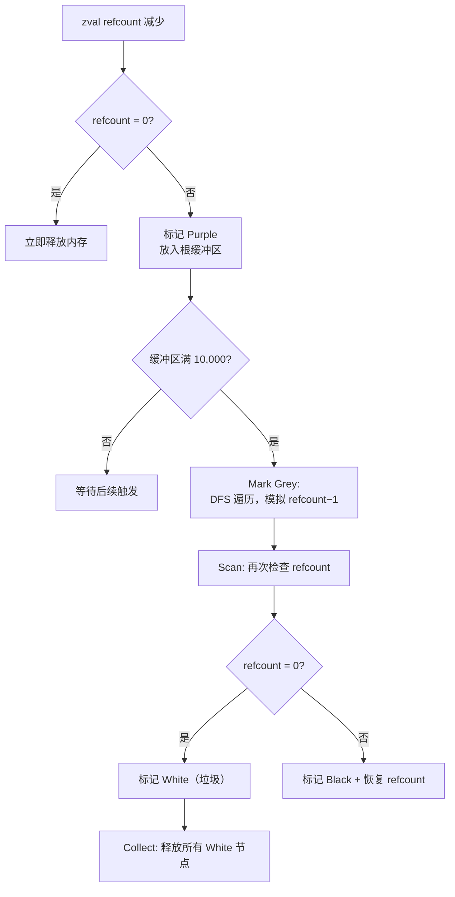

# [L3] PHP 的垃圾回收机制是如何工作的

#### 一句话结论

引用计数为主、循环引用收集器为辅，二者协同避免内存泄漏。

#### 体系讲解

**原理：为什么需要两层机制**

PHP 变量底层以 zval 容器存储，每个 zval 维护一个引用计数（refcount）。当变量的 refcount 降为 0 时，内存立即释放——这是第一层，覆盖绝大多数场景。

但引用计数有一个已知缺陷：无法处理循环引用。当对象 A 持有对 B 的引用、B 同时持有对 A 的引用，即使外部已无变量指向它们，两者的 refcount 仍为 1，永远无法降至 0，内存也就永远无法释放。这就需要第二层：循环引用收集器（Cycle Collector）。

**机制：循环引用收集器如何工作**

PHP 5.3 起引入的循环引用收集器，基于 David F. Bacon 与 V.T. Rajan 2001 年论文 [*Concurrent Cycle Collection in Reference Counted Systems*](https://pages.cs.wisc.edu/~cymen/misc/interests/Bacon01Concurrent.pdf) 的同步变体。

> 以下算法描述来源于 PHP 官方文档 [Collecting Cycles](https://www.php.net/manual/en/features.gc.collecting-cycles.php)。

核心流程分四步：

1. **收集疑似根（Purple）**：当 zval 的 refcount 减少但未降至 0 时，该 zval 被标记为"疑似垃圾根"放入根缓冲区（root buffer）。根缓冲区固定容量为 10,000 个根节点（源码中的 `GC_THRESHOLD_DEFAULT` 常量，可重新编译修改）。

2. **模拟删除（Mark Grey）**：根缓冲区满时，收集算法启动。从每个疑似根出发做深度优先遍历，对所引用的每个 zval 执行 refcount−1（模拟移除引用），并标记为灰色。同一 zval 不重复处理。

3. **扫描定性（Scan — White / Black）**：再次深度优先遍历。若 zval 的 refcount 已被减至 0，说明仅被循环引用维持，标记为白色（确认垃圾）；若 refcount 仍 > 0，说明还有外部引用，恢复其 refcount 并标记为黑色（非垃圾）。

4. **回收白色节点（Collect White）**：遍历根缓冲区，释放所有标记为白色的 zval，完成回收。

除了等缓冲区满自动触发外，也可通过 `gc_collect_cycles()` 随时手动触发收集。



**结论：对开发的直接影响**

- **PHP-FPM 短请求模式**：请求结束后 SAPI 层释放整个请求内存，GC 压力极小，循环引用即使存在也不会长期累积。
- **长驻进程（Swoole Worker、守护脚本、队列消费者）**：不存在"请求结束释放"的兜底，循环引用会持续累积，必须关注 GC 行为。
- **批量处理场景**：可通过 `gc_disable()` 暂时避免收集器频繁介入，处理完毕后 `gc_enable()` + `gc_collect_cycles()` 一次性清理。

#### 考察意图

- 验证候选人是否理解 PHP 内存管理的**两层机制**，而非只知"引用计数归零即释放"
- 考察对循环引用问题的认知——这是实际项目中最常见的 PHP 内存泄漏根因
- 区分"背过八股"和"真正理解"：能否说清根缓冲区触发机制，能否结合长驻进程场景分析 GC 策略

#### 追问链

1. PHP 中什么情况下引用计数机制无法回收内存？请举一个最简单的例子。

   简答：对象 A 持有对 B 的引用，B 同时持有对 A 的引用。外部 `unset` 后两者 refcount 仍为 1，无法降至 0。数组自引用 `$a = []; $a[] = &$a;` 也是同理。

2. 循环引用收集器是实时运行的吗？什么条件下会触发？

   简答：不是实时运行。只在根缓冲区存满 10,000 个疑似根时自动触发，或者通过 `gc_collect_cycles()` 手动触发。两次触发之间，循环引用垃圾暂驻内存。

3. 在 Swoole 等长驻进程场景下，GC 策略需要做哪些调整？

   简答：长驻进程没有请求结束后的内存重置，循环引用会持续累积。应当：用 `gc_status()` 监控回收情况；在业务逻辑中主动断开不需要的循环引用；在请求处理完毕后酌情手动调用 `gc_collect_cycles()`。

4. `gc_disable()` 在什么场景下是合理的？有什么风险？

   简答：批量导入、数据迁移等短时间创建大量临时对象的场景中，禁用 GC 可避免收集器反复扫描的开销。风险是禁用期间循环引用无法回收，内存会持续增长。正确姿势是先 `gc_collect_cycles()` 清空缓冲区，再 `gc_disable()`，处理完后 `gc_enable()` + `gc_collect_cycles()`。

5. PHP 的 GC 与 Java / Go 的 GC 有什么本质区别？

   简答：PHP 以引用计数为主，仅在处理循环引用时才启动追踪式收集（同步 stop-the-world）。Java 以分代追踪式 GC 为主（G1/ZGC），Go 使用三色标记并发 GC。PHP 的方案在短生命周期请求模型下效率很高——多数对象 refcount 归零即时释放，无需等 GC 周期；但在长驻进程场景下不如 Java / Go 的并发收集器成熟。

#### 易错点

1. **误以为 PHP 只有引用计数**：很多候选人答完"refcount 为 0 就释放"便结束，完全忽略循环引用收集器。在 L3 面试中只答出一半机制是致命缺陷。

2. **混淆"请求结束释放"与"GC 回收"**：PHP-FPM 请求结束时释放内存是 SAPI 层面的行为，和 GC 收集器是两个独立机制。候选人常以"反正请求结束就释放了"为由忽略 GC，但在长驻进程中这个假设不成立。

3. **以为 `unset()` 一定释放内存**：`unset()` 只是将变量从符号表中移除并将 refcount 减 1。如果还有其他引用（包括循环引用）指向该 zval，内存不会释放。

#### 代码示例

```php
<?php

class Node
{
    public function __construct(
        public string $name,
        public ?Node $next = null,
    ) {}

    public function __destruct()
    {
        echo "销毁: {$this->name}\n";
    }
}

gc_collect_cycles();

// 场景 1：无循环引用 — refcount 归零即释放
echo "--- 场景 1：正常释放 ---\n";
$a = new Node('A');
unset($a); // 立即输出 "销毁: A"

// 场景 2：循环引用 — unset 后不会立即释放
echo "\n--- 场景 2：循环引用 ---\n";
$b = new Node('B');
$c = new Node('C');
$b->next = $c;
$c->next = $b; // B → C → B 形成循环

unset($b, $c); // 不会输出销毁信息，refcount 仍 > 0
echo "unset 后尚未销毁\n";

$collected = gc_collect_cycles();
echo "GC 回收了 {$collected} 个对象\n"; // 输出销毁信息

// 场景 3：查看 GC 运行状态
echo "\n--- 场景 3：GC 状态 ---\n";
print_r(gc_status());
```
