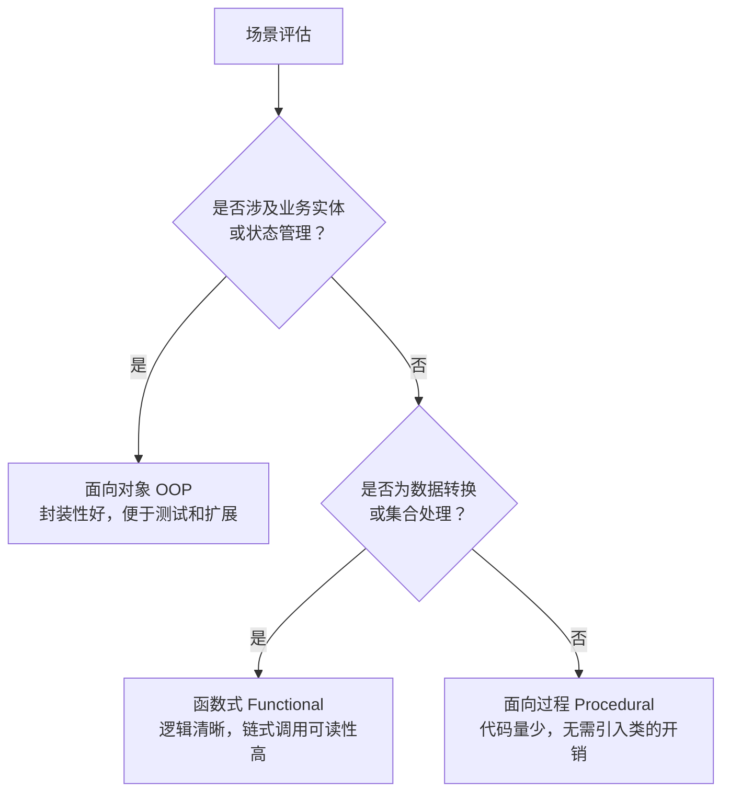

# [L2] PHP 多范式编程与场景选型

#### 一句话结论

PHP 是多范式语言，支持面向过程、OOP 与函数式，按场景复杂度和团队规范选型。

#### 体系讲解

**PHP 支持的三种主要范式**

| 范式 | 核心思想 | PHP 中的典型载体 |
|---|---|---|
| 面向过程（Procedural） | 以函数为单位，顺序执行 | 全局函数、procedural 脚本 |
| 面向对象（OOP） | 以对象为单位，封装状态与行为 | class / interface / trait / abstract |
| 函数式（Functional） | 以纯函数为单位，避免副作用 | 闭包、高阶函数、`array_map/filter/reduce` |

**设计意图：为什么 PHP 不强制单一范式？**

PHP 起源于面向过程的模板语言，随版本演进逐步完善 OOP（PHP 5）和函数式特性（PHP 5.3 闭包）。保持多范式的核心目的是**降低使用门槛、覆盖更广的应用场景**——从简单脚本到复杂业务系统，开发者可以按需选择。

**各范式的选型决策**



**混用的典型案例**

Laravel 的 `Collection` 是 OOP 与函数式混用的经典设计：外层是对象（OOP 封装状态），内部操作通过 `map()`、`filter()`、`reduce()` 实现函数式数据变换，两者相互增强而不冲突。

#### 考察意图

验证候选人是否理解 PHP 的语言设计哲学，以及是否具备在实际工程中做出合理范式选型的判断力，而非教条地坚持"一切皆对象"或"只写函数"。

#### 追问链

1. **PHP 函数式编程的三个核心工具是什么？**  
   简答：闭包（Closure）、高阶函数（将函数作为参数或返回值）、以及 `array_map` / `array_filter` / `array_reduce` 等内置集合操作函数。

2. **纯函数（Pure Function）的定义是什么？PHP 原生支持不可变数据吗？**  
   简答：纯函数指相同输入始终返回相同输出、且无副作用的函数。PHP 原生不支持不可变数据结构（无 `const` 数组等），需靠约定或第三方库（如 `azjezz/psl`）来模拟。

3. **什么情况下 OOP 反而是过度设计？**  
   简答：逻辑简单、无状态、无需复用时（如单次数据格式转换脚本），强行封装成类会带来不必要的复杂度，面向过程或函数式更合适。

4. **Laravel Collection 的链式调用体现了哪种范式混用？**  
   简答：OOP（`Collection` 对象封装数据集合）+ 函数式（`map/filter/reduce` 操作不修改原集合，每步返回新 `Collection` 实例），是两种范式协作的典型实践。

#### 易错点

1. **认为"PHP 支持 OOP"等于"PHP 是纯面向对象语言"**：PHP 不强制一切皆类，全局函数和过程式代码完全合法。与 Java（一切必须在类中）有本质区别。

2. **把"用了函数"等同于"函数式编程"**：函数式编程的核心是**纯函数 + 无副作用**，而非简单地调用函数。一个修改全局变量的函数恰恰违背函数式原则。

3. **忽略范式混用的边界**：混用不等于随意混用。同一模块内频繁切换范式会导致代码风格割裂，可维护性下降。团队应在架构层面约定各层的范式规范（如：领域层用 OOP，数据处理层用函数式）。

#### 代码示例

以"过滤活跃用户并提取邮箱列表"为例，对比三种范式写法：

```php
<?php

$users = [
    ['name' => 'Alice', 'active' => true,  'email' => 'alice@example.com'],
    ['name' => 'Bob',   'active' => false, 'email' => 'bob@example.com'],
    ['name' => 'Carol', 'active' => true,  'email' => 'carol@example.com'],
];

// --- 面向过程 ---
function getActiveEmails(array $users): array {
    $emails = [];
    foreach ($users as $user) {
        if ($user['active']) {
            $emails[] = $user['email'];
        }
    }
    return $emails;
}
var_dump(getActiveEmails($users));

// --- 面向对象 ---
class UserCollection {
    public function __construct(private array $users) {}

    public function filterActive(): static {
        return new static(array_filter($this->users, fn($u) => $u['active']));
    }

    public function pluck(string $field): array {
        return array_column(array_values($this->users), $field);
    }
}
var_dump((new UserCollection($users))->filterActive()->pluck('email'));

// --- 函数式 ---
$getActiveEmails = fn(array $users): array =>
    array_map(
        fn($u) => $u['email'],
        array_filter($users, fn($u) => $u['active'])
    );
var_dump(array_values($getActiveEmails($users)));
// 三种写法输出均为：['alice@example.com', 'carol@example.com']
```
