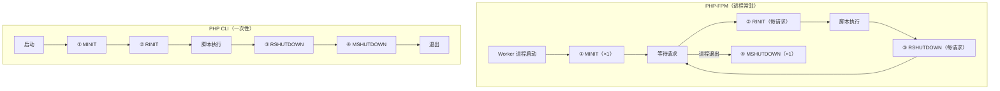

# [L3] PHP 请求生命周期的四个阶段

#### 一句话结论

PHP 引擎通过 MINIT/RINIT/RSHUTDOWN/MSHUTDOWN 四个钩子管理生命周期：FPM 下 MINIT/MSHUTDOWN 绑定进程级（触发一次），RINIT/RSHUTDOWN 随每次请求触发。

#### 体系讲解

**SAPI：引擎与宿主环境的抽象边界**

SAPI（Server Application Programming Interface）是 PHP 引擎与外部宿主环境之间的抽象层。每种运行方式对应一个 SAPI 实现：`fpm-fcgi`（PHP-FPM）、`cli`（命令行）、`apache2handler`（mod_php）等。SAPI 负责初始化 I/O 流、向引擎传递请求参数、协调生命周期钩子的调用时机。

> ⚠️ 需查证：生命周期各阶段的具体触发顺序以 PHP 扩展开发文档 [php.net/manual/en/internals2.structure.lifecycle.php](https://www.php.net/manual/en/internals2.structure.lifecycle.php) 及 PHP 源码 `main/main.c` 为准。

**四个生命周期阶段**

PHP 扩展通过四个宏函数嵌入引擎生命周期：

| 阶段 | 宏函数 | 触发时机 | 主要工作 |
|------|--------|---------|---------|
| 模块初始化（MINIT） | `PHP_MINIT_FUNCTION` | 进程/模块启动，执行一次 | 注册函数/类/INI 条目、分配全局内存 |
| 请求初始化（RINIT） | `PHP_RINIT_FUNCTION` | 每个请求开始前 | 填充超全局变量（`$_GET/$_POST/$_SERVER`）、重置执行器全局变量（EG） |
| 请求关闭（RSHUTDOWN） | `PHP_RSHUTDOWN_FUNCTION` | 每个请求结束后 | 释放请求级资源、执行 `register_shutdown_function` 回调、运行析构队列 |
| 模块关闭（MSHUTDOWN） | `PHP_MSHUTDOWN_FUNCTION` | 进程/模块退出，执行一次 | 释放全局内存、注销 INI 条目 |

**FPM vs CLI 触发差异**



CLI 下四个阶段各执行一次；FPM 下 MINIT/MSHUTDOWN 与 Worker 进程生命周期绑定，RINIT/RSHUTDOWN 伴随每个 HTTP 请求执行。

**超全局变量的填充时机**

`$_GET`、`$_POST`、`$_SERVER`、`$_COOKIE` 等超全局变量在 **RINIT 阶段**由 SAPI 模块（如 `sapi/fpm/fpm_main.c`）读取 FastCGI 参数后填充，每次请求独立初始化。这是 PHP-FPM"天然请求隔离"的引擎级保证。

**结论：对常驻内存框架的影响**

Swoole/RoadRunner/FrankenPHP 等常驻内存框架以 CLI SAPI 运行，进程长期存活，RINIT/RSHUTDOWN 不再随每个请求触发。超全局变量、静态属性、单例对象的状态跨请求持续存在，框架需要手动模拟 RINIT/RSHUTDOWN 的清理工作（如 Laravel Octane 的 `sandbox` 机制）。

#### 考察意图

- 验证候选人是否理解 PHP 请求隔离的**引擎级来源**：不是 PHP 语言自动清理，而是 RINIT/RSHUTDOWN 钩子重置了执行上下文
- 考察候选人能否从生命周期角度解释常驻内存框架（Swoole/Octane）的状态污染根因
- 检验候选人对 PHP 扩展开发基础的认知：MINIT 注册扩展功能，RINIT 初始化请求状态

#### 追问链

1. **超全局变量 `$_POST` 在 PHP-FPM 和 Swoole 下的填充方式有何差异？**

   简答：FPM 下，RINIT 阶段由 FastCGI SAPI 读取请求体并填充 `$_POST`，每请求独立重置。Swoole 框架下进程常驻，RINIT 不随请求触发，`$_POST` 不自动重置，框架（Hyperf/Octane）需在每次请求回调开始时将 Swoole 的 `$request` 对象手动映射到 `$_POST`。

2. **修改 php.ini 后是否一定要 restart PHP-FPM，还是 reload 就够了？**

   简答：php.ini 在 MINIT 阶段加载，reload（USR2 信号）会触发优雅重启：旧 Worker 处理完当前请求后退出，新 Worker 进程启动时重新执行 MINIT，因此 reload 即可加载新的 php.ini 配置。只有 FPM 主进程自身的配置变更（如监听地址、`pm.max_children`）才需要 restart。

3. **`register_shutdown_function` 注册的回调与 `__destruct` 的执行顺序是什么？**

   简答：顺序为：脚本主体执行结束 → shutdown functions 执行（此时对象仍存活）→ 对象析构（`__destruct`，引用计数归零时）→ RSHUTDOWN 钩子。在 fatal error 等异常终止场景下，shutdown functions 仍会执行，但 RSHUTDOWN 未必能完整运行。

4. **在 PHP-FPM Worker 中，PHP 扩展用 `ZEND_BEGIN_MODULE_GLOBALS` 定义的全局变量会在请求间自动重置吗？**

   简答：不会。通过 `ZEND_BEGIN_MODULE_GLOBALS` 定义的 C 层全局变量不在 EG（Executor Globals）中，RINIT 不会自动重置它们，需要扩展自行在 `PHP_RINIT_FUNCTION` 中手动初始化请求级状态。相比之下，PHP 脚本中的类/函数/静态属性属于 EG 的符号表，随 RINIT 重置。

#### 易错点

1. **混淆 MINIT 与 RINIT 的触发频率**：候选人常误以为 MINIT 每次请求触发。正确理解是 MINIT 绑定进程级，在 Worker 进程启动时执行一次；RINIT 绑定请求级，每次请求前触发。这也解释了为什么更改扩展编译选项后必须重启 Worker 进程，而非仅 reload。

2. **认为常驻框架"继承了"FPM 的请求隔离能力**：Swoole/RoadRunner 以 CLI SAPI 运行，RINIT/RSHUTDOWN 不随请求触发，PHP 本身不会重置超全局变量和静态属性。框架需通过沙箱（sandbox）或协程上下文机制主动实现隔离，未处理好的项目会出现跨请求数据污染 Bug。

3. **误以为修改 php.ini 必须 restart 才生效**：reload 触发 Worker 优雅重启，新 Worker 进程会重新经历 MINIT 并读取新的 php.ini。只有 FPM master 进程自身的监听/进程配置变更才需要 restart。

#### 代码示例

```php
<?php

// 演示常驻内存框架（Swoole）下静态属性跨请求状态污染
// PHP-FPM 不存在此问题，因为每次请求均经历 RINIT，符号表完整重置

class RequestCounter
{
    // 静态属性存储在进程全局区，Swoole 下 RINIT 不触发，不会自动重置
    public static int $count = 0;
}

$http = new Swoole\HTTP\Server('0.0.0.0', 9501);

$http->on('request', function ($request, $response): void {
    RequestCounter::$count++;

    // ❌ $count 会跨请求累加，PHP-FPM 下因 RINIT 重置符号表不存在此问题
    $response->end('Worker request count: ' . RequestCounter::$count);
});

// 修复方式：每次请求手动重置静态状态（或使用协程上下文隔离）
// $http->on('request', function ($request, $response): void {
//     RequestCounter::$count = 0; // 模拟 RINIT 的清理职责
//     RequestCounter::$count++;
//     $response->end('Count: ' . RequestCounter::$count);
// });

$http->start();
```
