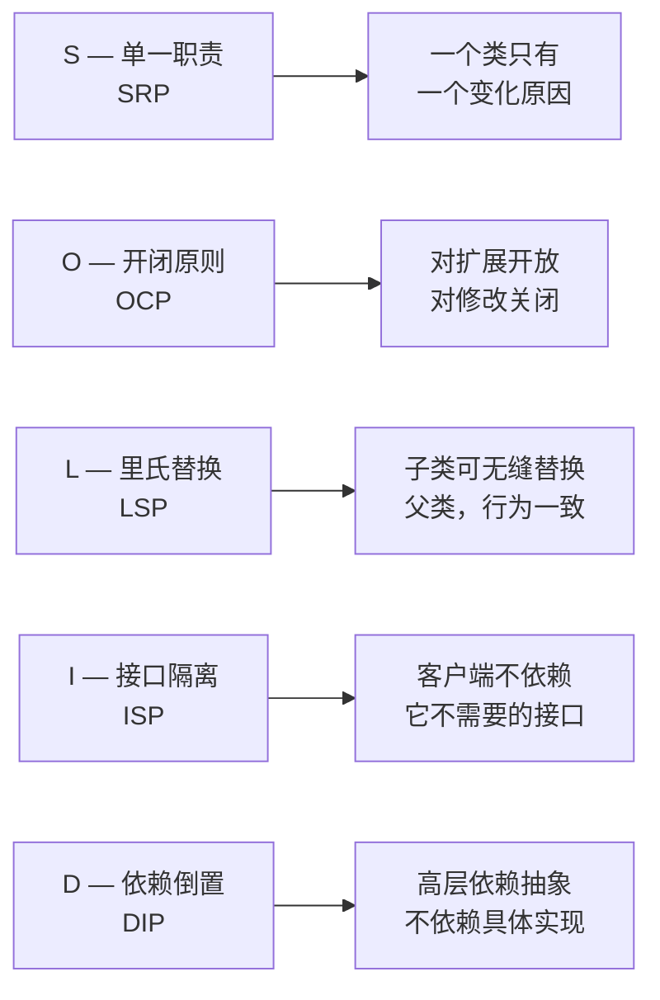

# [L2] SOLID 设计原则是什么？各原则的核心意图是什么？

#### 一句话结论

五项 OOP 设计原则，旨在降低耦合、提升扩展性与可维护性。

#### 体系讲解

**原理：为什么需要 SOLID**

随着系统规模增长，"能跑"的代码往往变成难以修改、难以测试的"大泥球"。SOLID 是 Robert C. Martin 整理的五条面向对象设计原则，提供一套可操作的判断标准，帮助识别和避免设计腐化。

**机制：五原则速查**



| 原则 | 一句话意图 | 违反的典型信号 |
|---|---|---|
| **SRP** 单一职责 | 一个类只负责一件事 | God Class：负责查询、格式化、发邮件、写日志 |
| **OCP** 开闭原则 | 新需求加新类，不改旧代码 | 每加一种支付方式就改 `if/switch` 分支 |
| **LSP** 里氏替换 | 子类行为与父类契约一致 | 子类覆写方法后抛出父类未声明的异常，或收窄返回类型 |
| **ISP** 接口隔离 | 接口小而专，不强迫实现用不到的方法 | 实现接口时大量写空方法或抛 `\Exception('not implemented')` |
| **DIP** 依赖倒置 | 依赖接口而非具体类 | 构造函数里 `new MySQLRepo()`，无法替换实现 |

**结论：对开发的直接影响**

- **SRP / ISP**：主要改善**可理解性**，类和接口边界清晰，修改一处不影响另一处
- **OCP**：主要改善**可扩展性**，新需求通过新增代码而非修改已有代码来实现
- **LSP**：主要改善**可替换性**，多态调用安全可靠
- **DIP**：主要改善**可测试性**，依赖抽象后可注入 Mock（详见「依赖注入」题）

#### 考察意图

1. **识别违反场景**：能否在给定代码中快速判断违反了哪条原则，而非只能背定义
2. **理解设计意图**：五条原则各自解决哪类问题，不混淆
3. **工程权衡意识**：SOLID 是指导方向而非教条，过度拆分也是问题

#### 追问链

1. **SRP：举一个违反单一职责的例子，如何重构？**

   简答：`UserService` 同时负责"查用户"、"发注册邮件"、"写操作日志"——三个变化原因。重构方向：拆分为 `UserRepository`（数据访问）、`UserMailer`（邮件）、`UserActivityLogger`（日志），每个类只有一个变化原因。判断标准是：如果类的修改需要同时考虑两个不同的业务方向，就应该拆分。

2. **OCP：新增一种支付方式时，"符合 OCP"的代码结构是什么样的？**

   简答：定义 `PaymentInterface`，每种支付方式（Alipay、WeChat、Stripe）各自实现该接口。调用方依赖接口，新增支付只需新建一个类实现接口，不修改任何已有代码。违反 OCP 的信号是：新增功能必须在原方法里加 `if ($type === 'alipay')` 分支。

3. **LSP：子类覆写父类方法，什么情况下会违反里氏替换原则？**

   简答：三种常见违反——①子类方法抛出父类方法签名中未声明的异常；②子类收窄前置条件（父类接受所有整数，子类只接受正整数）；③子类放宽后置条件（父类保证返回非空，子类可能返回 `null`）。典型案例：`Rectangle` → `Square`，`Square::setWidth()` 同时改高度，违反了父类"宽高独立"的行为契约。

4. **ISP：如何判断一个接口需要拆分？**

   简答：当接口的实现类中出现"空方法"或"抛 `not implemented` 异常"时，说明该实现类被迫依赖了它不需要的方法，接口需要拆分。例如 `WorkerInterface` 同时声明 `work()` 和 `eat()`，机器人实现时 `eat()` 无意义——应拆为 `Workable` 和 `Feedable` 两个接口。

5. **DIP 与 SRP/OCP 有什么协同关系？**

   简答：DIP 是其他原则的"基础设施"。没有依赖抽象，OCP 无法落地（无法用新类替换旧实现）；没有依赖抽象，SRP 拆分出的小类也难以在上层组合使用。三者常联动：SRP 拆分职责 → 接口（ISP）定义边界 → DIP 注入实现 → OCP 扩展新实现。DIP 的具体实现机制详见「依赖注入与控制反转」题。

#### 易错点

1. **把 OCP 理解成"禁止修改任何代码"**

   OCP 中"对修改关闭"的主语是**已稳定的抽象层**（接口/抽象类），而非所有代码。发现 Bug 当然要修改，初期快速迭代阶段也不必强行套 OCP。原则的价值在于：当需求稳定后，扩展点的新增不应触碰已测试的旧代码。

2. **把 SOLID 当教条，过度设计**

   一个只有 2 个方法的简单类不需要拆分成 2 个类来满足 SRP；一个只有一种实现的接口不需要为 ISP 拆成 3 个。SOLID 是权衡工具，应结合"当前变化频率"和"团队规模"判断是否值得抽象。过度设计（over-engineering）和设计腐化一样有害。

3. **混淆 LSP 与"子类可以覆写任何方法"**

   PHP 允许子类覆写父类的任何 `public`/`protected` 方法，但 LSP 要求的是**行为契约的一致性**，不仅是签名兼容。子类可以扩展行为，但不能改变父类方法的预期输出语义。PHP 8.0+ 的协变/逆变返回类型为 LSP 提供了语言层面的部分保障，但业务语义仍需开发者自己保证。

#### 代码示例

```php
<?php

// ── OCP 示例：新增支付方式不修改已有代码 ─────────────────────────

interface PaymentInterface
{
    public function pay(float $amount): bool;
}

class AlipayPayment implements PaymentInterface
{
    public function pay(float $amount): bool
    {
        // 调用支付宝 SDK（示意）
        return true;
    }
}

class WeChatPayment implements PaymentInterface
{
    public function pay(float $amount): bool
    {
        // 调用微信支付 SDK（示意）
        return true;
    }
}

// 订单服务依赖接口，新增 StripePayment 无需改此类（OCP ✅，DIP ✅）
class OrderService
{
    public function __construct(
        private readonly PaymentInterface $payment
    ) {}

    public function checkout(float $amount): bool
    {
        return $this->payment->pay($amount);
    }
}

// ── ISP 示例：胖接口 vs 小接口 ────────────────────────────────────

// ❌ 违反 ISP：机器人被迫实现 eat()
// interface WorkerInterface {
//     public function work(): void;
//     public function eat(): void;  // 机器人无法进食
// }

// ✅ 符合 ISP：按能力拆分
interface Workable
{
    public function work(): void;
}

interface Feedable
{
    public function eat(): void;
}

class HumanWorker implements Workable, Feedable
{
    public function work(): void { /* 工作 */ }
    public function eat(): void  { /* 吃饭 */ }
}

class RobotWorker implements Workable
{
    public function work(): void { /* 工作 */ }
    // 不实现 eat()，无需空方法
}
```
