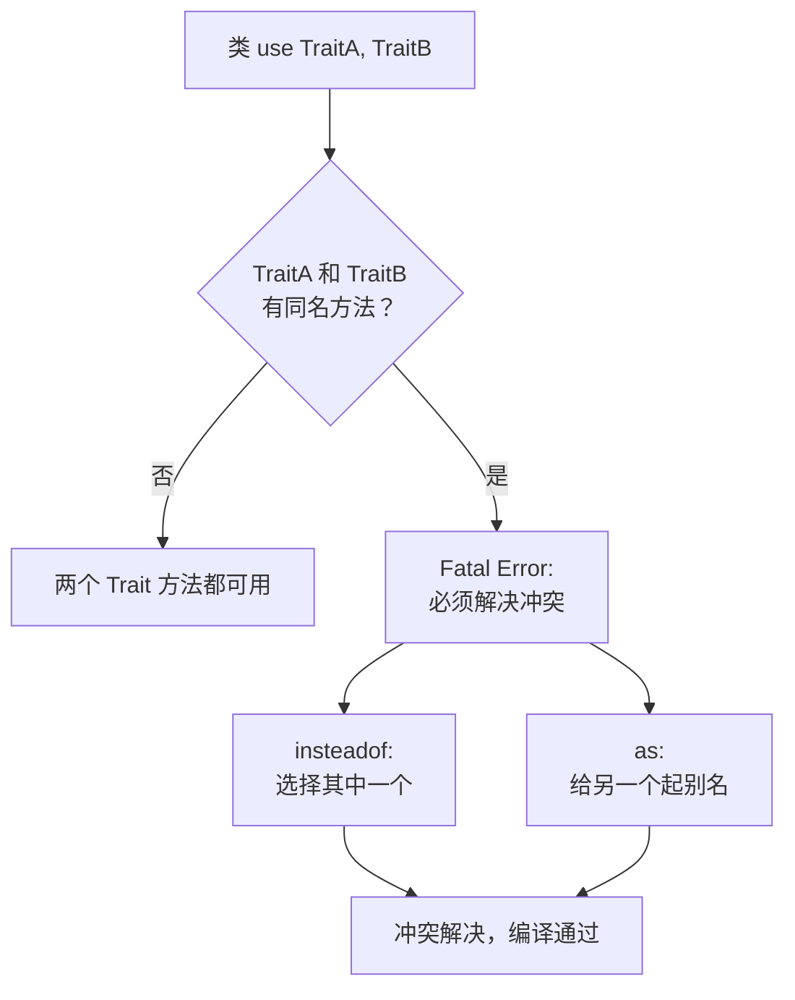

# [L2] PHP 中 Trait 的作用与冲突解决机制

#### 一句话结论

Trait 是横向代码复用机制，解决单继承下多处需要相同方法的问题。

#### 体系讲解

**原理：为什么需要 Trait**

PHP 是单继承语言，一个类只能 `extends` 一个父类。当多个不相关的类需要共享同一段逻辑时（如"可软删除"、"可记录日志"），传统做法要么复制代码，要么构造不合理的继承链。

Trait（PHP 5.4+）提供了一种水平复用机制：把一组方法定义在 Trait 中，任何类都可以通过 `use` 引入，编译时 Trait 的方法会被"复制"到使用它的类中。

**机制：Trait 的优先级与冲突解决**

当类自身方法、Trait 方法和父类方法同名时，优先级为：

```
类自身方法 > Trait 方法 > 父类方法
```

当一个类 `use` 了多个 Trait，且不同 Trait 含有同名方法时，PHP 会报 Fatal Error。必须用以下两种方式显式解决冲突：

1. **`insteadof`**：指定采用哪个 Trait 的方法，排除另一个。
2. **`as`**：为被排除的方法起别名保留，或修改方法的可见性。



**Trait 的其他能力**

- 可以定义属性（但如果多个 Trait 定义同名属性且初始值不同，会报错）。
- 可以定义抽象方法，强制使用者实现。
- 可以在 Trait 内部 `use` 其他 Trait（组合 Trait）。
- 可以使用 `as` 修改方法可见性（如将 `public` 改为 `protected`）。

**结论：对开发的直接影响**

- Trait 适合封装"横切关注点"：软删除、时间戳、日志、缓存等与业务无关但多处需要的行为。
- Laravel 的 Eloquent 大量使用 Trait（如 `SoftDeletes`、`HasFactory`），理解 Trait 是使用框架的基础。
- 不要滥用 Trait 替代接口——Trait 提供实现，接口定义契约，两者目的不同。

#### 考察意图

- 验证候选人是否理解 PHP 单继承的局限以及 Trait 的设计动机
- 考察对冲突解决机制的掌握——`insteadof` 和 `as` 是高频面试细节
- 判断候选人是否能区分 Trait、接口、抽象类的各自职责

#### 追问链

1. Trait 方法和父类同名方法，哪个优先？类自身方法呢？

   简答：优先级为：类自身方法 > Trait 方法 > 父类方法。即 Trait 会覆盖继承来的方法，但类自身定义的方法会覆盖 Trait。

2. 两个 Trait 有同名方法时如何解决冲突？`insteadof` 和 `as` 的区别是什么？

   简答：`insteadof` 选择采用哪个 Trait 的方法（排他）；`as` 为被排除的方法起一个别名，使其仍可通过别名调用。两者通常配合使用：先用 `insteadof` 选主方法，再用 `as` 保留另一个。

3. Trait 中可以定义属性吗？多个 Trait 定义同名属性会怎样？

   简答：可以定义属性。如果多个 Trait 定义了同名属性，且初始值和可见性完全相同则不报错（兼容），否则 Fatal Error。实践中建议避免在 Trait 中定义属性，改用抽象方法让使用类自行提供。

4. Trait 和接口在什么场景下应该配合使用？

   简答：接口定义"必须有哪些方法"（契约），Trait 提供"默认实现"。例如定义 `Loggable` 接口声明 `log()` 方法，同时提供 `LoggableTrait` 包含默认实现。使用类 `implements Loggable` + `use LoggableTrait`，既保证了类型约束又减少了重复代码。

#### 易错点

1. **以为 Trait 可以替代接口**：Trait 提供的是实现，不提供类型约束。`$obj instanceof SomeTrait` 不成立，类型检查无法通过 Trait 进行。需要类型约束时仍然需要接口。

2. **忽略 Trait 属性冲突的严格性**：不同 Trait 中同名属性只要初始值或可见性不同就会 Fatal Error，且没有 `insteadof` 这样的解决语法。这比方法冲突更难处理，设计时应避免在 Trait 中定义属性。

3. **过度使用 Trait 导致"隐式依赖"**：Trait 中调用 `$this->someMethod()` 但该方法并非 Trait 自身定义的，而是假设使用类会有。这种隐式依赖让代码难以理解。正确做法是在 Trait 中声明 `abstract` 方法明确依赖。

#### 代码示例

```php
<?php

// 基础用法：横切关注点
trait Timestampable
{
    public function touchTimestamps(): void
    {
        $this->updatedAt = new DateTimeImmutable();
    }

    abstract public function getCreatedAt(): DateTimeImmutable;
}

trait SoftDeletes
{
    public ?DateTimeImmutable $deletedAt = null;

    public function softDelete(): void
    {
        $this->deletedAt = new DateTimeImmutable();
    }

    public function isDeleted(): bool
    {
        return $this->deletedAt !== null;
    }
}

class Article
{
    public DateTimeImmutable $updatedAt;

    use Timestampable, SoftDeletes;

    public function __construct(
        public readonly string $title,
        private DateTimeImmutable $createdAt = new DateTimeImmutable(),
    ) {
        $this->updatedAt = $this->createdAt;
    }

    public function getCreatedAt(): DateTimeImmutable
    {
        return $this->createdAt;
    }
}

// 冲突解决
trait JsonOutput
{
    public function render(): string
    {
        return json_encode(['format' => 'json']);
    }
}

trait XmlOutput
{
    public function render(): string
    {
        return '<format>xml</format>';
    }
}

class ApiResponse
{
    use JsonOutput, XmlOutput {
        JsonOutput::render insteadof XmlOutput; // 采用 JsonOutput 的 render
        XmlOutput::render as renderXml;          // XmlOutput 的 render 保留为别名
    }
}

$response = new ApiResponse();
echo $response->render();     // {"format":"json"}
echo $response->renderXml();  // <format>xml</format>

// as 修改可见性
class InternalApi
{
    use JsonOutput {
        render as protected; // 将 public 改为 protected
    }
}
```
