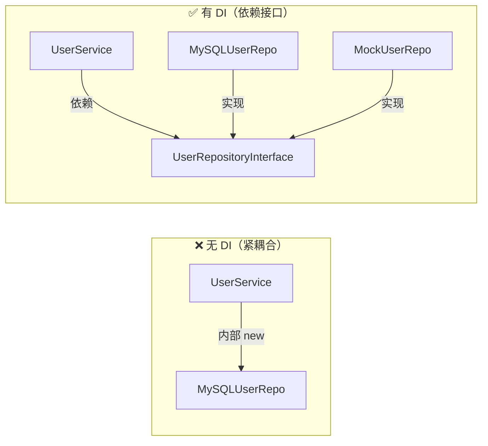

# [L2] 什么是依赖注入？它解决了什么问题？

#### 一句话结论

将依赖由外部注入而非内部创建，解耦具体实现，提升可测试性。

#### 体系讲解

**原理：从紧耦合说起**

当一个类在内部直接 `new` 它所依赖的对象时，两者就产生了**紧耦合**：调用方与具体实现绑定，无法替换、无法测试。依赖注入（Dependency Injection，DI）的核心思路是：**把"创建依赖"的职责交出去，由外部负责传入**。

DI 是**控制反转（IoC）原则**的最常见实现方式——把"谁来创建依赖"的控制权从类内部反转给外部调用者或容器。DI 同时也是 **SOLID 原则中 D（依赖倒置，DIP）** 的落地手段：高层模块依赖抽象（接口），而非依赖具体实现。

**机制：三种注入方式**



| 注入方式 | 语法形式 | 适用场景 |
|---|---|---|
| **构造函数注入** | `__construct(Dep $dep)` | 强依赖，对象无此依赖则无法工作，**最推荐** |
| **Setter 注入** | `setDep(Dep $dep)` | 可选依赖，有默认行为，依赖可在运行时替换 |
| **接口注入** | 接口声明 `inject()` 方法 | PHP 中极少使用，了解即可 |

**DI 容器（IoC Container）**

手动 DI 在依赖层级深时代码繁琐。DI 容器负责**自动解析依赖树**：只需声明接口与实现的绑定关系，容器在实例化时自动递归注入所有依赖。Laravel 的 Service Container、Symfony 的 DI Component 均基于此原理。

**结论：对开发的直接影响**

- 类只依赖接口，具体实现可随时替换（如从 MySQL 切换到 MongoDB）
- 测试时注入 Mock 对象，无需真实数据库连接
- 依赖关系显式声明在构造函数中，代码自文档化

#### 考察意图

1. **工程意识**：是否理解"直接 `new`"的具体代价，而非只是"知道 DI 是好东西"
2. **选型判断**：能否区分三种注入方式的适用场景，而非无脑用 Setter
3. **概念边界**：是否能清晰区分 DI、IoC、DIP 三个相关但不同的概念

#### 追问链

1. **不用 DI 直接 `new` 有什么具体问题？**

   简答：三个层面——①**可测试性**：无法在测试中替换真实依赖（数据库、第三方 API），只能做集成测试；②**可替换性**：切换实现（如从 Redis 换 Memcached）必须修改调用类源码，违反开闭原则；③**可读性**：依赖隐藏在方法体内，调用者无法从类签名看出其依赖关系。

2. **构造函数注入和 Setter 注入的选择依据是什么？**

   简答：区分依赖是否为"强依赖"。构造函数注入传达"没有此依赖对象无法工作"的语义，对象创建时即完成依赖注入，不存在中间无效状态；Setter 注入传达"可选依赖"语义，对象可以在没有该依赖时使用默认行为。若滥用 Setter 注入强依赖，会导致对象在调用 `setXxx()` 之前处于不完整状态，引发运行时错误。

3. **DI、IoC 和依赖倒置原则（DIP）分别是什么，三者有何关系？**

   简答：**DIP** 是 SOLID 中的设计原则（高层依赖抽象，不依赖具体）；**IoC** 是基于 DIP 的设计思想（把控制权反转给外部）；**DI** 是 IoC 最主流的落地方式（通过注入传递依赖）。三者是"原则 → 思想 → 实现"的层级关系，DI 是手段，IoC 是目的，DIP 是指导原则。

4. **DI 容器比手动 DI 多解决了什么问题？**

   简答：**自动解析依赖树**。手动 DI 在依赖层级深时需要层层 `new`（如 `new A(new B(new C()))`），维护成本高。容器通过读取构造函数参数类型（利用 PHP Reflection API）自动递归实例化所有依赖，只需一次 `$container->make(A::class)` 即可。此外，容器还管理对象的**生命周期**（单例 vs 每次新建），手动 DI 无法做到。

5. **单元测试中如何利用 DI 注入 Mock 对象？**

   简答：因为依赖通过构造函数以接口类型声明，测试时可以传入实现了相同接口的 Mock 对象（如 PHPUnit 的 `createMock()`），使测试完全不依赖真实数据库或外部服务。这是 DI 带来的最直接的工程收益。

#### 易错点

1. **把"DI"等同于"IoC"**

   IoC 是更广泛的设计原则，除 DI 外还包括事件驱动、服务定位器（Service Locator）等实现方式。DI 是 IoC 最常见的实现，但 IoC ≠ DI。服务定位器模式同样实现了 IoC，但被认为是反模式（依赖隐藏，不如 DI 透明）。

2. **对强依赖使用 Setter 注入**

   `setLogger($logger)` 表达"日志可选"，但 `setDatabase($db)` 表达"数据库可选"则是错误的语义。强依赖使用 Setter 注入会导致对象在未调用 Setter 前处于半初始化状态，调用业务方法时才触发 `Error: Call to a member function xxx() on null`，排查困难。

3. **以为使用了 DI 容器就等于做好了 DI**

   容器是工具，核心是**依赖接口而非实现**。如果类型提示写的是具体类（`__construct(MySQLUserRepo $repo)`）而非接口（`__construct(UserRepositoryInterface $repo)`），即便用了容器，可替换性和可测试性依然为零。

#### 代码示例

```php
<?php

// ── 反例：紧耦合，直接 new 具体实现 ──────────────────────────────

class BadUserService
{
    private MySQLUserRepo $repo;

    public function __construct()
    {
        $this->repo = new MySQLUserRepo(); // 无法替换，无法测试
    }
}

// ── 正例：依赖接口 + 构造函数注入 ────────────────────────────────

interface UserRepositoryInterface
{
    public function findById(int $id): ?array;
}

class MySQLUserRepo implements UserRepositoryInterface
{
    public function findById(int $id): ?array
    {
        // 实际执行 SQL（示意）
        return ['id' => $id, 'name' => 'Alice'];
    }
}

class UserService
{
    public function __construct(
        private readonly UserRepositoryInterface $repo // PHP 8.1+ readonly + 构造器属性提升
    ) {}

    public function getUser(int $id): ?array
    {
        return $this->repo->findById($id);
    }
}

// ── 手动 DI：由调用方负责组装依赖 ────────────────────────────────

$service = new UserService(new MySQLUserRepo());
var_dump($service->getUser(1));
// array(2) { ["id"]=> int(1) ["name"]=> string(5) "Alice" }

// ── 测试时注入 Mock，不依赖真实数据库 ────────────────────────────

class MockUserRepo implements UserRepositoryInterface
{
    public function findById(int $id): ?array
    {
        return ['id' => $id, 'name' => 'MockUser'];
    }
}

$testService = new UserService(new MockUserRepo());
var_dump($testService->getUser(99));
// array(2) { ["id"]=> int(99) ["name"]=> string(8) "MockUser" }
```
