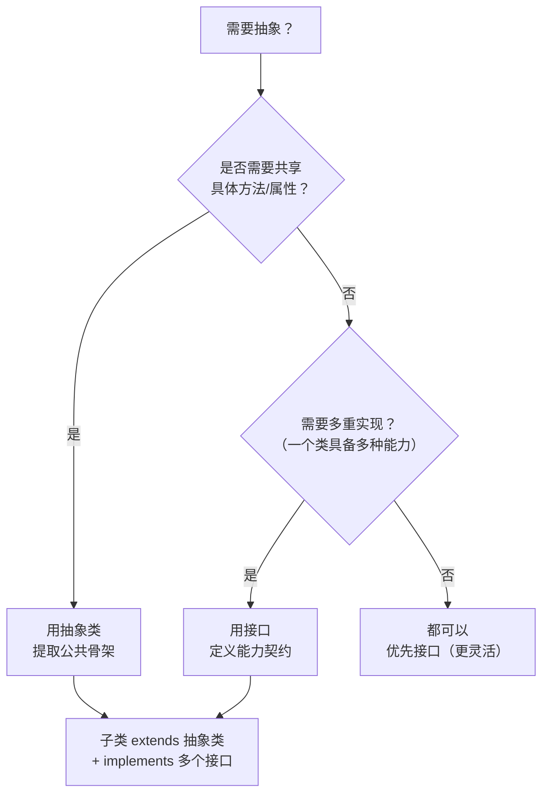

# [L2] 抽象类与接口的区别及使用场景

#### 一句话结论

接口定义"能做什么"（契约），抽象类定义"是什么"（共性骨架）。

#### 体系讲解

**原理：两种抽象机制的设计意图**

- **接口（interface）**：纯契约，规定实现者必须提供哪些方法，不关心如何实现。一个类可以实现多个接口，表达"具备某种能力"。
- **抽象类（abstract class）**：部分实现的类，既包含必须由子类实现的抽象方法，也可以包含已实现的具体方法和属性。一个类只能继承一个抽象类，表达"属于某种类型"。

**机制：关键差异对照表**

| 特性 | 接口 | 抽象类 |
|---|---|---|
| 方法实现 | PHP 8.0 前只能声明，不能有方法体；PHP 8.0+ 仍不能有方法体（但可通过 default 方案讨论中） | 可以有具体方法和抽象方法混合 |
| 属性 | 不能声明实例属性（PHP 8.4 起支持声明属性签名） | 可以声明任意属性 |
| 构造函数 | 不能有 | 可以有，子类可通过 `parent::__construct()` 复用 |
| 多继承 | 一个类可以 `implements` 多个接口 | 一个类只能 `extends` 一个抽象类 |
| 访问修饰符 | 方法默认且必须为 `public` | 可以使用 `public`、`protected`、`private` |
| 常量 | 可以定义常量 | 可以定义常量 |

**选型决策树**



**结论：对开发的直接影响**

- **接口优先原则**：当不确定时优先用接口。接口更灵活，不占用唯一的继承位。
- **抽象类适合模板方法模式**：多个子类共享流程骨架但部分步骤不同时（如支付流程的"验参→扣款→通知"），用抽象类封装骨架，子类只实现差异步骤。
- **组合使用**：实际项目中二者常组合——抽象类 `extends` 并实现通用逻辑，同时 `implements` 多个接口声明能力。

#### 考察意图

- 验证候选人是否能从设计意图层面区分二者，而不仅是罗列语法差异
- 考察面向接口编程的意识——中级工程师应具备"依赖抽象而非具体"的认知
- 检验能否结合实际场景给出选型判断

#### 追问链

1. 一个类能否同时继承抽象类并实现多个接口？请举例说明什么时候需要这么做。

   简答：可以。例如 `class AlipayPayment extends AbstractPayment implements Loggable, Retryable`。`AbstractPayment` 提供支付流程骨架，`Loggable` 和 `Retryable` 声明该类具备日志和重试能力。

2. PHP 8.0+ 中接口有哪些新能力？

   简答：PHP 8.0 引入了 `Union Types`，接口方法签名可使用联合类型。PHP 8.1 引入了 `enum implements Interface`，枚举可以实现接口。PHP 8.2 引入了 `readonly` 类但不影响接口。整体趋势是接口的表达能力在增强。

3. 什么是模板方法模式？它和抽象类的关系是什么？

   简答：模板方法模式在抽象类中定义算法骨架（具体方法），将某些步骤延迟到子类实现（抽象方法）。这是抽象类最典型的应用场景。例如 `AbstractExporter` 定义 `export()` 流程为"查询→格式化→输出"，子类只需实现 `format()` 方法。

4. 如果你设计一个缓存系统，会用接口还是抽象类来定义缓存驱动的规范？为什么？

   简答：用接口。缓存驱动（Redis、Memcached、File）实现方式完全不同，没有共享逻辑，只需统一契约（`get`、`set`、`delete`）。PSR-16（SimpleCache）就是用接口 `CacheInterface` 定义的。如果多个驱动确实有公共逻辑（如序列化/反序列化），可在接口之下再加一个 `AbstractCacheDriver` 抽象类。

#### 易错点

1. **只回答语法差异而不讲设计意图**：面试中只说"接口不能有实现、抽象类可以有"是 L1 水平的回答。L2 应该能讲出"接口是能力契约、抽象类是类型骨架"的设计语义差别，并结合场景分析选型。

2. **以为接口完全不能有任何实现**：PHP 虽然不支持接口默认方法（Java 8+ 的 default method），但接口可以定义常量，且 PHP 8.4 开始讨论属性声明。候选人应对接口能力的演进有基本了解。

3. **忽视"组合优于继承"原则**：过度使用抽象类继承链会导致层级过深、耦合严重。现代 PHP 推荐接口 + Trait + 组合的方式实现代码复用，而非多层抽象类继承。

#### 代码示例

```php
<?php

// 接口：定义能力契约
interface Cacheable
{
    public function getCacheKey(): string;
    public function getCacheTTL(): int;
}

interface Serializable
{
    public function serialize(): string;
    public static function deserialize(string $data): static;
}

// 抽象类：定义类型骨架（模板方法模式）
abstract class AbstractExporter
{
    // 模板方法：定义流程骨架
    public function export(array $filters): string
    {
        $data = $this->query($filters);
        $formatted = $this->format($data);
        return $this->output($formatted);
    }

    // 公共实现：子类共享
    protected function query(array $filters): array
    {
        // 通用查询逻辑（示意）
        return ['row1', 'row2', 'row3'];
    }

    // 抽象方法：子类必须实现差异部分
    abstract protected function format(array $data): string;

    abstract protected function output(string $content): string;
}

// 组合使用：继承抽象类 + 实现多个接口
class CsvExporter extends AbstractExporter implements Cacheable
{
    protected function format(array $data): string
    {
        return implode("\n", $data);
    }

    protected function output(string $content): string
    {
        return $content; // 实际场景可写入文件
    }

    public function getCacheKey(): string
    {
        return 'export:csv:' . md5(serialize(func_get_args()));
    }

    public function getCacheTTL(): int
    {
        return 3600;
    }
}

// 使用
$exporter = new CsvExporter();
echo $exporter->export(['status' => 'active']);
```
