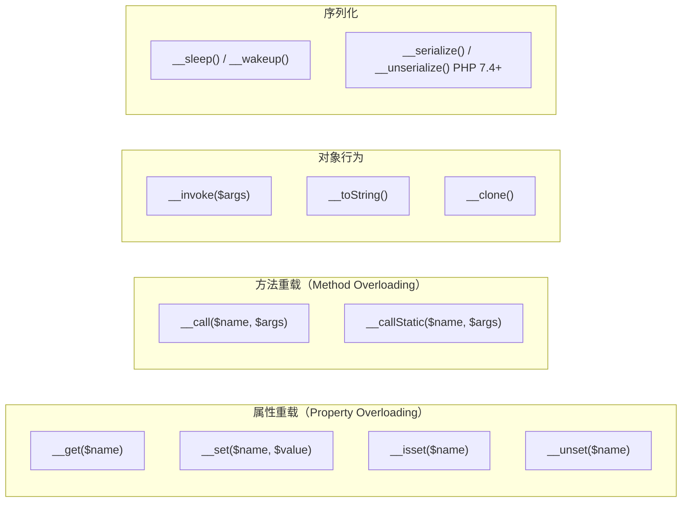

# [L2] PHP 魔术方法是什么？__get/__set/__call 各适用于哪些场景？

#### 一句话结论

PHP 特定操作时自动触发的拦截钩子，实现动态属性/方法访问，优先显式声明。

#### 体系讲解

**原理：PHP 的重载（Overloading）机制**

PHP 的"重载"与 Java/C++ 不同——不是指同名方法多态，而是指**属性与方法的动态拦截**：当访问不存在（或不可访问）的属性/方法时，PHP 自动调用对应的魔术方法，由开发者决定如何处理。

**机制：魔术方法分组速查**



**核心三个的适用场景**

| 魔术方法 | 触发时机 | 典型用途 |
|---|---|---|
| `__get($name)` | 读取不存在/不可访问的属性 | ORM 动态属性（Eloquent `$user->name` 读数据库列）、代理对象 |
| `__set($name, $value)` | 写入不存在/不可访问的属性 | 动态属性收集（`$obj->foo = 'bar'` 存入内部数组）、只读保护 |
| `__call($name, $args)` | 调用不存在/不可访问的方法 | 链式调用构造器（Builder 模式）、流畅接口（Fluent Interface） |
| `__callStatic($name, $args)` | 静态调用不存在的方法 | Facade 模式（Laravel `Cache::get()`）、测试桩 |
| `__invoke($args)` | 将对象当函数调用 `$obj()` | 闭包替代、策略模式函子（Functor）、中间件 callable |
| `__toString()` | 字符串上下文中使用对象 | 模型打印、调试输出 |

**结论：对开发的直接影响**

魔术方法赋予 PHP 高度的灵活性，但引入了**三个代价**：
1. **IDE 感知缺失**：属性/方法不在类定义中，自动补全失效（需用 `@property` PHPDoc 弥补）
2. **静态分析盲区**：PHPStan / Psalm 无法推断动态属性类型，产生误报
3. **调用开销**：每次经过 `__get` 的属性访问比直接访问属性多一次函数调用

#### 考察意图

1. **工程意识**：不只背签名，能说清"什么时候用 vs. 什么时候不用"
2. **框架理解**：Eloquent / Laravel Facade 背后是 `__get/__call`，能追溯机制
3. **静态分析意识**：知道魔术方法会导致 IDE 和类型检查工具无法推断，体现代码质量意识

#### 追问链

1. **Eloquent 的 `$user->name` 是怎么工作的？它用到了哪个魔术方法？**

   简答：Eloquent Model 实现了 `__get($key)`，当访问 `$user->name` 时，PHP 发现 `name` 不是实际类属性，触发 `__get('name')`，方法内部从 `$this->attributes['name']` 数组中取值，并经过 Accessor（`getNameAttribute`）处理后返回。因此 Eloquent 模型字段不需要声明为类属性，所有列名动态读取。

2. **`__get` 和直接声明 `public $name` 有什么区别？各有什么优劣？**

   简答：直接声明的属性被 IDE、PHPStan、OPcache 完全感知，访问开销最低，类型安全；`__get` 可以动态拦截无限多个属性名，适合字段数量不固定的场景（如 ORM），但无法获得 IDE 补全，无法被静态分析追踪，每次访问多一层函数调用。规则：字段固定 → 显式声明；字段动态（如数据库列名） → 可用 `__get`，但建议配合 `@property` PHPDoc 辅助工具链。

3. **`__call` 怎么实现链式调用（Fluent Interface）？**

   简答：Query Builder 类通过 `__call` 捕获所有未定义方法调用，将方法名和参数存储到条件数组后返回 `$this`，从而支持 `->where(...)->orderBy(...)->limit(...)` 的链式写法。这避免了为每个可能的条件组合显式声明方法，也是 Builder 模式的常见 PHP 实现形式。

4. **Laravel 的 `Cache::get()` 是静态调用，但 Cache 实例是单例，这是如何实现的？**

   简答：Laravel Facade 通过 `__callStatic($method, $args)` 实现——`Cache` 类继承 `Facade` 基类，`__callStatic` 拦截静态调用后，从服务容器中解析出真实的 `CacheManager` 实例，再将调用转发给该实例。这样 `Cache::get()` 语法上像静态调用，实际上是对容器内对象的实例方法调用。

5. **`__invoke` 和普通闭包相比，有什么优势？**

   简答：`__invoke` 让类实例可以像函数一样调用（`$handler($request)`），相比匿名函数，它可以**持有状态**（类属性）、**继承接口**（`implements HandlerInterface`）、**方便单元测试**（可单独实例化、Mock 依赖）。框架中间件、事件监听器常用此模式替代大型闭包。

#### 易错点

1. **以为 `__get` 会拦截所有属性访问**

   `__get` 只在属性**不存在**或**不可访问**时触发。已声明为 `public` 的属性直接访问，不会触发 `__get`；声明为 `private` 的属性在类外访问时才触发。常见误区：在类内部用 `$this->name` 认为会触发 `__get`，实际上类内部可直接访问 `private` 属性，不会触发。

2. **在 `__set` 中不做类型检查就接受任意值**

   `__set` 接受任何 `$value`，若不校验类型，等于把类变成了无类型的数组包装器，彻底丢失类型安全。建议在 `__set` 内部做白名单过滤或类型断言，或直接考虑用 `readonly` 属性（PHP 8.1+）替代只读保护场景。

3. **忘记 `__isset` 和 `__unset` 的配套实现**

   实现了 `__get/__set` 后，如果忘记实现 `__isset`，调用 `isset($obj->dynamicProp)` 会始终返回 `false`，导致某些框架的非空判断逻辑出错（Blade 模板、Twig 等依赖 `isset` 来检查属性是否存在）。四个方法通常需要配套实现。

#### 代码示例

```php
<?php

// ── 属性重载：动态属性存储（__get / __set / __isset / __unset）──────

class DynamicModel
{
    private array $attributes = [];

    public function __get(string $name): mixed
    {
        return $this->attributes[$name] ?? null;
    }

    public function __set(string $name, mixed $value): void
    {
        $this->attributes[$name] = $value;
    }

    public function __isset(string $name): bool
    {
        return isset($this->attributes[$name]);
    }

    public function __unset(string $name): void
    {
        unset($this->attributes[$name]);
    }
}

$model = new DynamicModel();
$model->name  = 'Alice';    // 触发 __set
$model->email = 'a@b.com';  // 触发 __set
echo $model->name;           // 触发 __get → 'Alice'
var_dump(isset($model->age));// 触发 __isset → false


// ── 方法重载：Fluent Builder（__call）─────────────────────────────

class QueryBuilder
{
    private array $conditions = [];
    private ?int  $limitVal   = null;

    public function __call(string $name, array $args): static
    {
        // 将方法名作为条件类型存储，返回 $this 实现链式调用
        $this->conditions[] = [$name => $args];
        return $this;
    }

    public function limit(int $n): static
    {
        $this->limitVal = $n;
        return $this;
    }

    public function getConditions(): array
    {
        return $this->conditions;
    }
}

$query = (new QueryBuilder())
    ->where('status', 'active')  // __call('where', ['status', 'active'])
    ->orderBy('created_at')      // __call('orderBy', ['created_at'])
    ->limit(10);

var_dump($query->getConditions());


// ── 对象当函数：__invoke ──────────────────────────────────────────

class Multiplier
{
    public function __construct(private readonly int $factor) {}

    public function __invoke(int $n): int
    {
        return $n * $this->factor;
    }
}

$double = new Multiplier(2);
$triple = new Multiplier(3);

echo $double(5);  // 10
echo $triple(5);  // 15

// 可直接传入 callable 参数位置
$result = array_map($double, [1, 2, 3, 4]);
// [2, 4, 6, 8]
```
