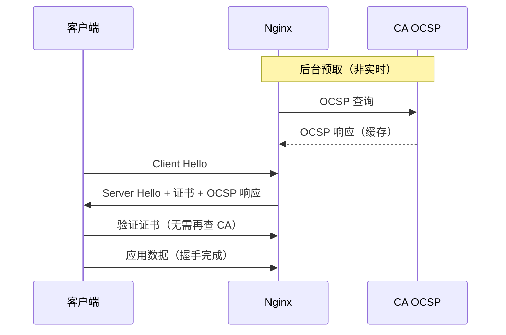

# [L2] Nginx SSL 终止与 HTTPS 安全配置

#### 一句话结论

Nginx SSL 终止在负载均衡层解密 TLS，通过 `ssl_session_cache`、OCSP Stapling 和严格的协议/套件配置，在性能与安全之间取得平衡。

#### 体系讲解

**SSL 终止模型**

```
Client ──HTTPS──► Nginx (SSL 终止) ──HTTP──► 后端 PHP-FPM/App
```

Nginx 承担 TLS 握手开销，后端内网通信走明文 HTTP，简化后端配置。若后端也需加密（合规要求），则使用 SSL 穿透或端到端加密，但性能代价更高。

**最小化 HTTPS 配置**

```nginx
server {
    listen 443 ssl;
    server_name example.com;

    ssl_certificate     /etc/letsencrypt/live/example.com/fullchain.pem;
    ssl_certificate_key /etc/letsencrypt/live/example.com/privkey.pem;
}
```

**协议与密码套件（安全基线）**

```nginx
ssl_protocols TLSv1.2 TLSv1.3;          # 禁用 SSLv3/TLS 1.0/1.1
ssl_ciphers   ECDHE-ECDSA-AES128-GCM-SHA256:ECDHE-RSA-AES128-GCM-SHA256:HIGH:!aNULL:!MD5;
ssl_prefer_server_ciphers on;            # 服务端优先选择更安全的套件
```

TLS 1.3 已内置强制前向保密（PFS），不需要显式配置套件；TLS 1.2 需要通过 `ECDHE` 前缀确保 PFS。

**`ssl_session_cache` — TLS 握手性能优化**

完整 TLS 握手需要 1-2 次 RTT，`ssl_session_cache` 允许客户端复用已协商的会话，减少握手开销：

```nginx
ssl_session_cache   shared:SSL:10m;    # 共享缓存（所有 worker 共用），10m ≈ 40,000 会话
ssl_session_timeout 1d;                # 会话有效期 24 小时
ssl_session_tickets off;               # 关闭 Session Ticket（PFS 原因，见下易错点）
```

- `shared:SSL:10m`：跨 worker 共享，比 `builtin` 性能更好
- `session_tickets`：是另一种会话复用机制，但 ticket key 不轮换时会破坏前向保密

**OCSP Stapling — 证书吊销验证加速**

正常流程：客户端需向 CA 的 OCSP 服务器查询证书是否被吊销，增加 RTT。Stapling 由 Nginx 预先向 CA 查询并缓存 OCSP 响应，在 TLS 握手时一并发送：

```nginx
ssl_stapling        on;
ssl_stapling_verify on;
ssl_trusted_certificate /etc/letsencrypt/live/example.com/chain.pem;
resolver            8.8.8.8 1.1.1.1 valid=300s;   # Nginx 向 CA 查询时用的 DNS
resolver_timeout    5s;
```

- `ssl_trusted_certificate`：用于验证 OCSP 响应签名的信任链（与 `ssl_certificate` 的 fullchain 不同）
- `resolver` 必须配置，否则 Nginx 无法解析 CA 域名，Stapling 静默失败

**HTTP → HTTPS 强制跳转**

```nginx
# 方案 A：独立 server 块（推荐，语义清晰）
server {
    listen 80;
    server_name example.com www.example.com;
    return 301 https://$host$request_uri;
}

# 方案 B：HSTS（配合 HTTPS server，浏览器缓存跳转规则）
server {
    listen 443 ssl;
    add_header Strict-Transport-Security "max-age=31536000; includeSubDomains" always;
}
```

HSTS 让浏览器在 `max-age` 内直接发 HTTPS，不再经过 Nginx 的 301 跳转，减少 1 次 RTT。**HSTS 一旦设置，关闭前必须等待 max-age 过期**，测试时先用较小值（如 3600）。

**Mermaid 流程图：TLS 握手 + OCSP Stapling**



#### 考察意图

考查候选人对 Nginx HTTPS 配置全流程的掌握，以及能否解释 `ssl_session_cache`、OCSP Stapling 等性能优化手段背后的原理，而非只会复制配置模板。

#### 追问链

1. **`ssl_session_tickets off` 为什么有利于安全？**
   Session Ticket 的原理是服务端将会话密钥加密后发给客户端保存（ticket key 由服务端持有）。若 ticket key 泄露，攻击者可解密所有历史使用该 key 的录制流量，破坏前向保密（PFS）。定期轮换 ticket key 可缓解但运维复杂；关闭 tickets 改用 `ssl_session_cache`（服务端保存会话状态）是更简单安全的选择。

2. **如何验证 OCSP Stapling 是否生效？**
   ```bash
   openssl s_client -connect example.com:443 -status
   ```
   输出中查找 `OCSP Response Status: successful`，若显示 `OCSP Response Data: no response received` 则未生效。常见原因：`resolver` 未配置或 Nginx 启动时 CA 不可达（首次 Stapling 失败后需等 Nginx 重载）。

3. **SSL 终止在负载均衡层还是应用层，各有什么取舍？**
   - 负载均衡层终止（当前方案）：集中管理证书、减轻后端负担，但内网明文有安全风险（需要可信内网或 mTLS）
   - 应用层直接终止：端到端加密，合规性更强，但证书分散管理、每台机器都承担 TLS 开销
   - 混合方案：负载均衡到应用层用内部 CA 签发的证书（mTLS），兼顾性能与安全

4. **`ssl_certificate` 应该用 `fullchain.pem` 还是 `cert.pem`？**
   应用 `fullchain.pem`（含证书链）。若只用 `cert.pem`（仅叶证书），客户端需要自行下载中间 CA 证书，在部分移动端或旧浏览器上会导致握手失败（中间证书下载超时或路径不完整）。

#### 易错点

1. **`resolver` 漏配导致 OCSP Stapling 静默失败**：Nginx 不报错，但 `ssl_stapling` 实际未工作，客户端需自行查询 OCSP，握手变慢。生产配置中必须用 `openssl s_client -status` 验证。

2. **HSTS `max-age` 设置过大后无法回退 HTTP**：一旦浏览器缓存了 HSTS 策略，在 `max-age` 内该域名所有请求都走 HTTPS。若证书过期或 443 端口故障而未保留 HTTP fallback，用户无法访问。新站点应从小值开始递增测试。

3. **HTTP 和 HTTPS 用同一个 `server` 块（`listen 80; listen 443 ssl;`）的陷阱**：语法允许，但当 80 端口收到 HTTPS 请求（如客户端配置错误）时，Nginx 会返回 `400 Bad Request` 而非优雅跳转。建议始终分开写两个 `server` 块，逻辑更清晰，也便于单独控制 HTTP 行为。

#### 代码示例

```nginx
# /etc/nginx/conf.d/ssl-example.conf
# HTTP：强制跳转 HTTPS
server {
    listen 80;
    server_name example.com www.example.com;
    return 301 https://example.com$request_uri;
}

# HTTPS：SSL 终止 + 安全加固
server {
    listen 443 ssl;
    http2  on;                                # 开启 HTTP/2
    server_name example.com;
    # 证书（fullchain 含中间证书）
    ssl_certificate     /etc/letsencrypt/live/example.com/fullchain.pem;
    ssl_certificate_key /etc/letsencrypt/live/example.com/privkey.pem;
    # 协议与套件
    ssl_protocols       TLSv1.2 TLSv1.3;
    ssl_ciphers         ECDHE-ECDSA-AES128-GCM-SHA256:ECDHE-RSA-AES128-GCM-SHA256:!aNULL:!MD5;
    ssl_prefer_server_ciphers on;
    # 会话复用（性能）
    ssl_session_cache   shared:SSL:10m;
    ssl_session_timeout 1d;
    ssl_session_tickets off;                  # 关闭 ticket，保留 PFS
    # OCSP Stapling
    ssl_stapling        on;
    ssl_stapling_verify on;
    ssl_trusted_certificate /etc/letsencrypt/live/example.com/chain.pem;
    resolver            8.8.8.8 1.1.1.1 valid=300s;
    resolver_timeout    5s;

    # 安全响应头
    add_header Strict-Transport-Security "max-age=31536000; includeSubDomains" always;
    add_header X-Content-Type-Options    nosniff                                always;

    location / {
        proxy_pass http://php_backend;
        proxy_set_header X-Forwarded-Proto $scheme;   # 告知后端原始协议
    }
}
```
