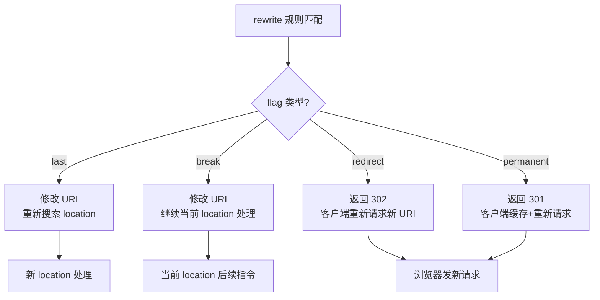

# [L2] Nginx rewrite 规则四种 flag 的行为差异

#### 一句话结论

`last`/`break` 是内部跳转（不改变客户端 URL），`redirect`/`permanent` 是外部跳转（302/301）；`last` 重新匹配 location，`break` 在当前 location 内继续处理。

#### 体系讲解

**四种 flag 速查**

| flag | HTTP 状态码 | 客户端 URL 变化 | 后续行为 |
|------|-----------|--------------|---------|
| `last` | 无（内部） | 不变 | 终止当前 rewrite，**重新搜索** location |
| `break` | 无（内部） | 不变 | 终止当前 rewrite，**在当前 location** 继续处理请求 |
| `redirect` | 302 | 变为 rewrite 后的 URI | 浏览器重新发起请求（临时重定向） |
| `permanent` | 301 | 变为 rewrite 后的 URI | 浏览器缓存重定向目标（永久重定向） |

**`last` — 重新搜索 location**

```nginx
location /api/ {
    rewrite ^/api/(.*)$ /v2/$1 last;   # ① 重写 URI
    # 不会继续执行此处后续指令
}
location /v2/ {
    proxy_pass http://php_backend;      # ② 被重新匹配，在这里处理
}
```

`last` 相当于发出"内部重定向信号"，Nginx 用新 URI `/v2/xxx` 重新走一遍 location 匹配流程。**有死循环风险**：若 `/v2/` 内又有 rewrite 且再次指向 `/api/`，会触发死循环（Nginx 限制最多 10 次跳转）。

**`break` — 停在当前 location**

```nginx
location /static/ {
    rewrite ^/static/(.*)$ /files/$1 break;  # 仅重写 URI
    root /var/www;                            # 继续在此 location 用新 URI 找文件
    # 不会重新匹配其他 location
}
```

`break` 适合纯文件路径重写场景，重写后直接按新路径服务静态文件，不再走 location 匹配。

**`redirect` 与 `permanent` 的选型**

- `redirect`（302）：目标 URL 可能变化时使用，如 A/B 测试、临时维护跳转
- `permanent`（301）：确定永久迁移时使用，如域名更换、旧路径下线

**301 的副作用**：浏览器会缓存 301，即使之后 Nginx 删除该规则，用户浏览器仍会直接跳转到旧目标，无法撤销（除非用户清缓存）。**上线前应先用 302 验证，确认无误再改 301**。

**Mermaid 流程图：四种 flag 执行路径**



**rewrite 指令语法**

```nginx
rewrite regex replacement [flag];
```

- `regex`：PCRE 正则，匹配当前 URI（不含查询串）
- `replacement`：若以 `http://` 开头，自动触发 302 重定向（无需写 flag）
- 可在同一 location 写多条 rewrite，从上到下依次匹配，直到遇到带 flag 的规则或全部匹配完

#### 考察意图

考查候选人是否能清晰区分内部重写与外部重定向，以及 `last`/`break` 这对容易混淆的 flag 在 location 匹配流程中的本质差异，避免线上配置错误导致重定向循环。

#### 追问链

1. **`last` 和 `break` 在 `server` 块（非 `location` 块）中有何区别？**
   在 `server` 块中，`last` 和 `break` 行为相同：都停止当前 rewrite 处理，然后进入 location 匹配。两者的差异只在 `location` 块内体现。

2. **如何避免 `last` 导致的死循环？**
   ① 规则设计时确保重写后的 URI 不再匹配原 location；② 使用 `break` 替代 `last`（若不需要重新匹配 location）；③ Nginx 内置的 10 次跳转上限会返回 500，是最后一道防线，但不应依赖它。

3. **`return` 指令与 `rewrite ... redirect/permanent` 有何区别？优先用哪个？**
   `return 301 /new-url` 比 `rewrite` 更高效：`return` 不需要 PCRE 引擎做正则匹配，直接返回响应；而 `rewrite` 需要编译并执行正则。对于简单的整路径重定向，**优先用 `return`**；只有需要正则捕获组进行路径变换时才用 `rewrite`。

4. **WordPress/Laravel 的 Pretty URL 通常用哪种 flag？为什么？**
   用 `last`（或等效的 `try_files`）：将不存在的文件路径重写到 `index.php`，再重新匹配 location 让 PHP-FPM 处理。`try_files $uri $uri/ /index.php?$query_string` 是更惯用写法，内部等效于 `last` 语义。

#### 易错点

1. **`last` 死循环**：在 location `/` 中用 `last` 重写到同样能匹配 `/` 的路径，Nginx 会在 10 次后返回 500。调试时可在 error.log 中看到 `rewrite or internal redirect cycle`。

2. **`permanent` 上线后无法"撤回"**：301 被浏览器永久缓存，即使删除 Nginx 规则，浏览器也不会重新请求原 URL。线上变更应用 `302` 观察期，确认稳定再切 `301`；已上线的 `301` 只能通过在新目标 URL 再做一次跳转来修正。

3. **`rewrite` 不匹配查询串**：`rewrite` 的正则只匹配 URI 路径，不含 `?` 后面的部分。若需要匹配查询参数，应用 `if ($args ~* "key=value")` 或在 replacement 中手动拼接 `$args`：`rewrite ^/old$ /new?$args last`。

#### 代码示例

```nginx
server {
    listen 80;
    server_name example.com www.example.com;

    # 去掉 www（外部永久重定向）
    if ($host = 'www.example.com') {
        return 301 https://example.com$request_uri;   # 比 rewrite 更高效
    }

    # API 版本迁移：内部重写，重新匹配 location（last）
    location /api/v1/ {
        rewrite ^/api/v1/(.*)$ /api/v2/$1 last;
    }
    location /api/v2/ {
        proxy_pass http://php_backend;
    }

    # 静态资源路径规范化：break，不重新匹配 location
    location /assets/ {
        rewrite ^/assets/(.+)\.(v\d+)\.(css|js)$ /assets/$1.$3 break;
        root /var/www/public;
        expires 1y;
    }

    # Laravel Pretty URL（推荐用 try_files，等效 last 语义）
    location / {
        try_files $uri $uri/ /index.php?$query_string;
    }

    location ~ \.php$ {
        fastcgi_pass unix:/run/php-fpm.sock;
        include fastcgi_params;
        fastcgi_param SCRIPT_FILENAME $document_root$fastcgi_script_name;
    }
}
```
