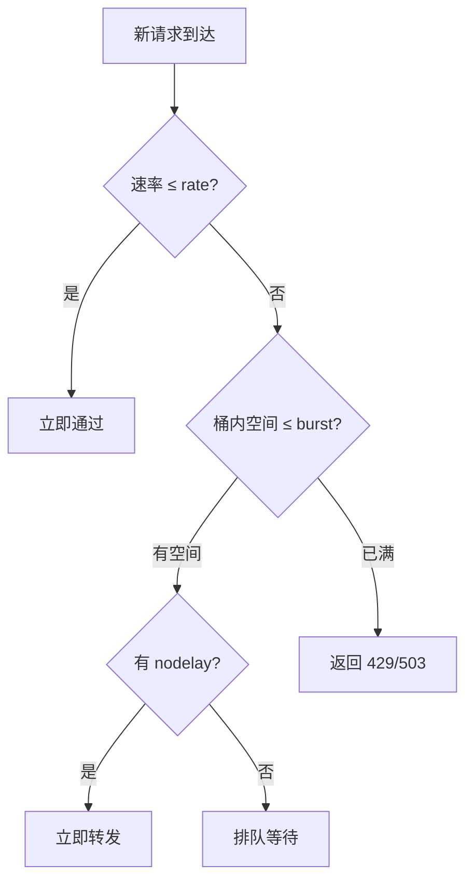

# [L2] Nginx 限流指令 limit_req 与 limit_conn 的区别

#### 一句话结论

`limit_req` 漏桶限速率，`limit_conn` 限并发连接数，两者维度不同，生产通常组合使用。

#### 体系讲解

**两种限流维度**

| 维度 | 指令 | 控制对象 | 典型场景 |
|------|------|---------|---------|
| 请求速率 | `limit_req` | 单位时间内的请求数（QPS） | 防接口刷取、爬虫限速 |
| 并发连接 | `limit_conn` | 同一时刻的活跃连接数 | 防慢速攻击（Slowloris）、限制下载并发 |

**`limit_req` — 漏桶模型**

漏桶以恒定速率"漏水"（处理请求），超速请求先进队列（桶），队满则拒绝。

```
客户端突发请求 →→→→ [桶(burst)] →→ 恒定速率处理 →→ 后端
                         ↓ 溢出
                       503/429
```

```nginx
# http 块：定义共享内存区，key 为客户端 IP，速率 10 QPS
limit_req_zone $binary_remote_addr zone=api_limit:10m rate=10r/s;

# server/location 块：应用限流
limit_req zone=api_limit burst=20 nodelay;
```

- `rate=10r/s`：漏桶出口速率 10 req/s（即每 100ms 允许 1 个）
- `burst=20`：桶容量，允许瞬时堆积最多 20 个请求
- **有 `nodelay`**：桶内请求立即转发给后端，不等速排队；超出 burst 则直接拒绝
- **无 `nodelay`**：桶内请求按速率平滑排队，每个请求最多等待 `burst/rate` 时间

**`nodelay` 选型决策**

- 无 `nodelay`：适合平滑限速（如文件下载 API），避免后端被突发打垮
- 有 `nodelay`：适合低延迟接口（如搜索、支付），不允许请求在 Nginx 侧等待

**`limit_conn` — 并发连接计数**

```nginx
# http 块：定义共享内存区
limit_conn_zone $binary_remote_addr zone=conn_limit:10m;

# server/location 块
limit_conn conn_limit 5;   # 单 IP 最多 5 个并发连接
```

常与下载场景配合，防止单用户占满带宽。

**组合使用模式**

```nginx
# 先限连接数，再限速率 — 双重防护
limit_conn conn_limit 10;
limit_req  zone=api_limit burst=30 nodelay;
```

**自定义拒绝状态码**

```nginx
limit_req_status  429;   # 默认 503，改为语义更准确的 429
limit_conn_status 429;
```

**Mermaid 流程图：`limit_req` 处理逻辑**



#### 考察意图

考查候选人是否理解"速率限流"与"并发限流"的本质区别，以及能否结合漏桶模型解释 `burst` 和 `nodelay` 的行为，而非仅会配置指令。

#### 追问链

1. **`rate=10r/s` 与 `rate=600r/m` 是否等价？**
   不完全等价。`10r/s` 的最小粒度是 100ms（每 100ms 允许 1 个），而 `600r/m` 的粒度是 100ms（每 100ms 允许 1 个）。在 Nginx 中两者实际效果相同，但若写成 `rate=1r/s`，则最小粒度为 1 秒，`burst` 外的请求将等待整整 1 秒，体验很差。生产中建议用 `r/s` 保持细粒度。

2. **共享内存区大小 10m 能存多少个 key？**
   使用 `$binary_remote_addr`（4 字节 IPv4 / 16 字节 IPv6），每条记录约 64 字节，10MB 大约能存 160,000 个 IP 状态。若超出，Nginx 会 LRU 淘汰最旧记录；流量洪峰时可能误放行，应根据真实 IP 数量调整内存区大小。

3. **`limit_req` 能否按用户 ID 而非 IP 限流？**
   可以，key 支持任意变量。例如按 JWT 中解析出的用户 ID（需配合 `set` + lua 或 `map` 提取）：
   ```nginx
   limit_req_zone $http_x_user_id zone=user_limit:20m rate=5r/s;
   ```
   对未认证请求（`$http_x_user_id` 为空），所有请求共享同一个 key，需额外处理。

4. **`limit_req` 拒绝请求后如何记录日志？**
   被拒绝的请求默认不进入 access.log，需配置 `limit_req_log_level warn`（默认 error），然后在 error.log 中搜索 `limiting requests` 关键字进行监控告警。

#### 易错点

1. **`burst` 不是"每秒额外允许"而是"排队队列容量"**：很多人误以为 `burst=20` 表示每秒多允许 20 个请求。实际上它是队列上限，配合 `nodelay` 才会立即通过；没有 `nodelay` 时，burst 内的请求会被延迟处理，可能造成客户端超时。

2. **`limit_conn` 计数时机**：`limit_conn` 在请求头被完整读取后才计数，连接建立阶段不计入。对于 Slowloris 攻击（故意拖慢发送请求头），`limit_conn` 本身防护不足，需配合 `client_header_timeout` 缩短超时。

3. **zone 定义必须在 `http` 块**：`limit_req_zone` 和 `limit_conn_zone` 只能在 `http` 块定义，若误放在 `server` 块内会报配置语法错误，但应用指令（`limit_req`/`limit_conn`）可以放在 `http`/`server`/`location` 任意层级。

#### 代码示例

```nginx
# /etc/nginx/conf.d/rate-limit.conf

http {
    # 按 IP 的请求速率区（10 QPS）
    limit_req_zone  $binary_remote_addr zone=api_qps:10m   rate=10r/s;
    # 按 IP 的并发连接区
    limit_conn_zone $binary_remote_addr zone=api_conn:10m;

    # 将拒绝日志级别降为 warn，便于监控告警
    limit_req_log_level  warn;
    limit_conn_log_level warn;
    # 统一返回 429 而非 503
    limit_req_status  429;
    limit_conn_status 429;

    server {
        listen 80;
        server_name api.example.com;

        location /api/ {
            # 先限并发：单 IP 最多 20 个活跃连接
            limit_conn api_conn 20;
            # 再限速率：允许 burst=50 的突发，立即转发不排队
            limit_req  zone=api_qps burst=50 nodelay;

            proxy_pass http://php_backend;
        }

        # 下载接口：不用 nodelay，平滑限速防止带宽打满
        location /download/ {
            limit_conn api_conn 3;
            limit_req  zone=api_qps burst=5;   # 无 nodelay，平滑排队
            proxy_pass http://file_backend;
        }
    }
}
```
