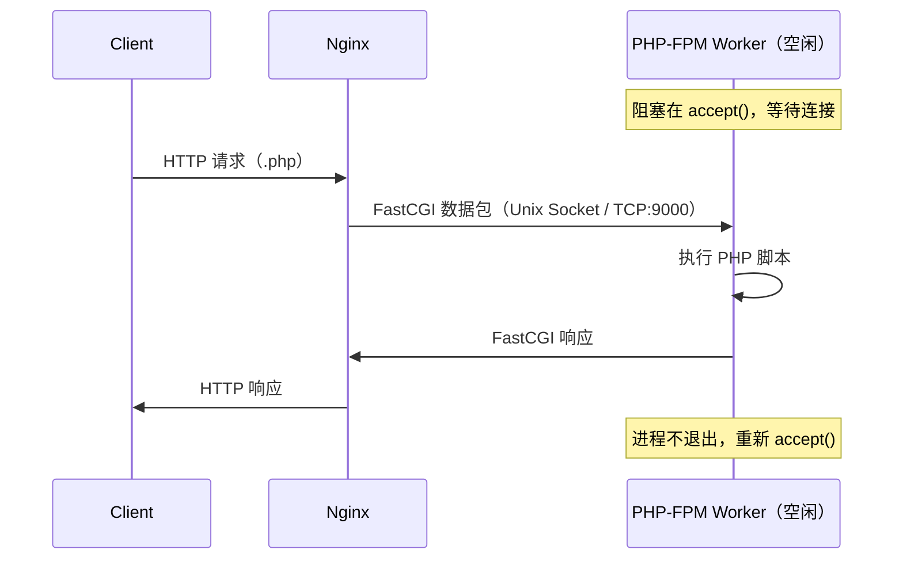

# [L2] PHP-FPM 进程模型与 FastCGI 协议

#### 一句话结论

PHP-FPM 是 FastCGI 进程管理器，pm 三种模式决定 worker 的伸缩策略。

#### 体系讲解

**CGI → FastCGI → PHP-FPM 演进**

| 技术 | 工作方式 | 缺陷 |
|---|---|---|
| CGI | 每次请求 fork 新进程，执行完立即退出 | 进程创建/销毁开销大，高并发差 |
| FastCGI | 进程持久化，执行完后继续等待下一请求 | 需要专门的进程管理器 |
| PHP-FPM | FastCGI 进程管理器，维护 worker 进程池 | — |

**Nginx → PHP-FPM 请求流程**

> Master 进程只负责管理 worker 生命周期（创建、监控、重启），**不参与请求转发**；Nginx 直接与空闲 worker 通信。



**三种 pm 模式**

| 模式 | 机制 | 适用场景 |
|---|---|---|
| `static` | worker 数量固定（= `pm.max_children`），不增不减 | 高并发、内存充足的生产环境；响应最快 |
| `dynamic` | 动态伸缩，维持 `min_spare ~ max_spare` 空闲 worker | 流量波动明显、资源需弹性分配 |
| `ondemand` | 有请求时才创建 worker，空闲 `process_idle_timeout` 后销毁 | 低频访问、内存敏感（如多站点服务器） |

**核心 pm 参数**

| 参数 | 说明 | 适用模式 |
|---|---|---|
| `pm.max_children` | worker 进程数上限（static 为固定值） | 全部 |
| `pm.start_servers` | 启动时初始 worker 数 | dynamic |
| `pm.min_spare_servers` | 维持的最少空闲 worker 数 | dynamic |
| `pm.max_spare_servers` | 维持的最多空闲 worker 数 | dynamic |
| `pm.process_idle_timeout` | worker 空闲超时后自动销毁（秒） | ondemand |
| `pm.max_requests` | 每个 worker 处理 N 次请求后自动重启，防止内存泄漏 | 全部 |

**慢日志**

```ini
request_slowlog_timeout = 5s          ; 执行超过 5 秒写入慢日志
slowlog = /var/log/php-fpm/slow.log   ; 慢日志路径
```

慢日志记录完整调用栈（函数名 + 文件名 + 行号），是定位慢接口的核心工具。

#### 考察意图

考查候选人对 PHP 运行时架构的掌握深度——从协议层（CGI/FastCGI）到进程层（pm 模式）再到调优层（参数）；
能说清 CGI 演进历史和三种模式选型的候选人，通常对生产运维有实际经验。

#### 追问链

1. **`pm.max_children` 如何估算合理值？**  
   简答：公式：`max_children = 可用内存 / 单个 worker 平均内存`。单 worker 平均内存（KB）可用以下命令采样：`ps --no-headers -o rss -p $(pgrep -d, php-fpm) | awk '{sum+=$1; n++} END {print sum/n " KB"}'`。通常 PHP-FPM worker 内存 30~60 MB，8 GB 内存服务器可设 100~150。

2. **`pm.max_requests` 不设置（或设为 0）会有什么问题？**  
   简答：worker 永不重启，内存泄漏（三方扩展或不规范代码中的全局变量）会持续累积，最终导致 worker 内存占用异常增大甚至 OOM 被杀。建议设 `500~1000`，在请求量低谷时自动轮换 worker。

3. **PHP-FPM 与 Nginx 通信用 Unix Socket 还是 TCP？各有什么优劣？**  
   简答：Unix Socket 无需经过 TCP 协议栈，延迟低、吞吐高，适合 Nginx 与 PHP-FPM 在同一机器；TCP（127.0.0.1:9000）跨机器时必选，也便于监控和防火墙管控。单机部署推荐 Unix Socket。

4. **502 Bad Gateway 和 504 Gateway Timeout 在 PHP-FPM 场景下各对应什么问题？**  
   简答：502 表示 Nginx 连接 PHP-FPM 失败（PHP-FPM 未启动、Socket 路径错误、所有 worker 忙且连接队列满）；504 表示 PHP-FPM 连接成功但响应超时（脚本执行时间超过 `fastcgi_read_timeout`）。两者都是 Nginx 上报的，根因在 PHP-FPM 侧。

#### 易错点

1. **把 pm=static 当"万能最优解"**：static 模式固定占满内存，在低流量时段浪费资源；多站点或内存受限服务器应优先考虑 dynamic/ondemand。
2. **忽略 `pm.max_requests`**：认为"PHP 每次请求内存都会释放"，忽略 C 扩展或第三方库中的内存泄漏；长期运行不重启的 worker 会逐渐占用越来越多内存。
3. **CGI 和 FastCGI 概念混淆**：CGI 是协议规范，FastCGI 是 CGI 的持久化改进也是协议，PHP-FPM 是实现了 FastCGI 协议的进程管理程序——三者是不同层次的概念，不可互换。

#### 代码示例

```ini
; /etc/php/8.1/fpm/pool.d/www.conf（dynamic 模式示例）

[www]
user  = www-data
group = www-data

; 通信方式（推荐同机使用 Unix Socket）
listen = /run/php/php8.1-fpm.sock

; pm 模式：动态伸缩
pm = dynamic
pm.max_children      = 50   ; 上限：可用内存 / 单 worker 均值
pm.start_servers     = 5    ; 启动时创建 5 个 worker
pm.min_spare_servers = 5    ; 最少保留 5 个空闲 worker
pm.max_spare_servers = 20   ; 最多保留 20 个空闲 worker
pm.max_requests      = 500  ; 每个 worker 处理 500 次请求后重启

; 慢日志配置
request_slowlog_timeout = 3s
slowlog = /var/log/php-fpm/www-slow.log

; 脚本执行超时（超时后 worker 被 kill）
request_terminate_timeout = 60s
```
