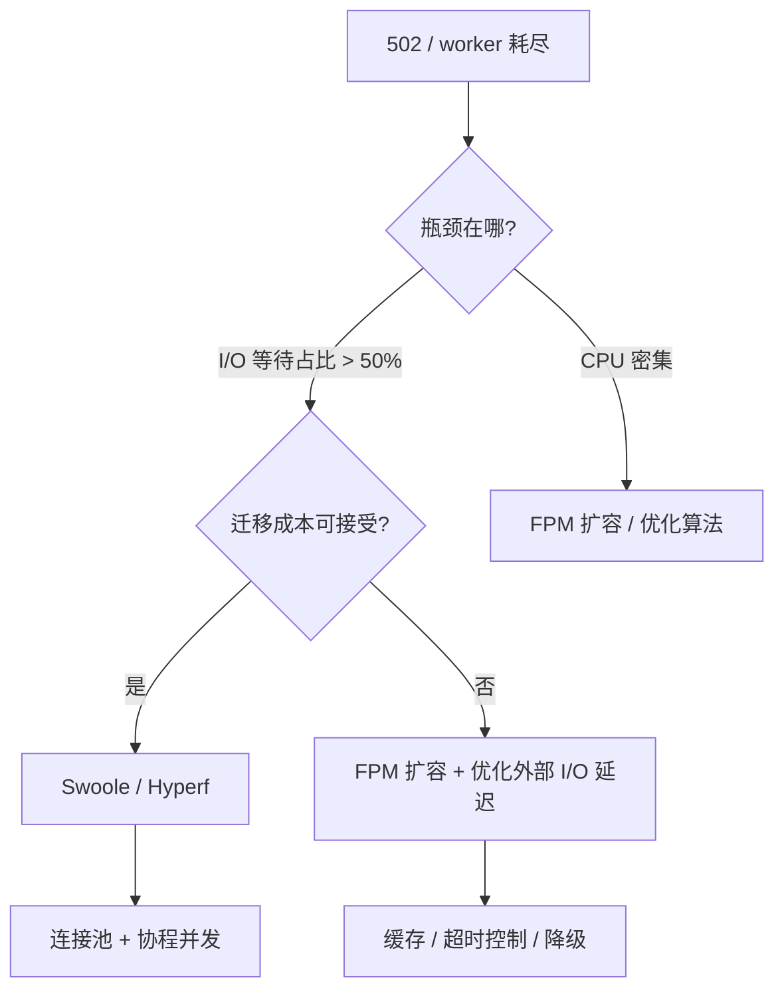

# [L4] Swoole 协程与 PHP-FPM 的选型决策

#### 一句话结论

I/O 密集型服务首选 Swoole，协程切换替代进程阻塞。

---

#### 业务场景

电商促销接口服务，现状如下：

| 指标 | 数值 |
|---|---|
| DAU | 50 万 |
| 大促峰值 QPS | 2000 |
| P95 延迟 | 300ms（其中约 60% 为外部支付/物流 API 等待） |
| PHP-FPM 配置 | dynamic 模式，pm.max_children=80 |
| 线上故障 | 大促期间偶发 502，原因为 worker 全部耗尽 |

**问题**：在不无限横向扩容机器的前提下，如何选型并发模型来消除 502 瓶颈？

---

#### 体系讲解

**1. PHP-FPM 阻塞模型的上限**

每个请求独占一个 worker 进程。I/O 等待期间 worker 挂起但不释放，并发上限 = max_children。

当前吞吐估算：`80 workers ÷ 0.3s/req = 约 266 QPS`，峰值 2000 QPS 时远超上限，502 是必然结果。横向扩容可解决，但成本线性增长。

**2. Swoole 协程模型**

单 worker 进程内可同时运行多个协程，I/O 挂起时调度器切换到其他协程继续执行，不阻塞 OS 线程。同一 worker 的实际并发能力由 I/O 延迟决定：

```
单 worker 理论并发协程数 ≈ I/O 延迟(ms) / 协程调度开销(μs 级)
```

当每请求 I/O 等待 200ms 时，单 worker 可并发数十至数百协程，整体吞吐可提升数倍。

**3. PHP Fiber 的定位**

Fiber 是 PHP 8.1 引入的协程**原语**，提供栈切换能力，但本身**不含**事件循环、网络驱动、连接池。需配合 ReactPHP / AMPHP 等框架才能形成完整的异步 I/O 方案，不可直接与 Swoole 等量比较。

**4. 三方案横向对比**

| 维度 | PHP-FPM 扩容 | Swoole | Fiber + ReactPHP/AMPHP |
|---|---|---|---|
| I/O 密集型吞吐 | 受限于 worker 数 | 协程切换，单 worker 高并发 | 取决于框架成熟度，可行但生态较小 |
| CPU 密集型 | 多进程并行，天然隔离 | 协程非并行，无优势 | 同 Swoole |
| 内存隔离 | 进程级，崩溃互不影响 | 协程共享进程堆，需防泄漏 | 同 Swoole |
| 生态兼容性 | 完整 Laravel/Symfony | 需 Hyperf / LaravelS 桥接 | 逐步成熟，迁移成本高 |
| 运维复杂度 | 低（无状态、graceful reload 成熟） | 高（常驻进程、需手动清理单例） | 中 |
| 迁移成本 | 无（现状） | 高（框架适配 + 异步改造） | 高 |

**5. 选型决策路径**

```
I/O 等待占比 > 50%
  且 峰值 QPS 超出 FPM 横向扩容的成本边界
    → 评估 Swoole（首选 Hyperf 或 LaravelS）

CPU 密集 / 生态依赖复杂（大量同步 ORM/Session）
    → 维持 FPM，纵向扩容或优化 I/O 延迟本身

团队 PHP 版本 ≥ 8.1 且愿意接受较长迁移周期
    → 可评估 AMPHP 3.x（原生 Fiber，无 Swoole 扩展依赖）
```



---

#### 考察意图

考察候选人能否量化现有模型的吞吐上限（而非凭感觉说"FPM 不够用"），理解协程模型解决的核心问题是 **I/O 等待时的资源释放**，并在生态兼容性、运维成本、迁移风险之间做出有依据的权衡，而非无脑推荐 Swoole。

---

#### 追问链

1. **容量估算**：切换到 Swoole 后，如何估算需要多少 worker 进程才能覆盖峰值 2000 QPS？
   > 参考：单 worker 并发协程数 ≈ I/O 延迟 / 调度开销。以 200ms I/O、0.1ms 调度为例，单 worker 可并发约 200 协程，理论上 10 个 worker 即可覆盖 2000 QPS，实际需留 2x 余量。

2. **内存泄漏防护**：Swoole 常驻进程下，哪些 PHP 写法会导致内存线性增长？如何检测和规避？
   > 典型场景：静态变量累积、单例容器未清理、日志 handler 未关闭。检测：定期打印 `memory_get_usage()`。规避：每请求结束后重置请求级单例，或设置 `max_requests` 定期 reload worker。

3. **Fiber vs Swoole 协程**：PHP Fiber 能直接替代 Swoole 协程吗？核心差距在哪？
   > Fiber 是语言原语（栈切换），不含事件循环和网络驱动；Swoole 是完整框架（事件循环 + epoll/kqueue + 协程调度 + 连接池）。单独用 Fiber 无法实现非阻塞网络 I/O，需配合 AMPHP/ReactPHP。

4. **渐进式迁移**：如果现有项目无法整体切换到 Swoole，如何局部引入异步收益？
   > 策略：在 FPM 项目中使用 `curl_multi_exec` 并行外部请求，或引入消息队列（RabbitMQ/Redis Stream）将阻塞操作异步化，无需改变运行时模型。

---

#### 易错点

1. **"切 Swoole = 性能翻倍"的误判**：Swoole 的提升仅针对 I/O 密集型请求。CPU 密集型场景（图片处理、复杂计算）因协程调度开销可能比 FPM 略慢，且无法利用多核并行。

2. **混淆 PHP Fiber 与 Swoole 协程**：Fiber 是协程切换原语，Swoole 是包含网络栈的完整异步框架。直接说"PHP 8.1 有 Fiber 了，不需要 Swoole"是错误结论。

3. **忽略常驻内存的代价**：PHP-FPM 每次请求后进程结束自动释放内存；Swoole worker 常驻内存，若代码中存在静态属性累积或未清理的全局状态，内存会线性增长直至 OOM。

---

#### 代码示例

```php
// ===== PHP-FPM 串行阻塞（示意）=====
// 两个外部 API 串行调用，总耗时约 300ms，worker 全程被占用
function getOrderStatus(int $orderId): array {
    $logistics = Http::get("https://api.logistics.com/track/{$orderId}"); // 阻塞 200ms
    $payment   = Http::get("https://api.payment.com/status/{$orderId}");  // 阻塞 100ms
    return [
        'logistics' => $logistics->json(),
        'payment'   => $payment->json(),
    ];
}

// ===== Swoole 协程并发（两个 I/O 请求并发执行）=====
// 总耗时约 200ms（取最长 I/O），worker 的 I/O 等待时间可服务其他协程
function getOrderStatusAsync(int $orderId): array {
    $results = [];
    $wg = new Swoole\Coroutine\WaitGroup();

    $wg->add();
    go(function () use ($orderId, &$results, $wg) {
        $cli = new Swoole\Coroutine\Http\Client('api.logistics.com', 443, true);
        $cli->get("/track/{$orderId}");
        $results['logistics'] = json_decode($cli->body, true);
        $wg->done();
    });

    $wg->add();
    go(function () use ($orderId, &$results, $wg) {
        $cli = new Swoole\Coroutine\Http\Client('api.payment.com', 443, true);
        $cli->get("/status/{$orderId}");
        $results['payment'] = json_decode($cli->body, true);
        $wg->done();
    });

    $wg->wait();
    return $results;
}
```
