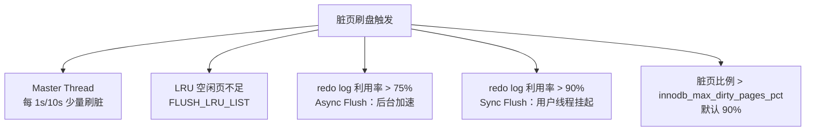

# [L3] InnoDB 脏页刷新与 Checkpoint 机制

#### 一句话结论

先写 redo log（WAL），Checkpoint 异步推进将脏页刷盘，把随机 IO 转为顺序写。

#### 体系讲解

**为什么不直接写磁盘？**

数据页的修改是随机 IO，代价极高。InnoDB 采用 WAL（Write-Ahead Logging）：先将变更追加写入 redo log（顺序 IO），Buffer Pool 中的数据页暂时保持"脏"状态，由后台线程异步刷盘。

**核心概念对照**

| 概念 | 含义 |
|---|---|
| 脏页（Dirty Page） | Buffer Pool 中已修改但未刷盘的数据页 |
| redo log | InnoDB 物理日志，记录页级别变更，循环覆盖写 |
| LSN（Log Sequence Number） | 单调递增序列号，标记 redo log 写入位置 |
| Checkpoint LSN | 已完成刷盘的脏页对应的最大 LSN，决定 redo log 哪段可被覆盖 |

**刷脏触发类型（Fuzzy Checkpoint）**



Sync Flush 是写入抖动的核心来源：用户写入线程被挂起，直到 Checkpoint 推进、redo log 腾出空间。

**关键参数**

| 参数 | 说明 |
|---|---|
| `innodb_log_file_size` | redo log 单文件大小；越大 → Checkpoint 压力越小，但崩溃恢复越慢（⚠️ MySQL 8.0.30+ 改用 `innodb_redo_log_capacity`，需确认版本） |
| `innodb_io_capacity` | 每秒刷脏 IO 能力，默认 200（针对 HDD）；SSD 建议调至 2000–4000 |
| `innodb_max_dirty_pages_pct` | 脏页比例上限，默认 90 |
| `innodb_flush_method` | `O_DIRECT` 可避免操作系统 double buffering |

**崩溃恢复与 Checkpoint 的关系**

重启时 InnoDB 仅需重放 Checkpoint LSN 之后的 redo log。Checkpoint 越新，恢复越快。这是 `innodb_log_file_size` 不能无限调大的制约。

#### 考察意图

考察候选人对 InnoDB 写入链路的理解深度：WAL 消除随机 IO → 脏页积压 → Checkpoint 推进 redo log 空间 → 刷脏策略决定写性能抖动。常出现在"写入突然变慢排查"和 `my.cnf` 参数调优讨论中。

#### 追问链

**Q1：redo log 写满了会怎样？**

> 触发 Sync Flush：用户写入线程被挂起，等待后台刷脏推进 Checkpoint LSN，腾出 redo log 空间后才能继续写入。表现为写 QPS 骤降、延迟毛刺。

**Q2：`innodb_io_capacity` 设置过小会有什么后果？**

> 后台刷脏速度跟不上脏页产生速度，脏页持续堆积，更频繁触发 Async/Sync Flush，加剧写入抖动。SSD 场景下默认值 200 是常见调优盲区。

**Q3：如何在线观察 Checkpoint 压力？**

> 执行 `SHOW ENGINE INNODB STATUS`，在 `LOG` 段比对 `Log sequence number`（当前写入 LSN）与 `Pages flushed up to`（Checkpoint LSN）的差值；差值持续增大说明刷脏跟不上写入节奏。

**Q4：`innodb_log_file_size` 越大越好吗？**

> 不是。更大的 redo log 能减少 Checkpoint 触发频率，但会延长实例崩溃恢复时间（极端情况下可达数十分钟）。需要在"降低 Sync Flush 频率"与"缩短崩溃恢复时间"之间权衡。

#### 易错点

1. **混淆 redo log 与 binlog**：redo log 是 InnoDB 层的物理日志（页级别），用于崩溃恢复；binlog 是 Server 层的逻辑日志，用于主从复制与时间点恢复。两者在事务提交时通过"两阶段提交"保证一致性。

2. **认为 innodb_log_file_size 越大越好**：大 redo log 可以减少 Sync Flush，但也显著延长崩溃恢复时间，不能一味调大。

3. **忽略 innodb_io_capacity 与存储介质的匹配**：默认值 200 针对 HDD，用在 SSD 上会严重低估刷脏能力，导致脏页堆积和不必要的 Sync Flush 抖动。

#### 代码示例

```php
<?php
// 解析 SHOW ENGINE INNODB STATUS 中的 LSN 差值，评估 Checkpoint 压力
$pdo = new PDO('mysql:host=127.0.0.1;dbname=mysql', 'user', 'pass');
$row = $pdo->query("SHOW ENGINE INNODB STATUS")->fetch(PDO::FETCH_ASSOC);
$status = $row['Status'];

preg_match('/Log sequence number\s+(\d+)/', $status, $m1);
preg_match('/Log flushed up to\s+(\d+)/', $status, $m2);
preg_match('/Pages flushed up to\s+(\d+)/', $status, $m3);

if ($m1 && $m2 && $m3) {
    $lsn           = (int)$m1[1];
    $flushedLsn    = (int)$m2[1];
    $checkpointLsn = (int)$m3[1];

    printf("redo log 未落盘：%d bytes\n", $lsn - $flushedLsn);
    printf("Checkpoint 滞后：%d bytes（越大说明脏页积压越严重）\n", $lsn - $checkpointLsn);
}
```
