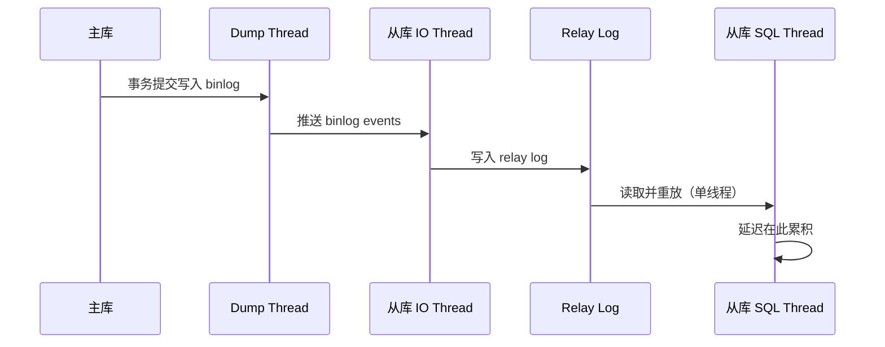

# [L3] MySQL 主从复制延迟的原因与解决

#### 一句话结论

从库单线程串行重放是延迟根源，MySQL 5.7+ 并行复制与减少大事务是核心解法。

#### 体系讲解

**主从复制链路回顾**



`Seconds_Behind_Master` 反映的是 SQL Thread 当前重放的事件时间戳与主库当前时间的差值，可用 `SHOW SLAVE STATUS` 查看。

**延迟的主要原因**

| 类别 | 原因 | 说明 |
|---|---|---|
| **重放能力** | 从库单线程重放（MySQL 5.6 以前） | 主库多并发写入，从库串行重放，天然瓶颈 |
| **大事务** | 主库执行超长 DDL / 批量 UPDATE | 一条大事务在从库重放时阻塞后续所有事务 |
| **主库写入突增** | 促销/导入等场景短时 TPS 飙升 | 从库消化不及，积压迅速放大 |
| **硬件差异** | 从库配置低于主库 | 磁盘/内存/CPU 能力差距直接影响重放速度 |
| **网络带宽** | 主从跨机房传输延迟或带宽不足 | IO Thread 传输 binlog 慢，间接加剧延迟 |
| **参数不一致** | `sync_binlog`/`innodb_flush_log_at_trx_commit` 从库配置宽松 | 影响有限，但需注意 |

**核心解法：并行复制演进**

| 版本 | 并行策略 | 粒度 | 限制 |
|---|---|---|---|
| 5.6 | 按 schema 并行 | 库级别 | 单库无法并行 |
| 5.7 | Logical Clock（基于组提交） | 事务组 | 主库并发提交越多，从库并行度越高 |
| 8.0 | WRITESET（基于行级无冲突检测） | 无冲突事务集 | 最细粒度，延迟最低 |

配置（MySQL 5.7+）：

```sql
-- 从库开启多线程复制
SET GLOBAL slave_parallel_type = 'LOGICAL_CLOCK';
SET GLOBAL slave_parallel_workers = 8;  -- 通常设置为 CPU 核数
```

**减少大事务**

- DDL 变更使用 Online DDL 或 `gh-ost`/`pt-online-schema-change` 分批执行
- 批量 DML 拆分为小批次（每批 500–1000 行），控制单个事务大小
- 避免在业务高峰期执行全表更新

**监控与处置**

```sql
-- 查看从库延迟状态
SHOW SLAVE STATUS\G
-- 关注：Seconds_Behind_Master（延迟秒数）
--       Master_Log_File / Read_Master_Log_Pos（IO Thread 位置）
--       Relay_Master_Log_File / Exec_Master_Log_Pos（SQL Thread 位置）
```

延迟持续增大时的应急手段：降低主库写入速率（限流）+ 调大 `slave_parallel_workers`。

#### 考察意图

考察候选人能否系统定位复制延迟的链路来源，并区分"治标"（监控告警、限流）与"治本"（并行复制、减少大事务）的方案层次，常出现在主从架构设计和故障排查面试场景。

#### 追问链

**Q1：`Seconds_Behind_Master = 0` 就代表无延迟吗？**

> 不一定。该指标是 SQL Thread 正在处理的事件时间戳与当前时间的差值，若 SQL Thread 暂时空闲（无新 binlog 可处理），值会显示为 0，但 IO Thread 可能仍在传输积压的 binlog。需同时关注 `Read_Master_Log_Pos` 与 `Exec_Master_Log_Pos` 是否一致。

**Q2：并行复制为什么在 5.7 后效果更好？**

> MySQL 5.6 的库级并行在单库场景完全无法并行；5.7 基于 Logical Clock（组提交时间窗口），同一组提交的事务在从库可并行重放，主库并发度越高从库并行收益越大；8.0 WRITESET 进一步检测行级写集冲突，允许更多无冲突事务并行，即使是单库单表也能受益。

**Q3：大事务是如何造成从库"雪崩式延迟"的？**

> SQL Thread 重放大事务期间（如删除 500 万行），其他事务全部阻塞等待，期间主库继续写入，relay log 中的积压越来越深。大事务执行完毕后，即使并行复制介入也需要较长时间消化积压，导致延迟曲线出现陡峰后缓慢恢复的"雪崩"形态。

**Q4：半同步复制能解决延迟问题吗？**

> 不能。半同步（`rpl_semi_sync_master_enabled`）保证主库提交前至少一个从库收到 binlog，解决的是**数据丢失**问题（提升 RPO），并不减少 SQL Thread 的重放延迟，有时反而因等待 ACK 而略微增大主库写延迟。

#### 易错点

1. **用 `Seconds_Behind_Master` 作为延迟的唯一判断依据**：该指标仅反映 SQL Thread 位置，不能反映 IO Thread 积压，双重检查 Master/Relay log 位置才完整。

2. **认为开启并行复制就能彻底消除延迟**：并行复制本质上是提高重放吞吐量，若主库写入速率长期超过从库重放能力上限，延迟仍然不可避免。根本解是从库配置对等或使用 GTID + 多从分担读压力。

3. **直接在高峰期执行全表 DDL**：`ALTER TABLE` 在非 Online DDL 场景会产生巨型单事务，是造成从库延迟最常见的运维失误之一。

#### 代码示例

```php
<?php
// 应用层监控主从延迟，超阈值时将读请求强制路由到主库

function getReadPdo(PDO $master, PDO $replica, int $maxLagSeconds = 5): PDO
{
    $row = $replica->query("SHOW SLAVE STATUS")->fetch(PDO::FETCH_ASSOC);

    if ($row === false) {
        // 无从库状态（单机模式），直接走主库
        return $master;
    }

    $lag = (int)($row['Seconds_Behind_Master'] ?? PHP_INT_MAX);

    return $lag <= $maxLagSeconds ? $replica : $master;
}

// 使用示例
$pdo = getReadPdo($masterPdo, $replicaPdo);
$users = $pdo->query("SELECT * FROM users WHERE id = 1")->fetchAll();
```
