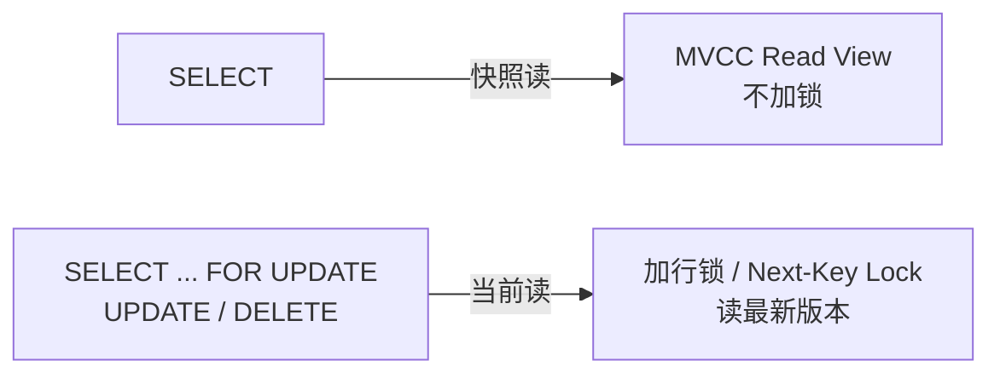

# [L2] MySQL 四种事务隔离级别与并发问题

#### 一句话结论

InnoDB 提供四种隔离级别，通过 MVCC 与锁协作解决脏读、不可重复读、幻读，默认 RR 兼顾一致性与性能。

#### 体系讲解

**1. 三类并发异常**

| 异常 | 场景描述 |
|---|---|
| 脏读 | 事务 A 读到事务 B **未提交**的数据，B 随后回滚 |
| 不可重复读 | 事务 A 两次读同一行，B 在中间**提交了修改** |
| 幻读 | 事务 A 两次范围查询，B 在中间**插入/删除了行** |

**2. 四种隔离级别对照**

| 级别 | 脏读 | 不可重复读 | 幻读 | InnoDB 实现 |
|---|:---:|:---:|:---:|---|
| READ UNCOMMITTED | ✅ | ✅ | ✅ | 不保护 |
| READ COMMITTED | ❌ | ✅ | ✅ | MVCC（每次 SELECT 创建新 Read View） |
| REPEATABLE READ（默认） | ❌ | ❌ | ⚠️ | MVCC（首次 SELECT 创建 Read View，事务内复用） |
| SERIALIZABLE | ❌ | ❌ | ❌ | 所有读自动加共享锁 |

**3. MVCC 快照读 vs 当前读**



- **RC**：每次快照读重建 Read View → 能看到其他事务的已提交变更 → 不可重复读
- **RR**：事务首次快照读时建立 Read View，后续复用 → 数据一致性快照

**4. RR 下的幻读边界**

纯快照读（SELECT）场景下，MVCC 已能规避幻读；但混用当前读（UPDATE / SELECT FOR UPDATE）时，仍需 **Next-Key Lock**（间隙锁 + 行锁）封堵新插入的行，才能彻底防止幻读。

**5. 选型建议**

- 绝大多数业务：默认 **RR** 即可
- 对读一致性要求极高（金融核对）：考虑 **SERIALIZABLE**，但需接受并发吞吐下降
- 允许脏读、追求极致读性能（日志分析）：可降为 **RC**

#### 考察意图

考察候选人能否区分三类并发异常、清晰说明各隔离级别的保护范围，以及是否理解 MVCC 与锁的边界——这两点在高并发扣款、库存超卖等场景中直接影响业务正确性。

#### 追问链

1. **RC 与 RR 的 Read View 创建时机有何不同？**  
   RC 每次 SELECT 都创建新 Read View，因此能读到其他事务的已提交变更（不可重复读）；RR 在事务第一次 SELECT 时创建，整个事务复用同一个 Read View，保证一致性快照。

2. **InnoDB RR 级别能彻底解决幻读吗？**  
   不能完全解决。纯快照读（普通 SELECT）路径通过 MVCC 规避；但若事务中混用了当前读（FOR UPDATE / UPDATE），InnoDB 会通过 Next-Key Lock 防止新行插入，此时才能防幻读。两种路径混用时仍可能观察到幻读。

3. **发生死锁时 InnoDB 如何处理？如何排查？**  
   InnoDB 自动检测死锁，选择 undo log 量较小（回滚代价低）的事务回滚，并返回错误 1213。排查时可执行 `SHOW ENGINE INNODB STATUS` 查看 `LATEST DETECTED DEADLOCK` 段，分析两个事务的加锁顺序。

4. **PHP 里如何正确使用事务，避免异常导致数据不一致？**  
   用 PDO 的 `beginTransaction` + `commit`，并在 `catch` 中调用 `rollBack`（见代码示例）。

#### 易错点

1. **混淆"幻读"与"不可重复读"**：不可重复读针对**同一行**前后值不同（RR 可解决）；幻读针对**范围查询**行数变化（需 Next-Key Lock 才能完全解决）。

2. **认为 RR 完全消除了幻读**：RR 对快照读有效，但一旦在同一事务中执行了 `FOR UPDATE` 等当前读，就可能看到新插入的行，需靠锁而非 MVCC 防范。

3. **PHP 事务漏写 rollBack**：只有 `beginTransaction` + `commit` 而无 `catch rollBack`，一旦抛出异常，连接关闭时 MySQL 才隐式回滚，期间若有其他查询依赖该数据，将读到中间态。

#### 代码示例

```php
$pdo = new PDO('mysql:host=localhost;dbname=app', 'user', 'pass', [
    PDO::ATTR_ERRMODE => PDO::ERRMODE_EXCEPTION,
]);

// 确认/设置隔离级别（生产一般由 my.cnf 统一配置）
$pdo->exec("SET SESSION TRANSACTION ISOLATION LEVEL REPEATABLE READ");

$pdo->beginTransaction();
try {
    // 当前读：加行锁，防止并发超扣
    $stmt = $pdo->prepare("SELECT balance FROM accounts WHERE id = ? FOR UPDATE");
    $stmt->execute([1]);
    $balance = (int) $stmt->fetchColumn();

    if ($balance < 100) {
        throw new RuntimeException('余额不足');
    }

    $pdo->prepare("UPDATE accounts SET balance = balance - 100 WHERE id = ?")->execute([1]);
    $pdo->prepare("INSERT INTO orders (account_id, amount) VALUES (?, ?)")->execute([1, 100]);

    $pdo->commit();
} catch (Throwable $e) {
    $pdo->rollBack();
    throw $e;
}
```
