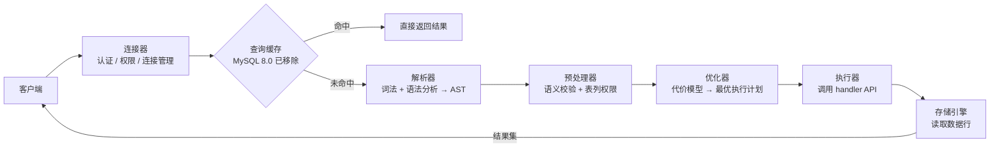

# [L3] MySQL 一条查询语句的完整执行流程

#### 一句话结论

查询经连接器、解析器、预处理器、优化器、执行器五阶段，Server 层与存储引擎层通过 handler API 解耦。

#### 体系讲解

**1. 两层架构分工**

| 层次 | 包含组件 | 核心职责 |
|---|---|---|
| Server 层 | 连接器、解析器、预处理器、优化器、执行器 | SQL 解析、权限校验、执行计划生成、结果汇总 |
| 存储引擎层 | InnoDB / MyISAM / Memory 等（插件化） | 数据读写、索引维护、事务管理 |

两层通过 **handler API** 解耦：Server 层无需关心数据如何存储，存储引擎无需关心 SQL 如何解析。

**2. 查询执行全流程**



各阶段职责：

- **连接器**：TCP 握手 + 账号认证 + 读取全局权限；长连接减少握手开销，但内存占用随连接数线性增长（可定期执行 `mysql_reset_connection` 释放）
- **查询缓存**（MySQL 8.0 已移除）：key = 原始 SQL 字符串，任何表级写操作导致整张表缓存全部失效，高并发写场景命中率极低，弊大于利
- **解析器**：词法分析（识别 SQL 关键字、表名、列名）+ 语法分析（构建 AST），此阶段发现**语法错误**
- **预处理器**：语义校验（表/列是否存在）+ 列级权限检查，此阶段发现 `Unknown column` 等**语义错误**
- **优化器**：基于**代价模型**（IO + CPU 估算）选择索引、JOIN 顺序、子查询展开策略，依赖统计信息（`ANALYZE TABLE` 刷新），输出执行计划
- **执行器**：按执行计划逐行调用存储引擎 handler API，汇总并返回结果集

**3. 优化器的局限性**

优化器选的是**估算代价最低**的计划，非绝对最优。统计信息过期或数据分布极度不均时可能选错。排查工具：`EXPLAIN`（查看计划）、`EXPLAIN ANALYZE`（MySQL 8.0+，查看实际执行）、`OPTIMIZER_TRACE`（查看代价推导过程）。

#### 考察意图

考察候选人能否清楚说明 Server 层各组件的职责边界，理解「解析器报错」与「预处理器/执行器报错」的本质差异，并能从优化器局限性出发解释为何需要 `ANALYZE TABLE`、`EXPLAIN ANALYZE` 等工具辅助调优。

#### 追问链

1. **MySQL 8.0 为什么彻底移除查询缓存？**  
   查询缓存 key 是原始 SQL 字符串（含空格、大小写敏感），任何对表的写操作都会使该表全部缓存失效。高并发写场景命中率极低，缓存维护本身成为锁竞争热点，弊大于利。8.0 移除后，建议由应用层（Redis）承担热点查询缓存。

2. **解析器报错与执行器报错的根本区别是什么？**  
   解析器只做语法层面校验（关键字是否合法、括号是否匹配），不涉及任何对象是否存在；预处理器做语义校验，`Unknown table`、`Unknown column` 来自预处理器；`Access denied` 来自执行器的最终权限校验。三类错误对应不同层，排查方向不同。

3. **EXPLAIN 的 `rows` 与实际扫描行数为何可能差异很大？**  
   `rows` 是优化器基于统计信息（索引区分度、采样行数）的估算值，统计信息长期未更新（未执行 `ANALYZE TABLE`）或数据分布极不均匀时误差显著。`EXPLAIN ANALYZE`（MySQL 8.0+）会实际执行并附上 `actual rows` 与 `actual time`，是定位估算偏差的最直接手段。

4. **连接器加载权限的时机会影响什么？**  
   连接器在建连时读取全局权限到内存。连接建立后修改用户权限（`GRANT`/`REVOKE`），对**当前已有连接**不立即生效——已有连接的全局权限缓存不会自动刷新，需等下次重连才读新权限。表/列级权限由执行器每次执行时校验，变更后对已有连接**立即生效**。

#### 易错点

1. **混淆解析器与预处理器**：`Unknown column 'xxx'` 不是解析器报的，而是预处理器在语义校验阶段发现列不存在。解析器只管语法，不查对象是否真实存在。

2. **认为 EXPLAIN 的 rows 是实际行数**：`rows` 仅是优化器估算，不反映真实扫描量。统计信息过期时估算可能严重偏低，导致优化器错误选择全表扫描而非走索引。

3. **忽略长连接的内存泄漏风险**：长连接减少握手开销，但 MySQL 执行查询产生的内存（如临时表、排序缓冲）在连接释放前不会归还，大量长连接累积可撑爆 mysqld 内存。解决方案：定期重置连接（`mysql_reset_connection`）或设置 `wait_timeout`。

#### 代码示例

```sql
-- 查看执行计划（优化器输出，不实际执行）
EXPLAIN SELECT u.name, o.total
FROM users u
JOIN orders o ON u.id = o.user_id
WHERE u.status = 1
ORDER BY o.created_at DESC
LIMIT 10;
-- 重点关注：type（ref/range/ALL）、key（走哪个索引）
--           rows（估算扫描行数）、Extra（Using filesort/Using temporary）

-- 查看真实执行数据：actual rows + actual time（MySQL 8.0+）
EXPLAIN ANALYZE SELECT u.name, o.total
FROM users u
JOIN orders o ON u.id = o.user_id
WHERE u.status = 1
ORDER BY o.created_at DESC
LIMIT 10;

-- 刷新统计信息，让优化器代价估算更准确
ANALYZE TABLE users, orders;

-- 查看优化器代价推导全过程（调试用，用后关闭）
SET optimizer_trace = "enabled=on";
SELECT u.name FROM users u WHERE u.status = 1 LIMIT 1;
SELECT JSON_PRETTY(TRACE) FROM information_schema.OPTIMIZER_TRACE;
SET optimizer_trace = "enabled=off";
```
