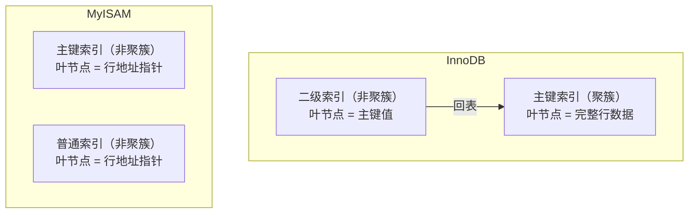

# [L2] MySQL 索引为什么用 B+ 树？聚簇索引与非聚簇索引有什么区别？

#### 一句话结论

B+ 树低树高、叶链表利于范围查询；InnoDB 聚簇索引存完整行，二级索引回表查主键。

#### 体系讲解

**原理：为什么选 B+ 树**

> 以下索引结构描述来源于 [MySQL 8.0 参考手册 — InnoDB 索引](https://dev.mysql.com/doc/refman/8.0/en/innodb-index-types.html) 及 [B-Tree 与 Hash 索引对比](https://dev.mysql.com/doc/refman/8.0/en/index-btree-hash.html)。

数据库索引的核心问题是**减少磁盘 IO 次数**。常见数据结构的对比：

| 数据结构 | 缺陷 | 为何不选 |
|:--------|:----|:-------|
| 哈希表 | 不支持范围查询、排序 | `WHERE age > 18` 无法走哈希索引 |
| B 树（平衡多路树） | 数据分布在所有节点，内部节点存 data，扇出小，树更高 | 范围查询需中序遍历，跨节点跳跃多 |
| 跳表 | 内存友好，但磁盘随机读代价高 | Redis 用跳表，MySQL 磁盘场景不适合 |
| **B+ 树** | — | 内部节点只存 key，叶节点存所有 data + 双向链表，扇出最大，树高最低（通常 3-4 层），范围查询顺序 IO |

B+ 树的两个关键设计：
1. **非叶节点只存索引键**，不存 data → 单个节点可放更多键 → 扇出更大 → 同样数据量树更矮
2. **叶节点之间通过双向链表相连** → 范围查询只需找到起始叶节点，然后顺序遍历链表，无需回溯

**机制：聚簇索引 vs 非聚簇索引**



| 维度 | 聚簇索引（InnoDB 主键）| 非聚簇索引（InnoDB 二级索引 / MyISAM 所有索引）|
|:----|:--------------------|:---------------------------------------------|
| 叶节点存储内容 | 完整行数据 | 主键值（InnoDB）或行地址（MyISAM） |
| 每张表数量 | 只有 1 个 | 可有多个 |
| 查询需要回表 | 否 | InnoDB 需回表（除非覆盖索引），MyISAM 按地址直接读 |
| 插入顺序影响 | 按主键顺序写入，乱序主键会导致页分裂 | 独立 B+ 树，不影响数据行顺序 |

**结论：对开发的直接影响**

- InnoDB 应使用**自增整数**作主键：保证顺序插入，避免页分裂，索引更紧凑
- 二级索引查询需要主键字段外的列时，会**回表**到聚簇索引再读行 —— 回表有额外 IO 开销
- 可通过**覆盖索引**（查询列全在索引中）消除回表
- 避免用 UUID 做主键：随机写入导致频繁页分裂，写入性能劣化严重

#### 考察意图

- 验证候选人能说清"B+ 树相比 B 树、哈希表各自的缺陷"，而非只背"B+ 树好"
- 考察对聚簇索引与二级索引的存储差异的理解，特别是 InnoDB 的回表代价
- 区分"知道有索引"和"能做索引选型"：主键选自增 vs UUID 的工程决策

#### 追问链

1. B 树和 B+ 树的主要区别是什么？为什么 B+ 树更适合数据库索引？

   简答：B 树每个节点（包括内部节点）都存 data，导致每页能放的 key 更少，树更高；B+ 树内部节点只存 key，扇出更大，树更矮（IO 次数更少）；B+ 树叶节点链表天然支持范围查询顺序 IO，B 树范围查询需中序遍历回溯。

2. InnoDB 一张表必须有主键吗？如果没有显式主键，会怎样？

   简答：必须有聚簇索引。若没有显式主键，InnoDB 会按优先级选择：第一个非 NULL 唯一索引 → 内部隐藏的 6 字节 row_id 作聚簇索引。建议总是显式定义自增主键，避免依赖隐式 row_id（无法从业务层控制）。

3. 为什么推荐 InnoDB 主键用自增整数，而不推荐 UUID？

   简答：自增主键保证新行总是追加到 B+ 树最右叶节点，写入顺序 IO；UUID 随机，每次插入都可能落在中间节点，触发**页分裂**（将已满页一分为二并调整指针），写入放大严重，且 UUID 占 16 字节，所有二级索引叶节点均存主键，空间开销也更大。

4. 什么是回表？如何消除回表？

   简答：二级索引叶节点只存主键值，查到主键后还需再查聚簇索引获取完整行，这一额外查找称为"回表"。消除方式：将查询所需的所有列纳入联合索引（覆盖索引），使引擎在二级索引上就能拿到所有数据，无需回表。

#### 易错点

1. **混淆 B 树与 B+ 树**：常见错误是说"B 树叶节点有链表"——实际上这是 B+ 树的特性，B 树没有叶节点链表。面试时说反会直接暴露知识漏洞。

2. **误以为每张 InnoDB 表有多个聚簇索引**：聚簇索引只有一个（主键），其余都是二级索引（非聚簇）。二级索引叶节点存的是主键值，而非行的完整数据。

3. **忽略主键选型对性能的影响**：只说"设置主键"而不提自增 vs UUID 的差异，在 L2 面试中是不完整的回答。UUID 主键的页分裂问题是实际工程中常见的写入性能陷阱。

#### 代码示例

```sql
-- ✅ 推荐：自增主键 + email 二级索引
CREATE TABLE users (
    id         BIGINT UNSIGNED AUTO_INCREMENT PRIMARY KEY,
    email      VARCHAR(100) NOT NULL,
    created_at DATETIME NOT NULL,
    INDEX idx_email (email)   -- 二级索引，叶节点存 email + 主键 id
);

-- ❌ 不推荐：UUID 主键，随机插入，频繁页分裂
CREATE TABLE users_uuid (
    id    CHAR(36) PRIMARY KEY,  -- 16 字节，随机写入导致页分裂
    email VARCHAR(100) NOT NULL
);

-- EXPLAIN 示例：SELECT id+email，两列均在 idx_email 中（email 索引键 + id 主键值）
-- type=ref（走二级索引），Extra=Using index（覆盖索引，无回表）
EXPLAIN SELECT id, email FROM users WHERE email = 'alice@example.com';
```
