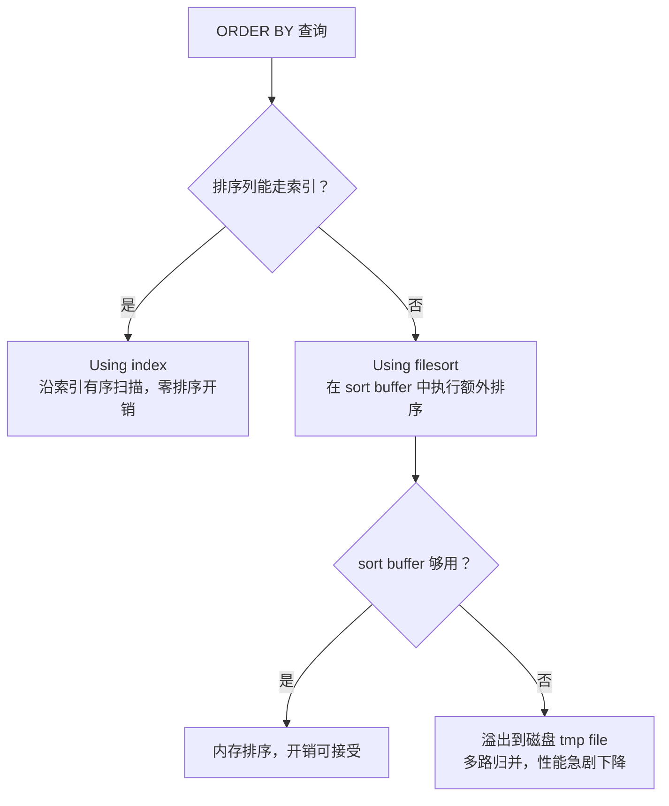

# [L3] ORDER BY 的执行原理与性能优化

#### 一句话结论

ORDER BY 有「走索引有序扫描」与「filesort 内存/磁盘排序」两条路径，优化核心是让排序列进入索引覆盖范围，消除 filesort。

#### 体系讲解

**1. 两条排序路径**



**2. filesort 两种内部算法** ⚠️ 需查证

| 算法 | 读入 sort buffer 的内容 | 特点 |
|---|---|---|
| 全字段排序（single-pass） | 排序键 + SELECT 所需全部列 | 排序后直接输出，省去二次回表；sort buffer 占用大 |
| rowid 排序（two-pass） | 排序键 + 主键 | sort buffer 占用小；排序后需按主键回表取剩余列，多一次 IO |

> MySQL 8.0.20 起废弃 `max_length_for_sort_data`，优化器自动根据行宽与 sort_buffer_size 权衡选择算法，具体行为建议参阅官方文档。

**3. 优化器选 index sort 的条件**

- ORDER BY 列是索引**最左前缀**（或通过等值 WHERE 补齐前缀）
- WHERE 过滤列与 ORDER BY 列使用**同一个索引**
- ORDER BY 列排序方向与索引方向一致（MySQL 8.0 支持降序索引，解决混合 ASC/DESC 问题）

**4. EXPLAIN 关键标志**

| Extra 字段 | 含义 | 优化优先级 |
|---|---|:---:|
| `Using index` | 覆盖索引 + 有序扫描，最优 | — |
| `Using index condition` | 索引条件下推，无额外排序 | 低 |
| `Using filesort` | 内存排序，可接受（需确认未溢出磁盘） | 中 |
| `Using temporary; Using filesort` | 先建临时表再排序，最差 | 高 |

**5. 优化手段**

- 建联合索引：**等值过滤列在前，ORDER BY 列在后**（`INDEX (status, created_at)`）
- 进一步建覆盖索引，彻底消除回表与 filesort
- 缩减 SELECT 列数，减少 sort buffer 压力
- 会话级调大 `sort_buffer_size`，防止溢出磁盘（注意每连接独立分配，不宜过大）
- 避免 `ORDER BY RAND()`，改用应用层随机 offset

#### 考察意图

考察候选人能否从 EXPLAIN 结果定位排序瓶颈，理解 filesort 两种算法的 IO/内存权衡，并给出从索引设计到参数调优的完整优化路径——这是 DBA 与高级后端的分水岭能力。

#### 追问链

1. **EXPLAIN 出现 `Using filesort` 一定要优化吗？**  
   不一定。小结果集在内存 sort buffer 中完成排序，性能可接受。真正危险的是：① `Using temporary; Using filesort`（临时表 + 排序双重开销）；② filesort 溢出磁盘（可通过 `OPTIMIZER_TRACE` 查看 `filesort_summary.number_of_tmp_files > 0` 确认）。

2. **WHERE + ORDER BY 同时存在时，联合索引如何设计？**  
   等值过滤列在索引最左侧，排序列紧随其后。例：`WHERE status = 1 ORDER BY created_at DESC` → `INDEX (status, created_at)`。若 WHERE 是范围过滤（`>`/`<`），排序列之后的索引列将失效，此时 filesort 可能比强制走索引更优（优化器自行决策）。

3. **MySQL 8.0 对 ORDER BY 做了哪些改进？**  
   ① 支持**降序索引**（`INDEX (a ASC, b DESC)`），解决混合排序方向导致 filesort 的历史痛点；② 废弃 `max_length_for_sort_data`，优化器自动选择排序算法。⚠️ 需查证：具体版本号与行为变化建议参阅 MySQL 8.0 Release Notes。

4. **`ORDER BY RAND()` 为什么慢？如何替代？**  
   MySQL 对每行生成随机值后全表 filesort，复杂度 O(n log n)，大表极慢。替代方案：先 `SELECT COUNT(*)` 得总量，应用层生成随机 offset，再 `WHERE id >= {offset} LIMIT 1`；或用 `JOIN` 子查询方式，避免全表扫描。

#### 易错点

1. **加了索引还是 filesort**：ORDER BY 列有单列索引不够——若 WHERE 过滤用了另一个索引，优化器只会选其中一个；需建**联合索引**将过滤列与排序列放在同一索引中。

2. **`Using filesort` ≠ 磁盘排序**：`Using filesort` 只表示使用了额外排序逻辑，不代表一定写磁盘。是否溢出磁盘需通过 `OPTIMIZER_TRACE` 的 `filesort_summary` 确认，不能仅凭 EXPLAIN 判断严重程度。

3. **覆盖索引忘包含 SELECT 列**：联合索引只包含了 `(status, created_at)`，但 SELECT 还需 `title`，导致回表，失去覆盖索引效果。建索引时需将 SELECT 所需列一并纳入，代价是索引体积增大。

#### 代码示例

```sql
-- 【反例】单列索引无法同时满足过滤 + 排序，触发 filesort
-- 现有索引：INDEX (user_id)
EXPLAIN SELECT id, title, created_at
FROM orders
WHERE user_id = 100
ORDER BY created_at DESC;
-- Extra: Using index condition; Using filesort

-- 【优化1】联合索引：等值列在前，排序列在后
ALTER TABLE orders ADD INDEX idx_user_created (user_id, created_at);

EXPLAIN SELECT id, title, created_at
FROM orders
WHERE user_id = 100
ORDER BY created_at DESC;
-- Extra: Using index condition   ← filesort 消除

-- 【优化2】覆盖索引：进一步消除回表
ALTER TABLE orders ADD INDEX idx_cover (user_id, created_at, id, title);

EXPLAIN SELECT id, title, created_at
FROM orders
WHERE user_id = 100
ORDER BY created_at DESC;
-- Extra: Using index   ← 最优，无回表、无 filesort

-- 验证是否溢出磁盘（MySQL 8.0+）
SET optimizer_trace = "enabled=on";
SELECT id FROM orders WHERE user_id = 100 ORDER BY created_at DESC LIMIT 1000;
SELECT JSON_EXTRACT(TRACE, '$**.filesort_summary')
FROM information_schema.OPTIMIZER_TRACE;
-- 关注 number_of_tmp_files：0 = 纯内存排序，>0 = 溢出磁盘
```
