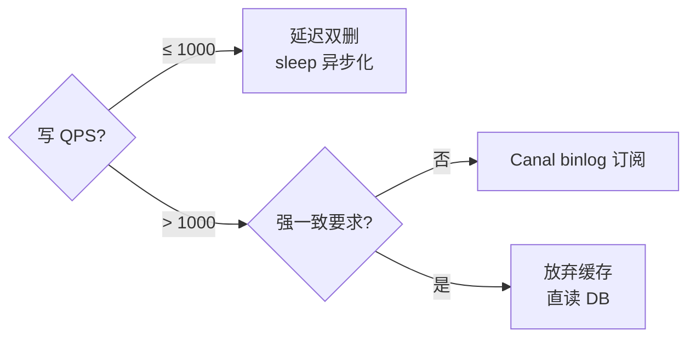

# [L4] 缓存与数据库双写一致性方案如何选型？

#### 一句话结论

写 QPS ≤1000 选延迟双删（sleep 异步化）；写 QPS 更高或不一致窗口敏感选 Canal binlog 异步订阅。

#### 业务场景

电商平台商品详情页：

- DAU：500 万
- 读峰值 QPS：5 万（Redis 缓存命中率 ≥99%，透传 DB ≤500 QPS）
- 写 QPS：500（商品价格/库存变更，运营后台触发）
- SLA：99.9%
- 一致性约束：允许 ≤1s 最终一致性窗口；不容忍价格错误超过 1 分钟（视为线上事故）

#### 体系讲解

**问题根源**

缓存删除与数据库写入是两个独立操作，不具备原子性。任何顺序都存在中间状态窗口——窗口期内的并发读请求可能读到旧数据并将其写回缓存。

**四种方案量化对比**

| 方案 | 操作顺序 | 不一致窗口 | 实现复杂度 | 主要风险 |
|---|---|---|---|---|
| 先删缓存再写 DB | DEL → UPDATE | 长（删后写前并发读重建旧值） | 低 | 窗口期内旧值回写，依赖 TTL 自愈 |
| 先写 DB 再删缓存 | UPDATE → DEL | 短（DEL 操作前的微秒级竞争） | 低 | DEL 失败则长期不一致，需重试 + TTL 兜底 |
| 延迟双删 | DEL → UPDATE → async DEL | 短（第二次删覆盖窗口内重建值） | 中（需异步队列） | sleep 时长标定难；短暂降低缓存命中率 |
| Canal binlog 订阅 | UPDATE → binlog → DEL | 极短（binlog 消费延迟通常 <100ms） | 高（引入独立组件） | 组件可用性依赖；消费失败需重试机制 |

**选型决策**

**本场景结论**

写 QPS 500，允许 ≤1s 不一致：选**延迟双删**。Canal 的引入成本（独立进程、Zookeeper 依赖、运维监控）在此规模下不合算。若写 QPS 升至 5000+（如大促期间），延迟双删对缓存命中率的冲击变得明显，届时切换 Canal。

#### 考察意图

考察候选人是否理解双写不一致的根因（无原子性），能否在 QPS / 一致性窗口 / 运维成本约束下量化选型，而非泛谈"先删还是先写"的概念。

#### 追问链

**Q1：延迟双删的 sleep 时长怎么确定？偏短会怎样？**

**Q2："先写 DB 再删缓存"方案，删缓存失败如何补救？**

**Q3：Canal 消费积压（如 Canal Server 重启）时如何处理？**

**Q4：余额/金额类数据是否也需要双写一致性方案？**

**Q5：写 QPS 从 500 升到 5000 时如何平滑切换至 Canal？**

> 以上 5 道追问的**完整答案**、3 个大厂高频**易错点**，
> 以及可直接复用的 **PHP 延迟双删完整代码**，
> 已整理为深度解析文章。
>
> 关注公众号 **学编程拿offer**，后台回复 `双写` 即可获取。
