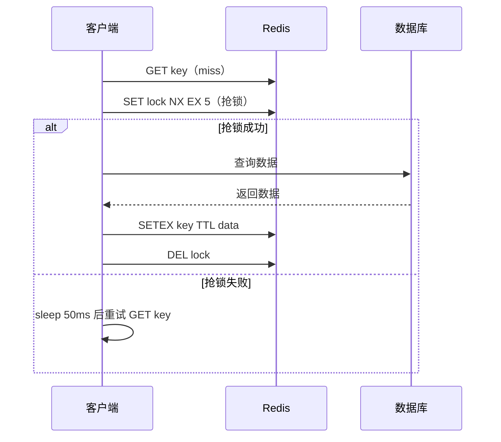

# [L2] 缓存穿透、缓存击穿与缓存雪崩的区别及防护方案

#### 一句话结论

三类缓存问题本质是「查不到」「单点失效」「批量失效」，分别用空值缓存/布隆、互斥锁、随机 TTL 对症防护。

#### 体系讲解

**1. 三类问题根因对比**

| 问题 | 触发根因 | 危害 |
|---|---|---|
| 缓存穿透 | 请求的 key 在缓存**和** DB 中均不存在 | 每次请求都打穿到 DB，可被恶意利用放大攻击 |
| 缓存击穿 | **单个热点** key 缓存恰好过期，大量并发同时穿透 | "狗堆效应"导致 DB 瞬时压力激增 |
| 缓存雪崩 | **大批量** key 同时过期，或 Redis 实例宕机 | DB 瞬间承接全量流量，可能级联崩溃 |

**2. 防护方案选型**

| 问题 | 方案 | 适用场景 |
|---|---|---|
| 穿透 | **缓存空值**（短 TTL） | 实现简单，不存在的 key 量级可控 |
| 穿透 | **布隆过滤器** | 数据量大、恶意枚举场景，提前过滤不存在的 key |
| 击穿 | **互斥锁**（SET NX EX） | 保证只有一个请求回源 DB，其余等待重试 |
| 击穿 | **逻辑过期**（不设 TTL） | 牺牲短暂一致性换取高可用 |
| 雪崩 | **随机 TTL**（基础值 + 随机偏移） | 打散批量过期时间 |
| 雪崩 | **Redis 高可用**（主从 + 哨兵 / Cluster） | 防实例宕机导致整体缓存失效 |

**3. 互斥锁防击穿流程**



#### 考察意图

考察候选人能否识别三类问题的根因差异，并根据业务场景（数据是否存在、key 是否热点、过期是否集中）选择合适的防护组合——这是任何有缓存层的业务系统必备的设计能力。

#### 追问链

1. **布隆过滤器如何防缓存穿透？它有什么局限性？**  
   布隆过滤器用多个哈希函数将合法 key 映射到 bit 数组，查询时若任意一位为 0 则 key 必不存在，可在缓存前直接拦截。局限性：存在误判率（false positive，可能误杀合法 key），且标准布隆过滤器不支持删除元素。

2. **互斥锁方案中，持锁线程崩溃了怎么办？**  
   必须使用 `SET lock 1 NX EX 5` 原子命令同时设置锁和过期时间，防止持锁线程崩溃后锁永不释放。仅用 `SETNX` 再单独 `EXPIRE` 是非原子的，存在死锁风险。

3. **随机 TTL 偏移量如何选取？**  
   通常取基础 TTL 的 10%–30% 作为随机区间，例如基础 300s 则设 `300 + random_int(0, 60)`。偏移量过小打散效果差，过大会显著缩短热点数据的有效缓存时长。

4. **缓存击穿与缓存雪崩的本质区别是什么？**  
   击穿是**单个**热点 key 过期后的并发穿透，锁住一个 key 即可解决；雪崩是**大批量** key 集中过期或整个缓存层不可用，需从 TTL 分散和架构高可用两个维度应对。

#### 易错点

1. **混淆穿透与击穿**：穿透是数据在缓存和 DB 中都不存在（根本没这个数据）；击穿是数据存在于 DB 但缓存恰好过期。解决方案完全不同。

2. **互斥锁忘设过期时间**：只用 `SETNX` 不设 `EX`，持锁线程崩溃后锁永不释放，后续请求全被阻塞，将击穿问题变成可用性问题。

3. **空值缓存 TTL 过长**：恶意请求大量不存在的 key，空值堆满 Redis 内存，触发内存淘汰反而驱逐正常热点数据，间接引发雪崩。

#### 代码示例

```php
function getProduct(Redis $redis, PDO $pdo, int $id): ?array
{
    $cacheKey = "product:{$id}";
    $lockKey  = "lock:{$cacheKey}";

    // 1. 读缓存（空值用哨兵字符串区分「数据不存在」与「缓存未命中」）
    $cached = $redis->get($cacheKey);
    if ($cached !== false) {
        return $cached === 'NULL' ? null : json_decode($cached, true);
    }

    // 2. 互斥锁防击穿（SET NX EX 原子操作）
    if (!$redis->set($lockKey, 1, ['NX', 'EX' => 5])) {
        usleep(50_000); // 等待 50ms 后重试
        return getProduct($redis, $pdo, $id);
    }

    try {
        $stmt = $pdo->prepare("SELECT * FROM products WHERE id = ?");
        $stmt->execute([$id]);
        $data = $stmt->fetch(PDO::FETCH_ASSOC) ?: null;

        // 3. 随机 TTL 防雪崩；空值短 TTL 防穿透
        $ttl   = $data ? (300 + random_int(0, 60)) : 30;
        $value = $data ? json_encode($data) : 'NULL';
        $redis->setex($cacheKey, $ttl, $value);

        return $data;
    } finally {
        $redis->del($lockKey);
    }
}
```
