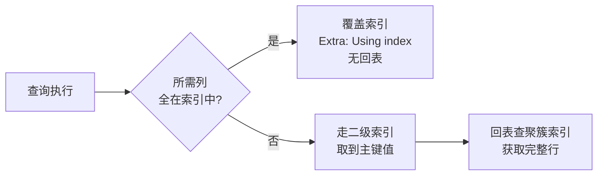

# [L2] 什么是覆盖索引？联合索引的最左前缀原则是什么？

#### 一句话结论

覆盖索引消除回表；最左前缀决定联合索引的命中范围，两者是联合索引设计的核心。

#### 体系讲解

**原理：回表的代价与覆盖索引的价值**

InnoDB 二级索引叶节点只存索引列 + 主键值，查询时若需要索引之外的列，引擎必须拿主键值再查一次聚簇索引，即**回表**。每次回表是一次额外的随机 IO。

**覆盖索引**（Covering Index）：查询所需的所有列（SELECT 列 + WHERE 列 + ORDER BY 列）都包含在某个索引中，引擎无需回表，直接从索引叶节点返回结果。EXPLAIN 输出中 `Extra: Using index` 即表示命中了覆盖索引。

```sql
-- 表：orders(id, user_id, status, amount, created_at)
-- 联合索引：idx_user_status(user_id, status)

-- ✅ 覆盖索引：SELECT 列 (user_id, status) 全在索引中，Extra=Using index
SELECT user_id, status FROM orders WHERE user_id = 1;

-- ❌ 回表：amount 不在索引中，需回表取完整行，Extra=Using index condition
SELECT user_id, status, amount FROM orders WHERE user_id = 1;
```

**机制：最左前缀原则**

联合索引按创建时的列顺序组合排序。以索引 `(a, b, c)` 为例：

| 查询条件 | 能否命中索引 | 命中情况 |
|:-------|:----------:|:--------|
| `WHERE a = 1` | ✅ | 命中 a |
| `WHERE a = 1 AND b = 2` | ✅ | 命中 a, b |
| `WHERE a = 1 AND b = 2 AND c = 3` | ✅ | 命中 a, b, c |
| `WHERE a = 1 AND c = 3` | ✅ 部分 | 仅命中 a，c 无法走索引（b 断开） |
| `WHERE b = 2` | ❌ | 跳过 a，索引失效 |
| `WHERE b = 2 AND c = 3` | ❌ | 跳过 a，索引失效 |
| `WHERE a LIKE 'abc%'` | ✅ | a 前缀匹配，可走索引 |
| `WHERE a LIKE '%abc'` | ❌ | 前缀不确定，索引失效 |

**关键**：联合索引只有从最左列开始连续使用，才能充分命中。中间列有范围查询（`>`、`<`、`BETWEEN`）时，右侧列索引失效：

```sql
-- 索引 (a, b, c)
-- a 等值 + b 范围 → c 无法走索引
WHERE a = 1 AND b > 10 AND c = 3
-- 等价于只用了 (a, b)，c 由 server 层过滤
```

**结论：联合索引的设计原则**

1. **高频等值列放左边**，范围查询列放右边，让更多列能被索引命中
2. **将 SELECT 列纳入索引末尾**，构造覆盖索引，消除回表
3. 用 `EXPLAIN` 的 `key_len` 验证实际命中了几列（每列字节数之和即 key_len）



#### 考察意图

- 验证候选人能说清覆盖索引的本质（消除回表），而非只知道"建了索引就快"
- 考察最左前缀的命中规则——这是联合索引设计的核心，也是 EXPLAIN 分析的基础
- 区分"会用索引"和"会设计索引"：能否根据查询模式给出合理的联合索引列顺序

#### 追问链

1. EXPLAIN 中如何判断是否命中了覆盖索引？`key_len` 说明什么？

   简答：`Extra` 列显示 `Using index` 表示命中覆盖索引（无回表）；显示 `Using index condition` 表示走了索引但仍需回表；`key_len` 是实际命中索引的字节长度总和，可反推命中了联合索引的几列（例如 INT 列 4 字节，允许 NULL 则加 1 字节）。

2. 以下查询 `WHERE a = 1 AND b > 10 AND c = 3` 用 `(a,b,c)` 联合索引，实际命中了几列？

   简答：命中 a 和 b 两列。b 是范围查询（`>`），其右侧的 c 无法走索引，由 MySQL Server 层在取回记录后再过滤。`key_len` 只会覆盖 a + b 的字节数。

3. 索引条件下推（ICP，Index Condition Pushdown）是什么？对回表有什么帮助？

   简答：ICP 是 MySQL 5.6+ 的优化：将部分 WHERE 过滤下推到存储引擎层，在索引遍历阶段就过滤掉不符合条件的行，减少回表次数。EXPLAIN 中 `Extra: Using index condition` 表示启用了 ICP（注意与 `Using index` 区分）。

4. `SELECT *` 为什么在高并发场景要避免？与覆盖索引有什么关系？

   简答：`SELECT *` 把所有列都列入查询，几乎不可能命中覆盖索引（除非表列极少），必然回表。高并发下大量回表导致大量随机 IO，性能劣化明显。应显式列出所需列，并为高频查询设计覆盖索引（把 SELECT 列加入联合索引末尾）。

5. 对 `ORDER BY` 排序字段建索引有用吗？需要满足什么条件才能避免 filesort？

   简答：有用。若 ORDER BY 列顺序与联合索引列顺序一致（且 WHERE 等值列已命中最左前缀），MySQL 可直接按索引顺序返回，无需额外排序（`Extra: Using index`）。若排序列不在索引中或顺序不一致，会产生 `filesort`（内存或临时文件排序）。

#### 易错点

1. **认为联合索引任意顺序都能命中**：`(a, b, c)` 索引在 `WHERE b = 1` 时完全失效，必须从 a 开始。设计联合索引时列顺序至关重要，高频等值过滤列应靠左。

2. **`Using index condition` 误读为覆盖索引**：`Using index condition` 表示 ICP（走了索引+条件下推），仍需回表；只有 `Using index` 才是真正的覆盖索引，无回表。两者易混淆。

3. **在索引列上使用函数或隐式类型转换导致索引失效**：`WHERE YEAR(created_at) = 2024` 对索引列套函数，导致索引失效走全表扫描。应改写为范围查询 `WHERE created_at BETWEEN '2024-01-01' AND '2024-12-31'`。

#### 代码示例

```sql
-- 表：orders(id, user_id, status, amount, created_at)
-- 业务：按 user_id 查某状态的订单，只需 id/user_id/status

-- ❌ 无覆盖索引：需回表取 amount
CREATE INDEX idx_user ON orders (user_id);
EXPLAIN SELECT user_id, status, amount FROM orders WHERE user_id = 1;
-- Extra: NULL（回表）

-- ✅ 覆盖索引：将 status 纳入索引，SELECT 列全覆盖
CREATE INDEX idx_user_status ON orders (user_id, status);
EXPLAIN SELECT user_id, status FROM orders WHERE user_id = 1 AND status = 1;
-- Extra: Using index（无回表）

-- 验证 key_len：user_id=BIGINT(8B) + status=TINYINT(1B) → key_len=9
-- 若 key_len=8，说明只命中了 user_id，status 条件未走索引
```
