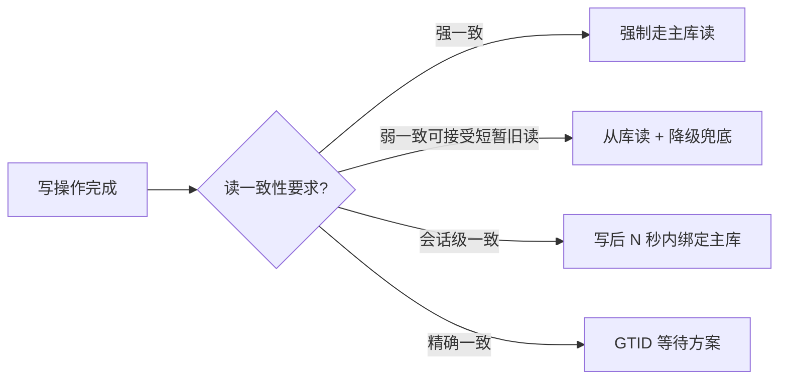

# [L3] 读写分离下的一致性陷阱

#### 一句话结论

写主库后立读从库因主从延迟可能拿到旧数据，需按一致性要求分场景路由。

#### 体系讲解

**陷阱的本质**

读写分离将写请求路由到主库、读请求路由到从库，以此分散读压力。但主从复制存在延迟（通常毫秒级，峰值可达秒级），导致**写后立读**场景出现"读到自己刚写入的旧版本"的问题。

**高频触发场景**

| 场景 | 问题表现 |
|---|---|
| 用户注册后立刻展示个人主页 | 从库尚未同步新用户记录，404 或空页 |
| 下单后立刻查询订单列表 | 订单不出现在列表中 |
| 管理员修改配置后刷新页面 | 看到修改前的旧配置 |
| 社交场景：发帖后立刻看到"0 条帖子" | 帖子内容延迟可见 |

**四种规避策略对比**



**策略一：关键读强制走主库**

最简单直接，在业务层标记"强一致读"场景，直接路由到主库。

代价：主库读压力增大，部分抵消读写分离的收益。适用于订单查询、用户鉴权等强一致场景。

**策略二：会话级主库绑定（写后粘滞）**

写操作完成后，在 Session 或 Token 中打标记，此后 N 秒内（通常覆盖预期最大延迟）的读操作强制走主库，超时后恢复走从库。

ProxySQL 的 `mysql_query_rules` 支持事务粘滞，部分中间件（如 MyCat）也内置了此策略。

**策略三：GTID 等待（精确一致）**

```sql
-- 主库事务提交后记录 GTID
-- 从库执行读查询前，等待该 GTID 已被应用
SELECT WAIT_FOR_EXECUTED_GTID_SET('xxxxxxxx-xxxx-xxxx-xxxx-xxxxxxxxxxxx:1-100', 1);
-- 返回 0 表示 GTID 已追上，可安全读取；返回 1 表示超时
```

精度最高，只等待当前业务所需的事务被同步，不做全局等待。代价是需要在应用层传递 GTID，增加耦合。

**策略四：接受弱一致 + 用户体验补偿**

对部分场景（如点赞数、阅读量），允许短暂读旧，配合"操作中…" Loading 态或乐观更新（Optimistic UI）降低用户感知。

**中间件层的处理**

| 中间件 | 一致性支持 |
|---|---|
| ProxySQL | 事务内自动路由主库；支持 `multiplex=0` 绑定连接 |
| MaxScale | `transaction_replay` 模式 |
| ShardingSphere | Hint 强制主库；SHOW SLAVE STATUS 延迟判断 |

#### 考察意图

考察候选人能否识别读写分离引入的一致性风险，并根据业务场景的一致性要求选择合适的规避策略，而非一刀切地"全走主库"或"完全不管"。

#### 追问链

**Q1：如何判断某个读场景是否需要强一致路由？**

> 判断依据：该读是否直接依赖同一请求链路中刚发生的写（"写后立读"）。用户鉴权、订单确认页、支付结果查询属于强一致场景，必须走主库；商品搜索、推荐列表、历史数据查询允许短暂旧读，可走从库。

**Q2：GTID 等待方案的局限性是什么？**

> 需要在服务间传递 GTID（写操作响应带上 GTID，读操作带上 GTID 去从库等待），增加了应用层与数据库层的耦合。若从库严重滞后，等待超时会触发降级逻辑（通常回退到主库读），增加了代码复杂度。

**Q3：半同步复制能解决读写分离的一致性问题吗？**

> 部分缓解，但不能根治。半同步保证主库提交前至少一个从库收到 binlog（redo log 写入），但 SQL Thread 还未重放，从库数据仍不可见。只有等 SQL Thread 重放完成后，从库才能对外提供最新数据。真正解决需要 MGR（组复制）的强同步模式。

**Q4：写后立刻读同一连接上能保证读到最新数据吗？**

> 不一定。读写分离中间件通常会在事务结束后切换连接到从库。若读操作在事务外且走了不同连接（从库连接），仍然面临延迟问题。需要明确中间件的事务路由策略。

#### 易错点

1. **认为"在同一事务内读写就没问题"**：事务内的写和读若由中间件路由到不同节点（事务提交后第一个读已切到从库），依然存在延迟风险。需确认中间件是否在事务粒度内保持主库粘滞。

2. **用 `Seconds_Behind_Master` 作为等待判断依据**：该指标粒度太粗（秒级），且存在一定误差。在需要精确一致的场景，应使用 GTID 等待而非轮询延迟秒数。

3. **全局强制走主库当作"解决方案"**：这等于放弃了读写分离的全部收益，在读多写少的业务下会导致主库过载，是治标不治本的逃避方案。应按场景分级，仅强一致读走主库。

#### 代码示例

```php
<?php
// 策略二：写后会话粘滞，N 秒内强制走主库

class ReadWriteRouter
{
    private const MASTER_STICKY_SECONDS = 3;

    public function __construct(
        private PDO $master,
        private PDO $replica,
        private \Psr\SimpleCache\CacheInterface $cache,
    ) {}

    public function afterWrite(string $sessionId): void
    {
        // 写完后在 Cache 中打标记
        $this->cache->set(
            "rw_sticky:{$sessionId}",
            1,
            self::MASTER_STICKY_SECONDS
        );
    }

    public function getReadPdo(string $sessionId): PDO
    {
        // 粘滞期内走主库，否则走从库
        return $this->cache->has("rw_sticky:{$sessionId}")
            ? $this->master
            : $this->replica;
    }
}
```
