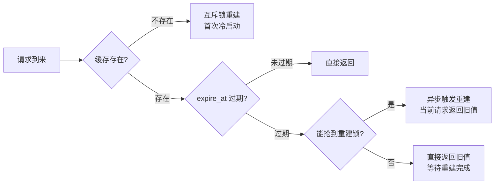

# [L4] 高并发下缓存击穿防护方案如何量化选型？

#### 一句话结论

PHP-FPM 下 Singleflight 跨进程不可行；单 Key 并发 ≤500 用互斥锁兜底；并发 >500 且可接受短暂旧值用逻辑过期。

#### 业务场景

电商大促期间热点商品详情页：

- 热点 Key 峰值并发：单 Key 3000 并发请求/s（如某明星同款商品上架瞬间）
- DB 承载上限：500 QPS（正常水位，击穿后瞬间请求全部透传则超限）
- PHP-FPM 部署：100 Worker × 3 台 = 300 Worker 实例
- SLA：99.9%，P99 响应 ≤100ms
- 一致性约束：允许返回旧数据不超过 500ms（用户基本无感知）

#### 体系讲解

**缓存击穿的成因**

热点 Key 在高并发下恰好过期，导致大量请求同时穿透到 DB。与缓存雪崩（大批 Key 同时过期）不同，击穿通常集中在**单个热点 Key**，瞬时 DB 压力可达平时的数百倍。

**三种防护方案对比**

| 方案 | 核心机制 | PHP-FPM 可行性 | 并发控制效果 | 响应时延影响 | 返回旧值 |
|---|---|---|---|---|---|
| Singleflight | 进程内合并并发请求，仅 1 个协程查 DB | ⚠️ 仅限单进程（Swoole/Roadrunner），FPM 跨进程不可行 | 极好（进程内 N→1） | 无额外延迟 | 否 |
| 互斥锁（Redis SETNX） | 分布式锁，仅 1 个 Worker 查 DB，其余等待或降级 | ✅ 完全兼容 | 好（全局 N→1） | 等待期增加延迟 | 可选（降级旧值） |
| 逻辑过期 | 不设 Redis TTL，value 中存 expire_at，过期后异步重建，同时返回旧值 | ✅ 完全兼容 | 好（重建请求 N→1） | 无阻塞，延迟不受影响 | 是（短暂旧值） |

**Singleflight 在 PHP-FPM 下为何不可行**

Singleflight 的核心是在**同一进程内**用 Map 记录"正在飞行中"的请求，后续重复请求复用第一个的结果。PHP-FPM 下每个 Worker 是独立进程，进程间不共享内存，300 个 Worker 各自独立发起 DB 查询，无法合并。在 Swoole 协程或 Roadrunner 下，同一 Worker 进程内的协程才能共享 Singleflight Map，有效范围仅限单进程。

**逻辑过期方案决策流程**

**本场景选型**

单 Key 并发 3000/s，允许旧值 500ms：选**逻辑过期**。

- 互斥锁在 3000 并发下，299 个未抢到锁的 Worker 需轮询等待，DB 重建期间 P99 劣化 100–200ms，触碰 100ms SLA 红线
- 逻辑过期下所有 Worker 立即返回旧值（<500ms 约束内），仅 1 个 Worker 异步触发重建，DB 压力为 1 QPS
- 代价：短暂（重建期间约 100–300ms）返回旧价格，业务已接受此约束

若业务不允许返回旧值（如库存强一致），则选互斥锁 + 降级返回"稍后再试"而非旧值。

**并发量分级选型**

| 单 Key 并发 | 可接受旧值 | 推荐方案 |
|---|---|---|
| < 100 | 任意 | 互斥锁（轮询等待，影响小） |
| 100–500 | 否 | 互斥锁 + 降级兜底值 |
| > 500 | 是 | 逻辑过期（异步重建） |
| > 500 | 否 | 降级熔断（直接返回错误/静态兜底页） |

#### 考察意图

考察候选人是否理解 Singleflight 在 PHP-FPM 下的不可用边界，能否根据并发量和业务对旧值的容忍度量化选型，而非背"用互斥锁防击穿"的八股答案。

#### 追问链

**Q1：互斥锁的 EX（锁超时）应设多大？设置不合理会怎样？**

**Q2：逻辑过期方案，如何防止多个 Worker 同时触发异步重建？**

**Q3：逻辑过期方案，重建任务执行失败（如 DB 超时）怎么处理？**

**Q4：Singleflight 在 Swoole 场景下如何实现？**

**Q5：大促开始前如何预防热点 Key 击穿？**

> 完整答案/易错点/代码见「学编程拿offer」公众号，回复「缓存击穿」获取
