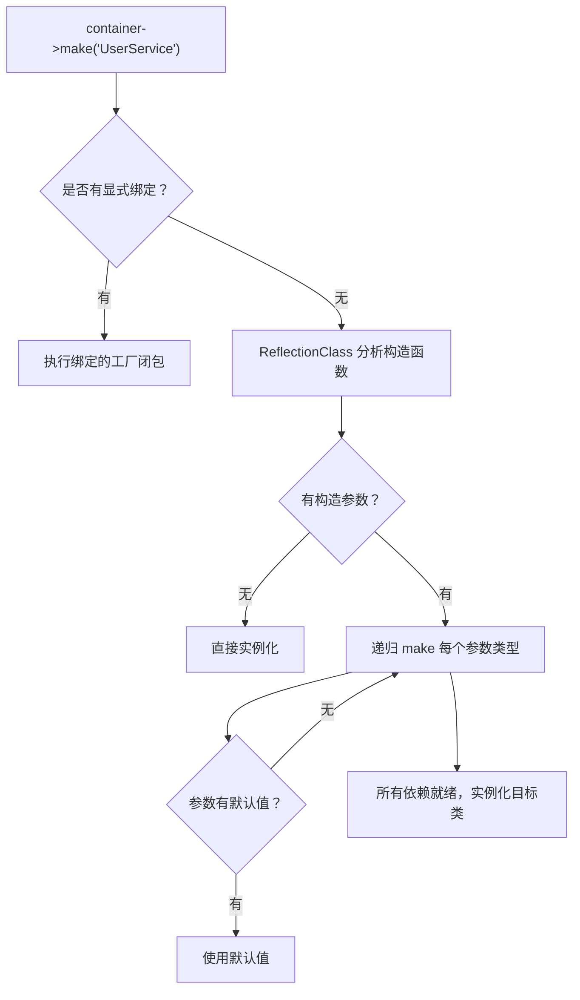

# [L3] Laravel 服务容器（IoC）的实现原理

#### 一句话结论

服务容器通过反射自动解析构造函数依赖，结合 bind/singleton/instance 三种绑定策略，实现依赖反转与对象生命周期管理。

#### 体系讲解

**1. 控制反转（IoC）与依赖注入（DI）的关系**

- **IoC**（Inversion of Control）：对象的依赖不由自身 `new` 创建，而是交由外部容器提供——控制权从对象内部反转到容器
- **DI**（Dependency Injection）：IoC 的具体实现手段，容器将依赖对象「注入」到需要它的类中
- **容器**：负责维护绑定关系、解析依赖图、管理对象生命周期的核心组件

**2. 三种绑定策略**

| 方法 | 生命周期 | 说明 |
|---|---|---|
| `bind($abstract, $factory)` | 每次 `make` 都创建新实例 | 适合有状态、请求级对象（如 Request） |
| `singleton($abstract, $factory)` | 首次解析后缓存，后续复用 | 适合无状态共享服务（如 DB 连接池、Config） |
| `instance($abstract, $object)` | 绑定已有实例，永远复用 | 适合测试 Mock 替换 |

**3. 自动依赖解析（Autowiring）流程**



**4. PHP ReflectionClass 是核心工具**

容器通过 `ReflectionClass` 读取构造函数的参数列表，拿到每个参数的**类型声明**（`ReflectionParameter::getType()`），递归调用 `make` 解析，最终用解析好的依赖数组调用 `new $class(...$dependencies)`。

**5. 循环依赖问题**

若 A 依赖 B、B 依赖 A，递归解析会无限循环。处理方案：

- 用「构建栈」检测循环（Laravel 中抛出 `BindingResolutionException`）
- 重构代码打破循环（通常是设计问题，引入第三个类或用事件解耦）
- 将其中一个依赖改为**延迟注入**（通过 `Closure` 或懒加载代理）

#### 考察意图

考察候选人是否真正理解「容器自动解析依赖」背后的反射机制，能否区分三种绑定策略的生命周期差异，以及是否有处理循环依赖这类工程问题的经验。

#### 追问链

1. **`bind` 和 `singleton` 的本质区别是什么？什么时候该用哪个？**  
   `bind` 每次解析都执行工厂函数、创建新对象，适合持有请求状态的对象（如 `Request`、`FormRequest`）；`singleton` 首次解析后将实例存入容器缓存，后续直接返回缓存，适合无状态的共享服务（如数据库连接、缓存驱动）。误用 `singleton` 存储请求数据会导致请求间状态污染（在 Swoole/Hyperf 常驻内存场景下尤为危险）。

2. **如果构造函数依赖是接口而非具体类，容器如何解析？**  
   容器无法通过反射推断接口的具体实现，需要显式绑定：`$container->bind(LoggerInterface::class, FileLogger::class)`。这正是「面向接口编程」与容器结合的核心——业务代码依赖抽象，容器负责将抽象映射到具体实现，测试时替换 Mock 只需修改绑定。

3. **Laravel 的 Service Provider 和容器是什么关系？**  
   Service Provider 是**注册绑定的入口**，`register()` 方法负责向容器写入绑定（`bind`/`singleton`），`boot()` 方法在所有 Provider 注册完成后执行（可安全使用其他服务）。容器本身只负责解析，Provider 决定「绑什么、怎么绑」，两者职责分离。

4. **如何用 PHP 实现一个最小可用的 IoC 容器？**  
   见代码示例——核心只需 `bind` 方法存工厂、`make` 方法通过 `ReflectionClass` 递归解析，约 40 行即可实现 Autowiring 基础功能。

#### 易错点

1. **把 `singleton` 当成全局最优选项**：`singleton` 的实例在整个请求生命周期（或进程生命周期，若是常驻内存）共享，若服务持有请求上下文（如用户 ID、请求头），会造成数据污染。应优先用 `bind`，只在确认无状态时升级为 `singleton`。

2. **认为自动解析无所不能**：构造参数是接口、标量类型（`string`/`int`）或联合类型时，容器无法自动推断，必须显式绑定或提供默认值。盲目依赖 Autowiring 而不写绑定，会在运行时抛出 `BindingResolutionException`。

3. **在 `register()` 里调用其他服务**：Service Provider 的 `register()` 阶段，其他 Provider 可能尚未注册完毕，此时解析依赖可能失败或拿到不完整的实例。依赖其他服务的逻辑必须放在 `boot()` 方法中。

#### 代码示例

```php
class Container
{
    private array $bindings  = [];
    private array $instances = [];

    public function bind(string $abstract, Closure $factory): void
    {
        $this->bindings[$abstract] = $factory;
    }

    public function singleton(string $abstract, Closure $factory): void
    {
        $this->bind($abstract, function () use ($abstract, $factory) {
            if (!isset($this->instances[$abstract])) {
                $this->instances[$abstract] = $factory($this);
            }
            return $this->instances[$abstract];
        });
    }

    public function make(string $abstract): mixed
    {
        // 有显式绑定，执行工厂
        if (isset($this->bindings[$abstract])) {
            return ($this->bindings[$abstract])($this);
        }

        // 无绑定，通过反射自动解析
        $ref = new ReflectionClass($abstract);
        $constructor = $ref->getConstructor();

        if ($constructor === null) {
            return $ref->newInstance();
        }

        $dependencies = array_map(function (ReflectionParameter $param) {
            $type = $param->getType();
            if ($type instanceof ReflectionNamedType && !$type->isBuiltin()) {
                return $this->make($type->getName()); // 递归解析依赖
            }
            if ($param->isDefaultValueAvailable()) {
                return $param->getDefaultValue();
            }
            throw new RuntimeException("无法解析参数: {$param->getName()}");
        }, $constructor->getParameters());

        return $ref->newInstanceArgs($dependencies);
    }
}

// 使用示例
$container = new Container();
$container->singleton(PDO::class, fn() => new PDO('sqlite::memory:'));
$userRepo = $container->make(UserRepository::class); // 自动注入 PDO
```
