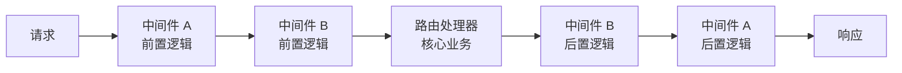

# [L2] PHP 框架中间件机制与洋葱模型

#### 一句话结论

中间件以洋葱模型包裹 HTTP 请求/响应，框架通过 Pipeline 将多个中间件串联，实现认证、日志、限流等横切关注点的解耦。

#### 体系讲解

**1. 洋葱模型**



每个中间件调用 `$next($request)` 将控制权传递给下一层；`$next` 返回后可对响应做后置处理。若中间件不调用 `$next`，请求被**短路**（如认证失败直接返回 401）。

**2. PSR-15 标准接口**

```php
interface MiddlewareInterface {
    public function process(
        ServerRequestInterface $request,
        RequestHandlerInterface $handler
    ): ResponseInterface;
}
```

PSR-15 将「中间件」与「请求处理器」分离，框架可通过统一接口串联来自不同组件的中间件。

**3. Laravel Pipeline 实现原理**

Laravel 使用 `Pipeline` 类将中间件数组反转后用 `array_reduce` 嵌套包裹，形成洋葱结构。调用最外层时，控制权依次向内传递，响应逐层向外返回。核心等价逻辑：

```php
$pipeline = array_reduce(
    array_reverse($middlewares),
    fn($carry, $middleware) => fn($req) => $middleware->handle($req, $carry),
    fn($req) => $handler->handle($req)
);
$response = $pipeline($request);
```

**4. 三种中间件作用域**

| 类型 | 作用范围 | 典型用途 |
|---|---|---|
| 全局中间件 | 所有请求 | 异常捕获、请求日志、HTTPS 强制 |
| 路由中间件 | 特定路由/路由组 | 认证（auth）、权限（acl）、限流（throttle） |
| 终止中间件（terminate） | 响应发送后异步执行 | 慢日志记录、Session 写回 |

#### 考察意图

考察候选人对框架中间件机制的理解深度——能否说清洋葱模型的双向流转、短路逻辑，以及为什么中间件是解耦横切关注点的最佳实践，而非堆砌在控制器里。

#### 追问链

1. **中间件的执行顺序是怎样的？前置和后置逻辑各在什么时机执行？**  
   中间件按注册顺序**由外向内**执行前置逻辑（`$next` 调用前）；响应返回时**由内向外**执行后置逻辑（`$next` 调用后）。因此注册顺序会影响前置/后置逻辑的执行顺序，需注意认证类中间件必须在业务中间件之前注册。

2. **中间件不调用 `$next` 会发生什么？**  
   请求被短路，后续中间件和路由处理器均不执行，直接返回当前中间件构造的响应。这是认证/权限中间件的核心机制——校验失败时直接返回 401/403，不进入业务层。

3. **为什么 `terminate` 中间件能在响应发送后执行？**  
   PHP-FPM 支持 `fastcgi_finish_request()` 在发送响应后继续执行脚本，Laravel 的 `terminate` 方法正是在此之后调用。注意：常驻内存框架（Hyperf/Swoole）中同样支持类似钩子，但实现机制不同（协程生命周期回调）。

4. **中间件与 AOP 有什么关系？**  
   中间件是 HTTP 层的 AOP（面向切面编程）实践——「前置逻辑」对应 Before Advice，「后置逻辑」对应 After Advice，「短路」对应 Around Advice 的提前返回。区别在于 AOP 可在任意方法级别切入，中间件只作用于 HTTP 请求/响应边界。

#### 易错点

1. **后置逻辑执行顺序与直觉相反**：多数人以为中间件 A→B 注册，后置也是 A→B；实际上后置是 B→A（内层先返回），与洋葱结构一致。调试时在后置逻辑打日志可验证。

2. **在中间件中修改请求对象不生效**：PSR-7 请求对象是**不可变（immutable）**的，`withHeader()`/`withAttribute()` 返回新对象，必须将新对象传给 `$next`，否则修改不会传递到下游。

3. **将业务逻辑写入全局中间件**：全局中间件对所有请求生效，误将「只有登录用户才需要」的逻辑写入全局中间件会影响公开接口（如登录接口本身），应使用路由中间件精确控制作用范围。

#### 代码示例

```php
// 实现 PSR-15 中间件：JWT 认证 + 响应头注入
class AuthMiddleware implements MiddlewareInterface
{
    public function process(ServerRequestInterface $request, RequestHandlerInterface $handler): ResponseInterface
    {
        // 前置逻辑：校验 JWT
        $token = $request->getHeaderLine('Authorization');
        if (!$this->validateToken($token)) {
            return new JsonResponse(['error' => 'Unauthorized'], 401); // 短路，不调用 $handler
        }

        $user = $this->parseUser($token);
        // PSR-7 不可变，必须接收 withAttribute 返回的新对象
        $request = $request->withAttribute('user', $user);

        // 调用下一个中间件/处理器
        $response = $handler->handle($request);

        // 后置逻辑：追加响应头
        return $response->withHeader('X-User-Id', (string) $user->id);
    }
}
```
