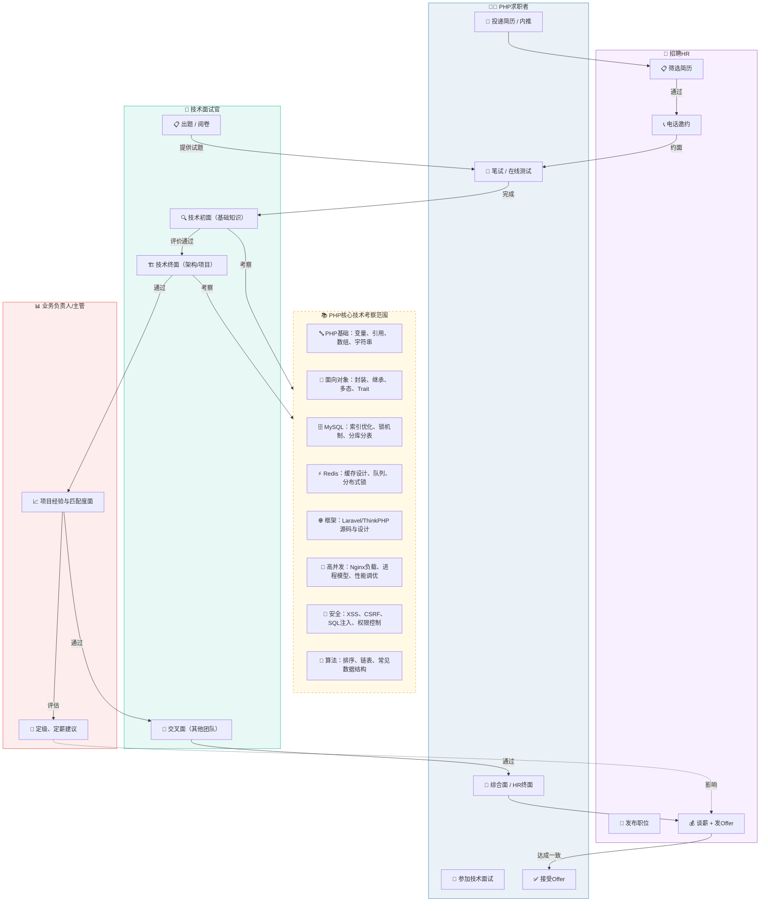

# 面试全景图

```mermaid
flowchart TB
    subgraph HR["🏢 招聘HR"]
        HR1["📢 发布职位"]
        HR2["📋 筛选简历"]
        HR3["📞 电话邀约"]
        HR4["💰 谈薪 + 发Offer"]
    end

    subgraph 求职者["👨‍💻 PHP求职者"]
        A1["📄 投递简历 / 内推"]
        A2["📝 笔试 / 在线测试"]
        A3["🤝 参加技术面试"]
        A4["💼 综合面 / HR终面"]
        A5["✅ 接受Offer"]
    end

    subgraph 面试官["👥 技术面试官"]
        T1["📋 出题 / 阅卷"]
        T2["🔍 技术初面（基础知识）"]
        T3["🏗️ 技术终面（架构/项目）"]
        T4["🔄 交叉面（其他团队）"]
    end

    subgraph 业务方["📊 业务负责人/主管"]
        B1["📈 项目经验与匹配度面"]
        B2["📌 定级、定薪建议"]
    end

    subgraph PHP考点["📚 PHP核心技术考察范围"]
        P1["🔤 PHP基础：变量、引用、数组、字符串"]
        P2["🧱 面向对象：封装、继承、多态、Trait"]
        P3["🗄️ MySQL：索引优化、锁机制、分库分表"]
        P4["⚡ Redis：缓存设计、队列、分布式锁"]
        P5["🌐 框架：Laravel/ThinkPHP 源码与设计"]
        P6["🚀 高并发：Nginx负载、进程模型、性能调优"]
        P7["🔐 安全：XSS、CSRF、SQL注入、权限控制"]
        P8["🧠 算法：排序、链表、常见数据结构"]
    end

    A1 --> HR2
    HR2 -- 通过 --> HR3
    HR3 -- 约面 --> A2
    T1 -- 提供试题 --> A2
    A2 -- 完成 --> T2
    T2 -- 考察 --> PHP考点
    T2 -- 评价通过 --> T3
    T3 -- 考察 --> PHP考点
    T3 -- 通过 --> B1
    B1 -- 评估 --> B2
    B1 -- 通过 --> T4
    T4 -- 通过 --> A4
    A4 --> HR4
    HR4 -- 达成一致 --> A5
    B2 -. 影响 .-> HR4

    style HR fill:#f9f0ff,stroke:#9b59b6
    style 求职者 fill:#eaf2f8,stroke:#2980b9
    style 面试官 fill:#e8f8f5,stroke:#1abc9c
    style 业务方 fill:#fdedec,stroke:#e74c3c
    style PHP考点 fill:#fff9e6,stroke:#f39c12,stroke-dasharray: 5 5
```

> 从小公司到一线大厂，均适合这张面试全景图，但在流程复杂度、考察深度、参与者角色上会出现明显分化。