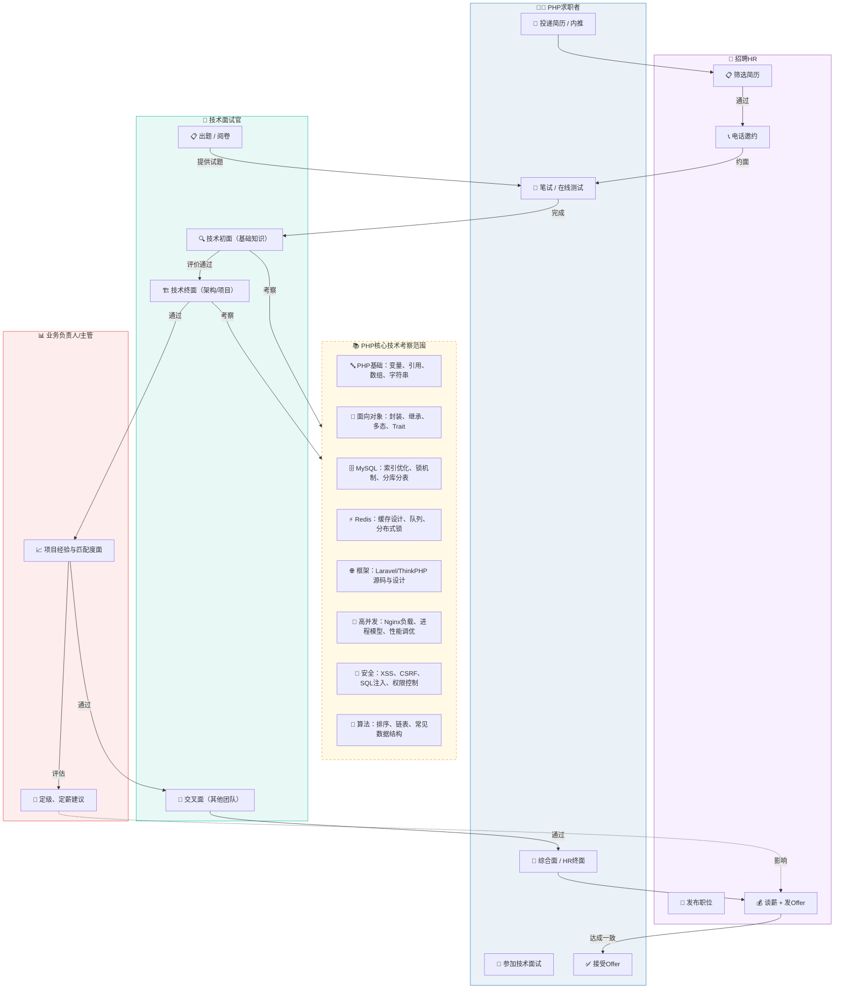

# 面试全景图

> 从小公司到一线大厂，均适合这张面试全景图，但在流程复杂度、考察深度、参与者角色上会出现明显分化。

**求职行动链**：投递 → 笔试 → 技术初面 → 技术终面 → 交叉面 → 综合面 → 谈薪/接受Offer

| 行动环节 | 求职者可以主动作为 |
|------|-------------------|
| **1. 投递简历 / 内推** | 针对目标公司技术栈定制简历，量化成果；通过人脉或社区激活内推，获取真实反馈；前置调研公司产品与技术挑战，在简历中埋下匹配点。 |
| **2. 笔试 / 在线测试** | 靶向刷题：PHP 常见坑、数组函数、魔术方法、命名空间烂熟于心，辅以基本算法与数据结构；模拟限时编码环境，养成一次写对、注重边界条件的习惯；遇到模糊需求主动在平台提问澄清，展现严谨。 |
| **3. 技术初面** | 将八股文讲成理解，用实际场景解释 Redis 数据结构等知识点；准备 1 分钟埋钩子的自我介绍，引导面试官追问你最熟悉的项目；遇到不会的题不沉默，说出思考路径与排查方向。 |
| **4. 技术终面** | 用 STAR 法则深挖每个核心项目，突出个人决策与分析；主动要求画架构图，练习短链、秒杀、IM 消息推送等系统设计题，计算流量与存储；介绍技术选型时埋下对比方案，促成高质量追问。 |
| **5. 交叉面** | 展现可迁移能力，举例说明代码规范落地、跨团队协作的真实经验；准备有深度的问题反向调研对方（如“当前最大技术债是什么？”）；用“我们”传递协作感，描述冲突时强调如何达成共识。 |
| **6. 综合面（HR/业务）** | 设计连贯的职业故事线，正面解释离职原因，具体说明来这里的动机；提前准备价值观问题（缺点、失败案例等）并附带改进动作；询问团队结构、培养机制，展现长期主义。 |
| **7. 谈薪 / 接受 Offer** | 面试中后期明确薪资期望，终面后主动提供流水等材料加速审批；以年度总包（现金+股票+奖金+公积金等）为基础做横向比较；书面确认试用期、转正标准、期权行权条件等关键细节，保护自身权益。 |